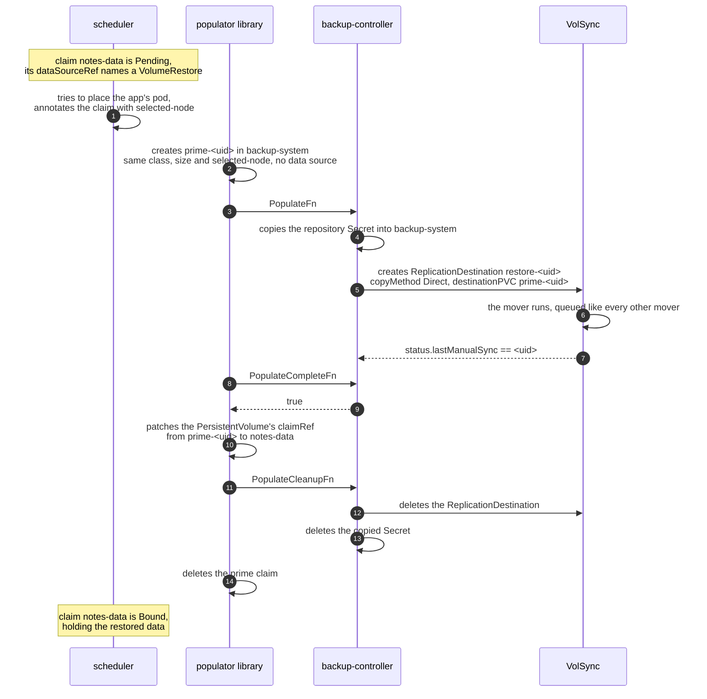

# Architecture

## Three parts in one binary

| Part | Package | Acts on |
| --- | --- | --- |
| the populator | internal/populator, on lib-volume-populator | a claim whose `dataSourceRef` names a VolumeRestore, while it is Pending |
| the run manager | internal/runs, on controller-runtime | BackupRun and RestoreRun objects, and the scheduler that creates a BackupRun at each tick of a Namespace's `backup.wlz.li/schedule` |
| the bootstrap webhook | internal/bootstrap | a CloudNativePG Cluster on CREATE, and a recovered one on UPDATE |

internal/volsync builds the ReplicationDestinations both the populator and a
RestoreRun create, and internal/restic reads a repository's snapshots for the
restore checks and each BackupRun's `snapshotTime`. The sections below this
table are about the populator; the runs are in
[namespace-backups.md](namespace-backups.md) and the webhook in
[restores.md](restores.md).

## Objects the controller writes

In the app's namespace:

| Object | Written by | Lifetime |
| --- | --- | --- |
| BackupRun `scheduled-<yyyymmdd-hhmm>` | the scheduler, once per tick | deleted 30 days after it finishes |
| Kueue Workload, one per run, named in the run's `status.workload` | each BackupRun, which also writes its `PodsReady` condition | deleted when the run ends |
| ReplicationSource named after each claim marked `backup.wlz.li/enabled` | each BackupRun, owned by the claim and labelled `app.kubernetes.io/managed-by: backup-controller` | stays, and goes with the claim |
| CloudNativePG Backup `<cluster>-<suffix>` | each BackupRun, one per Cluster marked `backup.wlz.li/enabled` | stays, as CloudNativePG's backup record |
| ReplicationDestination | an in-place RestoreRun | deleted when the restore ends |
| VolumeRestore and a scratch claim named by `into:` | a RestoreRun with `into:`, both owned by the run | deleted with the RestoreRun, the claim's dataset included |

In the controller's namespace, for each claim the populator fills: a copy of the
repository Secret and a ReplicationDestination, both deleted when the fill ends,
and the prime claim the library creates and hands over.

On objects the controller does not own:

| Object | Write | When |
| --- | --- | --- |
| Deployment or StatefulSet marked `backup.wlz.li/quiesce` | `spec.replicas` to 0, then back to the recorded value | during a run with `all: true` |
| the workload's Flux Kustomization | `spec.suspend` on, then off, only when the run found it running | the same |
| a new CloudNativePG Cluster | `bootstrap` swapped for `recovery`, an `externalClusters` entry, the `cnpg.io/skipEmptyWalArchiveCheck` annotation, and `backup.wlz.li/restore-run` when a run waits for it | on CREATE, in the webhook |
| a recovered Cluster | the `initdb` a GitOps tool applies again, dropped | on UPDATE, in the webhook |
| a Cluster in a database RestoreRun | deleted, so it is created again and recovered | when the restore starts |
| a claim being filled | the library's `backup.wlz.li` annotations and finalizer | while the fill runs |

Its own BackupRuns and RestoreRuns carry a finalizer, which releases whatever a
run changed when the run fails, times out or is deleted. The sources it writes
make VolSync create the clone claim `volsync-<claim>-src`, the restic cache
claims and the mover Jobs; those are VolSync's objects.

## Built on lib-volume-populator

The controller is a thin provider on top of
[kubernetes-csi/lib-volume-populator](https://github.com/kubernetes-csi/lib-volume-populator),
which owns the whole PersistentVolumeClaim dance. Its `populator-machinery`
package exposes two entry points:

```go
func RunController(masterURL, kubeconfig, imageName, httpEndpoint, metricsPath,
  namespace, prefix string, gk schema.GroupKind, gvr schema.GroupVersionResource,
  mountPath, devicePath string, populatorArgs func(bool, *unstructured.Unstructured)
  ([]string, error))

func RunControllerWithConfig(vpcfg VolumePopulatorConfig)
```

Use the second. `VolumePopulatorConfig` takes either a `PodConfig` or a
`ProviderFunctionConfig`, and this controller takes the second of those, which
is what keeps a pod of our own out of the design entirely:

| Callback | This controller's implementation |
| --- | --- |
| `PopulateFn` | create the ReplicationDestination pointed at the prime claim |
| `PopulateCompleteFn` | report true when the destination's `status.lastManualSync` matches the trigger it was given |
| `PopulateCleanupFn` | delete the ReplicationDestination |

Each callback receives `PopulatorParams`, which carries the Kubernetes client,
the original claim, the prime claim, the storage class, the data source object
and an event recorder. go.mod pins the library at
`github.com/kubernetes-csi/lib-volume-populator/v3 v3.3.0`.

## What the library does around those three calls

| Step | Detail |
| --- | --- |
| watches | claims whose `dataSourceRef` names the GroupKind the controller registers |
| creates the prime claim | named `prime-<uid of the app's claim>`, in the controller's own namespace, with the app claim's access modes, resources and storage class, and no data source |
| carries the node over | when the storage class binds WaitForFirstConsumer, the app claim's `volume.kubernetes.io/selected-node` annotation is copied onto the prime claim |
| calls the provider | `PopulateFn`, then `PopulateCompleteFn` until it returns true |
| rebinds | once the prime claim is bound, the library patches the PersistentVolume's `claimRef` to name the app's claim, and records the data source reference in an annotation on the PV |
| cleans up | deletes the prime claim and calls `PopulateCleanupFn` |

A mutator hook can alter the prime claim before it is created. This controller
does not need one today; [decisions.md](decisions.md) records why the storage
class is copied rather than chosen.

## The node the volume lands on

The copied `selected-node` annotation is the reason this design also settles a
placement problem the snapshot path has.

With VolSync's populator, two independent decisions pick a worker. The scheduler
picks one for the app's pod and writes it onto the claim; the restore mover is
placed by its own affinity and the clone is made wherever it ran. They can
disagree, and the volume wins, so the pod follows the volume rather than the
schedule. The walzen test cluster showed exactly that on 2026-09-13: a claim
annotated `selected-node: talos-unraid-w-2` whose PersistentVolume sat on
talos-unraid-w-1.

Here the annotation is carried onto the prime claim, so the volume is created on
the worker the scheduler chose for the pod, and the mover follows the volume it
has to mount. One decision, made once.

## Object flow for one restore



Every object the restore created is gone by the end. What survives is the
PersistentVolume, now bound to the app's claim, and it is an ordinary dataset
with no origin.

## Why the repository Secret is copied

VolSync resolves `spec.restic.repository` as a Secret in the ReplicationDestination's
own namespace. The prime claim lives in the controller's namespace, so the
destination does too, and the app's repository Secret is in the app's namespace.

The controller copies that Secret into its own namespace for the length of the
restore and deletes it in `PopulateCleanupFn`. The copy is named for the claim's
UID, so two restores never collide, and it exists only while a restore is
running.

[decisions.md](decisions.md) records the alternative that was weighed, which is
a repository Secret that lives in the controller's namespace from the start.

## Failure behaviour

| Case | What happens |
| --- | --- |
| the repository has no snapshot yet, a first deploy | VolSync completes with nothing to write; the prime claim binds empty, the app starts on an empty volume, which matches what the snapshot path does today |
| the restore fails | `PopulateCompleteFn` keeps returning false, the prime claim never binds, the app's claim stays Pending and its pod does not start. The reason is in the ReplicationDestination's status and events |
| the controller is down | claims stay Pending. Nothing is half-written and no app starts on an empty volume |
| the controller restarts mid-restore | every object is named from the app claim's UID, so the next reconcile finds the existing destination rather than creating a second one |
| two apps restore at once | each destination carries the backup queue label, so Kueue admits them the way it admits every other mover |
| the app's claim is deleted while the app runs | the pod loses its volume and stays down until the refill completes, which is what deleting a claim already does |
| the app's claim is deleted mid-restore | the library's own garbage collection removes the prime claim; `PopulateCleanupFn` removes the destination and the Secret copy |

## What runs where for one fill

| Object | Namespace | Lifetime |
| --- | --- | --- |
| the controller Deployment | the controller's namespace | always |
| the webhook Service, its cert-manager Issuer and Certificate, and the MutatingWebhookConfiguration | the controller's namespace, and cluster-scoped for the configuration | always |
| the VolumeRestore | the app's namespace | as long as the app declares it |
| the prime claim | the controller's namespace | one restore |
| the ReplicationDestination | the controller's namespace | one restore |
| the copied repository Secret | the controller's namespace | one restore |
| the mover's restic metadata cache claim | the controller's namespace | one restore, and VolSync deletes it with the destination |
| the restored PersistentVolume | cluster-scoped | the life of the app's claim |
