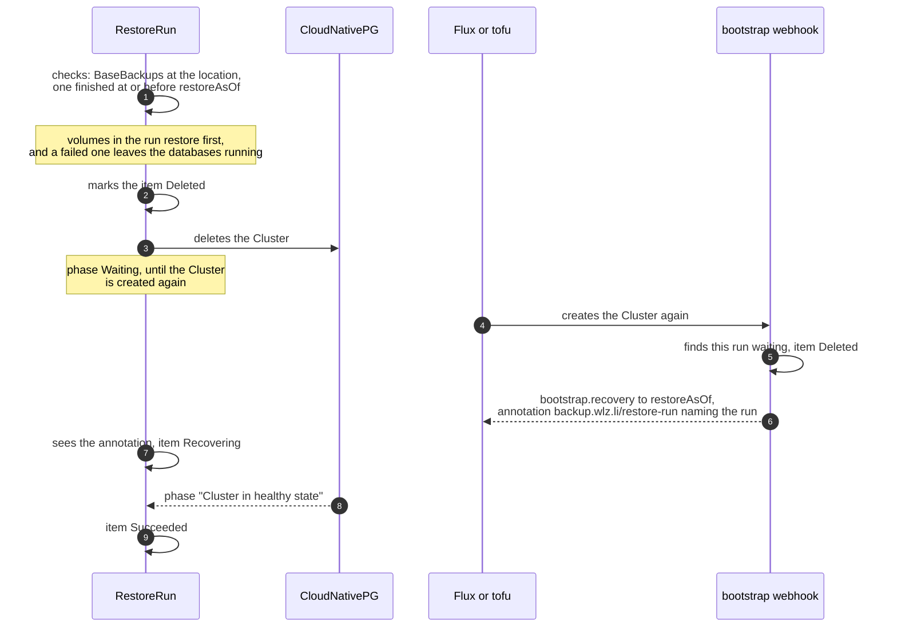
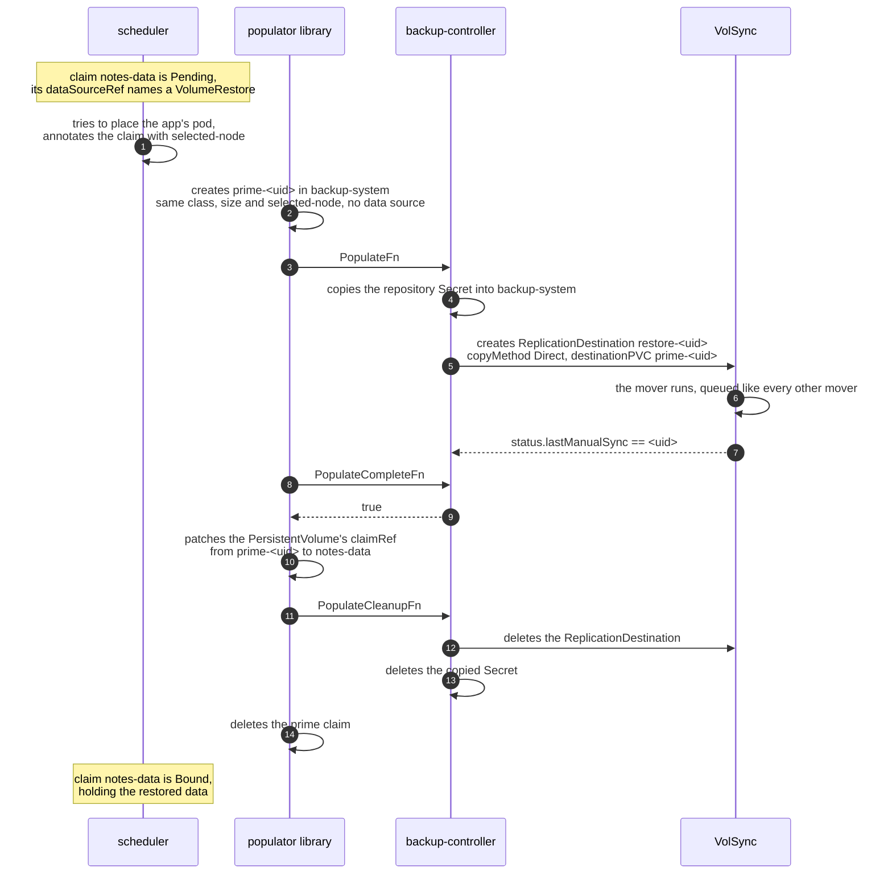

# Architecture

## Three parts in one binary

| Part | Package | Acts on |
| --- | --- | --- |
| the populator | internal/populator, on lib-volume-populator | a claim whose `dataSourceRef` names a VolumeRestore, while it is Pending |
| the run manager | internal/runs, on controller-runtime | BackupRun and RestoreRun objects, the scheduler that creates a BackupRun at each tick of a Namespace's `backup.wlz.li/schedule`; it also runs the populator's orphan reconciler from internal/populator, which releases a deleted claim whose VolumeRestore is gone |
| the bootstrap webhook | internal/bootstrap | a CloudNativePG Cluster on CREATE, and a recovered one on UPDATE |

internal/volsync builds the ReplicationDestinations both the populator and a
RestoreRun create, and internal/restic reads a repository's snapshots for the
restore checks and each BackupRun's `snapshotTime`, and rewrites a quiesced
run's snapshots. Databases below covers the
database side of all three parts; the sections after it are about the
populator, and the volume runs are in [namespace-backups.md](namespace-backups.md).

## Objects the controller writes

In the app's namespace:

| Object | Written by | Lifetime |
| --- | --- | --- |
| BackupRun `scheduled-<yyyymmdd-hhmm>` | the scheduler, once per tick | deleted 30 days after it finishes |
| Kueue Workload, one per run, named in the run's `status.workload` | each BackupRun, which also writes its `PodsReady` condition | deleted when the run ends |
| ReplicationSource named after each claim marked `backup.wlz.li/enabled` | each BackupRun, owned by the claim and labelled `app.kubernetes.io/managed-by: backup-controller` | stays, and goes with the claim; a failed mover leaves it in place, and VolSync keeps retrying |
| CloudNativePG Backup `<cluster>-<suffix>` | each BackupRun, one per Cluster marked `backup.wlz.li/enabled` | stays, as CloudNativePG's backup record |
| ReplicationDestination | a RestoreRun that restores a volume: in place, or with `claim:` and `into:`, or with `repository:` and `into:` | deleted once the item's end is in the run's status |
| Lease `backup-controller-claim-<claim uid>` and `backup-controller-repo-<secret uid>` | a run, right before it creates its mover object for an item | released once the item's end is in the run's status, and taken over by another run when its holder is gone or finished |
| Lease `backup-controller-quiesce` in the run's namespace, and `backup-controller-kustomization-<Kustomization uid>` in each Kustomization's namespace | a run, before it records the plan that stops the workloads of a BackupRun with `all: true`, or of a RestoreRun that lists `quiesce` | released once the run's stored status shows the workloads back and the plan reads back; taken over when its holder has finished, is gone or has given the workloads back |
| VolumeRestore named by `into:`, with the finalizer `backup.wlz.li/volume-populator` | a v0.8.1 or older controller, for an `into` restore from a claim, owned by the run | deleted with the RestoreRun; v0.9.0 creates none, and the run removes the finalizer itself when the populator never took the VolumeRestore on |
| a scratch claim named by `into:` | a RestoreRun with `into:`, owned by the run; it carries no data source, and the run's ReplicationDestination fills it | deleted with the RestoreRun, the claim's dataset included |

In the controller's namespace, for each claim the populator fills: a copy of the
repository Secret and a ReplicationDestination, both deleted when the fill ends,
and the prime claim the library creates and hands over. When the claim is
deleted after its VolumeRestore, the orphan reconciler deletes all three
([A claim whose VolumeRestore is gone](#a-claim-whose-volumerestore-is-gone)).

On objects the controller does not own:

| Object | Write | When |
| --- | --- | --- |
| Deployment or StatefulSet marked `backup.wlz.li/quiesce` | `spec.replicas` to 0, then back to the recorded value | during a BackupRun with `all: true` |
| Deployment or StatefulSet a RestoreRun's `quiesce` lists | the same | from the RestoreRun's start until its volumes are restored and its databases deleted |
| the workload's Flux Kustomization | `spec.suspend` on, then off, only when the run found it running and its `status.inventory` lists the workload | the same as its workload |
| a snapshot in the volume's restic repository | a new snapshot file at the run's `restartedAt`, tagged `quiesced`, replacing the one the mover wrote, under a lock file in locks/ | after the mover of a BackupRun that stopped workloads |
| a new CloudNativePG Cluster | `bootstrap` swapped for `recovery`, an `externalClusters` entry, the `cnpg.io/skipEmptyWalArchiveCheck` annotation, and `backup.wlz.li/restore-run` when a run waits for it | on CREATE, in the webhook |
| a recovered Cluster | the `initdb` a GitOps tool applies again, dropped | on UPDATE, in the webhook |
| a Cluster in a database RestoreRun | deleted, so it is created again and recovered | when the restore starts |
| a claim being filled | the library's `backup.wlz.li` annotations and finalizer | while the fill runs |
| a claim being deleted whose VolumeRestore is gone | the library's finalizer `backup.wlz.li/populate-target-protection` removed by the orphan reconciler, and its WaitingForMover and DataSourceGone events | once the claim's destination, mover pod, Secret copy and prime claim are gone |
| the VolumeRestore a claim fills from | the finalizer `backup.wlz.li/volume-populator` | while any claim is listed in its `status.claims`; the populator adds it on its first call for a claim, which the library makes once the claim's prime claim is bound |

Before a run changes anything, the run manager reads the installed CRD of the
run's kind straight from the API server and compares its schema with the fields
the Go type writes. A run whose CRD lacks one of those fields ends Failed with
reason CRDOutdated before it stops or creates anything, because the API server
would drop that field from every write: a run that lost `status.quiesced` would
stop an app and record nothing to start it again. A run that v0.8.x planned
under an older CRD meets the check again right before it stops the workloads.
The same reason covers a controller that may not read the CRD, and one whose
CRD is not installed. Applying the CRDs of the controller's release fixes each;
Helm upgrades no CRD on its own. [packaging.md](packaging.md#rbac-the-controller-needs)
lists the rule this needs.

A backup and a restore of one claim or repository never run at once. Each run
takes a `coordination.k8s.io` Lease for the claim and one for the repository
before it creates its mover object, so the API server admits exactly one of two
runs that reach that moment together, and a run that finds a Lease held waits
with reason SourceBusy.
[namespace-backups.md](namespace-backups.md#one-mover-at-a-time) has the
messages and the takeover rule.

Two runs never stop one namespace's workloads at once, either. A run that is
about to record a stop plan takes the namespace's Lease
`backup-controller-quiesce` and one Lease per Kustomization its plan needs in
the same way, and holds them until its stored status shows every workload back
and every Kustomization resumed, so a second run waits with the app running, and records its plan
only once that run has given the workloads back. A run waits
for a run that v0.8.x left in flight without a Lease as well, and for a
RestoreRun that has deleted a Cluster and not yet seen it created again.
[namespace-backups.md](namespace-backups.md#one-quiesce-at-a-time) has the
messages and the release rule.

Its own BackupRuns and RestoreRuns carry a finalizer, which releases whatever a
run changed when the run fails, times out or is deleted. The sources it writes
make VolSync create the clone claim `volsync-<claim>-src`, the restic cache
claims and the mover Jobs; those are VolSync's objects.

## Databases

The controller moves no database byte. The barman-cloud plugin archives WAL and
writes base backups; the controller asks it for a base backup, reads what it
wrote, and decides how a new Cluster bootstraps. It reads CloudNativePG objects
as unstructured, so it carries no dependency on CloudNativePG's Go module.

### Where a database's backups are

Every database operation starts by finding the archive. `bootstrap.Archiver`
reads the Cluster's `spec.plugins`, picks the `barman-cloud.cloudnative-pg.io`
entry with `isWALArchiver: true`, and returns its `barmanObjectName` and
`serverName`. An unset `serverName` means the Cluster's own name, the same
default barman uses. A Cluster with no such entry archives nowhere, and every
database operation leaves it alone.

`bootstrap.ResolveLocation` then turns the store's name into an S3 location:

| Read | From | Becomes |
| --- | --- | --- |
| the ObjectStore | the Cluster's namespace, by `barmanObjectName` | |
| `spec.configuration.destinationPath` | `s3://prod-cluster-backup-cnpg/canary-namespace-backup` | bucket `prod-cluster-backup-cnpg`, and the prefix `canary-namespace-backup/canary-namespace-backup-pg` once the server name is appended |
| `spec.configuration.endpointURL` | `https://…` or `http://…`; a bare host, with or without a port, reads as HTTPS | the S3 endpoint |
| `s3Credentials.accessKeyId`, `secretAccessKey` | the Secret and keys they name | the key pair |
| `endpointCA`, when present | the Secret and key it names | a PEM bundle added to the image's public roots |

`bootstrap.S3Prober` reads that location with the minio client, in two ways:

| Method | Caller | Reads |
| --- | --- | --- |
| Survey | the webhook | lists `<prefix>/base/` with the `/` delimiter, one entry per backup directory, and reads the `backup.info` files newest first with eight GETs in flight, stopping at the first DONE backup, or the first that finished by the target when there is one. When `base/` holds no directory, it lists one key under `<prefix>/` to learn whether the prefix is empty |
| BaseBackups | the RestoreRun checks | the same listing and parallel reads without the early stop; it keeps every backup whose `status` is `DONE` and orders them by `end_time` |

Both count a directory with no `backup.info` as not DONE, as barman does.
barman names each backup's directory by its start time, so sorting the IDs as
strings sorts them by time, and in a healthy store the newest backup is DONE,
or STARTED while a backup runs. barman-cloud writes no `backup_id` into
backup.info, so the ID is the directory's name, such as `20260924T221544`.

Survey returns an error that carries its counts when its context ends before
it has an answer, during a listing too. minio-go ends a listing without an
error item when the context ends, so Survey checks the context after each
listing, and an expired budget never reads as an empty prefix.

The S3 credential in the ObjectStore's Secret needs `s3:ListBucket` on
`<prefix>/`, the whole server prefix, and `s3:GetObject` on
`<prefix>/base/*/backup.info`. The barman-cloud plugin already lists
`<prefix>/wals/` with the same credential for its empty-archive check, so a
store that archives has the permission unless a policy allows the listing on
narrower prefixes only. A refused listing ends the webhook's answer in
`(HTTP 403 AccessDenied)`.

### A base backup

A run with `database:` or `all: true` has one item per enabled Cluster. For
each, it:

1. skips the Cluster when it carries `cnpg.io/hibernation: "on"`, because
   CloudNativePG fails a Backup of a hibernated Cluster and the Backup stays
   failed after it wakes;
2. creates a CloudNativePG Backup named `<cluster>-<first 8 characters of the
   run's UID>`, with `method: plugin` and `pluginConfiguration.name:
   barman-cloud.cloudnative-pg.io`, labelled
   `app.kubernetes.io/managed-by: backup-controller`. The name comes from the
   run, so a restarted controller finds the Backup it made;
3. reads the Backup's `status.phase` on every reconcile, and marks the item
   Succeeded on `completed`, or Failed with `status.error` on `failed`.

The Backup stays after the run; it is CloudNativePG's record of the base backup,
and the plugin's retention window decides when the backup itself is deleted.

### A database restore


```mermaid
sequenceDiagram
    autonumber
    participant run as RestoreRun
    participant cnpg as CloudNativePG
    participant owner as Flux or tofu
    participant hook as bootstrap webhook

    run->>run: checks: BaseBackups at the location,<br/>one finished at or before restoreAsOf
    Note over run: volumes in the run restore first,<br/>and a failed one leaves the databases running
    run->>run: marks the item Deleted
    run->>cnpg: deletes the Cluster
    Note over run: phase Waiting, until the Cluster<br/>is created again
    owner->>hook: creates the Cluster again
    hook->>hook: finds this run waiting, item Deleted
    hook-->>owner: bootstrap.recovery to restoreAsOf,<br/>annotation backup.wlz.li/restore-run naming the run
    run->>run: sees the annotation, item Recovering
    cnpg-->>run: phase "Cluster in healthy state"
    run->>run: item Succeeded
```

The item is marked Deleted before the Cluster is deleted, because the webhook
recovers a Cluster for a run only when that run's item says Deleted. The same
status write records the old Cluster's UID in `status.items[].clusterUID`, and
the delete carries that UID as a precondition, so it never reaches a Cluster of
the same name created since the run read it.

While the item says Deleted, the run sorts the Cluster it finds by name:

| Cluster found | What the run does |
| --- | --- |
| none, or one being deleted | waits |
| the UID in `clusterUID`, carrying `backup.wlz.li/bootstrap: initdb` or declaring its own bootstrap method | marks the item Skipped and never deletes it |
| the UID in `clusterUID` | deletes it again: the old Cluster, which a failed delete or a controller restart after the mark did not reach |
| another UID, with `backup.wlz.li/restore-run` naming the run | marks the item Recovering |
| any other Cluster | fails the item and leaves the Cluster alone, naming what it does instead: it archives nowhere, another run recovered it, or the webhook did not mark it |

The UID settles what the annotation alone cannot. The webhook's
`backup.wlz.li/restore-run` stays on a recovered Cluster for good, so a run
created again under the same name would find it on the old Cluster too, and
take the old database for its recovery. A run deletes only the Cluster it
recorded, so a Cluster that comes back without that run's recovery is reported
and left alone, and so is every Cluster an item without a `clusterUID`, from a
run that started under v0.7.2, finds.
[namespace-backups.md](namespace-backups.md#a-database-restore) has those
messages. A recovered Cluster deleted before it turns healthy fails the item.

### A Cluster being created

The webhook's checks run in this order:

1. An update goes to the recovered-Cluster handler below, and any other
   operation but a create passes. A dry-run create passes unchanged.
2. The webhook gives the rest of the create a 10-second budget.
3. A Cluster that archives nowhere passes unchanged.
4. ResolveLocation reads the ObjectStore and its Secrets; a failure refuses
   the Cluster.
5. The shared-archive check lists every Cluster and every ObjectStore once,
   reads none of their Secrets, and refuses the Cluster when another one
   archives to the same bucket and prefix. A failed list refuses it too.
6. A Cluster carrying `backup.wlz.li/bootstrap: initdb` and declaring no other
   bootstrap method gets a Survey without a target. It passes unchanged when
   its prefix is empty, and is refused when anything is there.
7. The webhook looks for a RestoreRun waiting for this Cluster. A Cluster that
   declares a bootstrap method other than `initdb` passes unchanged, or is
   refused when a run waits.
8. The target comes from the run or from `backup.wlz.li/restore-as-of`; one
   that does not parse refuses the Cluster.
9. Survey reads the store. A DONE backup, by the target when there is one,
   leads to the recovery patch below. Without one, the Cluster is refused when
   a run or the annotation asks for a recovery (naming the oldest DONE backup
   when one exists but finished too late), refused when anything is under
   its prefix, and passes unchanged, to start empty, when the prefix is empty.

A budget that ends during a Kubernetes read in steps 4, 5 or 7 answers HTTP 500
naming the step; one that ends during a Survey refuses the Cluster with the
counts read. [restores.md](restores.md) has what each outcome does and the
text of each refusal.

A Cluster it recovers gets, in one patch:

| Field | Value |
| --- | --- |
| `spec.bootstrap.recovery` | `source: backup-controller`, `recoveryTarget.targetTime` when there is a target, and the `database`, `owner` and `secret` its `initdb` named |
| `spec.bootstrap.initdb` | removed |
| `spec.externalClusters` | an entry `backup-controller` naming the same plugin, `barmanObjectName` and `serverName` |
| `cnpg.io/skipEmptyWalArchiveCheck` | `enabled`, so the database archives into the prefix it recovered from |
| `backup.wlz.li/restore-run` | the run's name, when a RestoreRun waits for it |

Carrying `database` and `owner` over matters: CloudNativePG defaults a
recovery's database and owner to `app`, so a Cluster created with database
`canary` would come back with its data in `canary`, an empty `app` beside it,
and the `<cluster>-app` Secret pointing at the empty one.

On UPDATE of a Cluster whose stored recovery has `source: backup-controller`,
the webhook drops the `initdb` a GitOps tool applies from its source again,
which CloudNativePG would otherwise refuse as a second bootstrap method.

## Process, probes and rollout

One pod runs all three parts. The populator library runs in the main goroutine,
and a controller-runtime manager runs the run reconcilers, the scheduler, the
populator's orphan reconciler and the webhook server beside it. The container listens on four ports:

| Port | Flag | Serves |
| --- | --- | --- |
| 8080 | `--metrics-addr` | the populator library's metrics |
| 8081 | `--runs-metrics-addr` | the scheduler's metrics, listed in [namespace-backups.md](namespace-backups.md#metrics) |
| 8082 | `--health-probe-addr` | `/healthz` and `/readyz` for the manager; `0` serves neither |
| 9443 | `--webhook-port` | the bootstrap webhook, when `--webhook-cert-dir` is set |

The Deployment probes `/healthz` every 20 seconds for liveness and `/readyz`
every 5 seconds for readiness. `/healthz` answers while the manager runs.
`/readyz` answers once the webhook server accepts TLS connections, so the
webhook's Service sends the API server to a pod only once that pod can answer
an admission request. A controller started without a webhook is ready at once.
The populator library serves no health route of its own.

When the manager stops while the process is still meant to run, for example
because its caches failed to sync, the process logs `the run controllers
stopped, exiting so the pod restarts` and exits with status 1. Without the
manager the pod would serve no webhook and reconcile no run, and the webhook's
`failurePolicy: Fail` would refuse every Cluster create on the cluster until
someone restarted it. The exit makes the kubelet restart the container. The
populator library ends the process itself when it fails, through
`klog.Fatalf`.

The controller runs without leader election, so two pods would run two
schedulers and two sets of reconcilers. The Deployment's strategy is Recreate:
a rollout stops the old pod before it starts the new one, where the default
RollingUpdate would run both for a while.

The run manager's client and the populator callbacks' client carry no
client-side rate limit. Each Cluster create makes several reads: the
ObjectStore and its Secrets, one list of every Cluster, one list of every
ObjectStore and the RestoreRun list. A cluster rebuild creates every Cluster at
once, and at client-go's default of 5 requests a second, with a burst of 10, a
few dozen creates would queue past the webhook's 10-second budget and each
would fail closed. The API server's priority and fairness shares out the
requests.

The ClusterRole the process runs under is listed in
[packaging.md](packaging.md#rbac-the-controller-needs), rule by rule.

## Built on lib-volume-populator

The controller is a thin provider on top of
[kubernetes-csi/lib-volume-populator](https://github.com/kubernetes-csi/lib-volume-populator),
which owns the whole PersistentVolumeClaim dance. Its `populator-machinery`
package exposes two entry points:

```go
func RunController(masterURL, kubeconfig, imageName, httpEndpoint, metricsPath,
  namespace, prefix string, gk schema.GroupKind, gvr schema.GroupVersionResource,
  mountPath, devicePath string, populatorArgs func(bool, *unstructured.Unstructured)
  ([]string, error))

func RunControllerWithConfig(vpcfg VolumePopulatorConfig)
```

Use the second. `VolumePopulatorConfig` takes either a `PodConfig` or a
`ProviderFunctionConfig`, and this controller takes the second of those, which
is what keeps a pod of our own out of the design entirely:

| Callback | This controller's implementation |
| --- | --- |
| `PopulateFn` | create the ReplicationDestination pointed at the prime claim |
| `PopulateCompleteFn` | report true when the destination's `status.lastManualSync` matches the trigger it was given |
| `PopulateCleanupFn` | delete the ReplicationDestination |

Each callback receives `PopulatorParams`, which carries the Kubernetes client,
the original claim, the prime claim, the storage class, the data source object
and an event recorder. go.mod pins the library at
`github.com/kubernetes-csi/lib-volume-populator/v3 v3.3.0`.

## What the library does around those three calls

| Step | Detail |
| --- | --- |
| watches | claims whose `dataSourceRef` names the GroupKind the controller registers |
| creates the prime claim | named `prime-<uid of the app's claim>`, in the controller's own namespace, with the app claim's access modes, resources and storage class, and no data source |
| carries the node over | when the storage class binds WaitForFirstConsumer, the app claim's `volume.kubernetes.io/selected-node` annotation is copied onto the prime claim |
| calls the provider | `PopulateFn`, then `PopulateCompleteFn` until it returns true |
| rebinds | once the prime claim is bound, the library patches the PersistentVolume's `claimRef` to name the app's claim, and records the data source reference in an annotation on the PV |
| cleans up | deletes the prime claim and calls `PopulateCleanupFn` |

A mutator hook can alter the prime claim before it is created. This controller
does not need one today; [decisions.md](decisions.md) records why the storage
class is copied rather than chosen.

## The node the volume lands on

The copied `selected-node` annotation is the reason this design also settles a
placement problem the snapshot path has.

With VolSync's populator, two independent decisions pick a worker. The scheduler
picks one for the app's pod and writes it onto the claim; the restore mover is
placed by its own affinity and the clone is made wherever it ran. They can
disagree, and the volume wins, so the pod follows the volume rather than the
schedule. The walzen test cluster showed exactly that on 2026-09-13: a claim
annotated `selected-node: talos-unraid-w-2` whose PersistentVolume sat on
talos-unraid-w-1.

Here the annotation is carried onto the prime claim, so the volume is created on
the worker the scheduler chose for the pod, and the mover follows the volume it
has to mount. One decision, made once.

## Object flow for one restore

This is the path a claim takes when it is created and its `dataSourceRef` names
a VolumeRestore. A RestoreRun writes into a claim the same way, through a
ReplicationDestination with `copyMethod: Direct`, but in the app's namespace
and without the populator library;
[restores.md](restores.md#submitting-a-restore) has those runs.


```mermaid
sequenceDiagram
    autonumber
    participant sched as scheduler
    participant lib as populator library
    participant ctl as backup-controller
    participant vs as VolSync

    Note over sched: claim notes-data is Pending,<br/>its dataSourceRef names a VolumeRestore
    sched->>sched: tries to place the app's pod,<br/>annotates the claim with selected-node

    lib->>lib: creates prime-<uid> in backup-system<br/>same class, size and selected-node, no data source
    lib->>ctl: PopulateFn

    ctl->>ctl: copies the repository Secret into backup-system
    ctl->>vs: creates ReplicationDestination restore-<uid><br/>copyMethod Direct, destinationPVC prime-<uid>
    vs->>vs: the mover runs, queued like every other mover
    vs-->>ctl: status.lastManualSync == <uid>

    lib->>ctl: PopulateCompleteFn
    ctl-->>lib: true

    lib->>lib: patches the PersistentVolume's claimRef<br/>from prime-<uid> to notes-data
    lib->>ctl: PopulateCleanupFn
    ctl->>vs: deletes the ReplicationDestination
    ctl->>ctl: deletes the copied Secret
    lib->>lib: deletes the prime claim

    Note over sched: claim notes-data is Bound,<br/>holding the restored data
```

Every object the restore created is gone by the end. What survives is the
PersistentVolume, now bound to the app's claim, and it is an ordinary dataset
with no origin.

## Why the repository Secret is copied

VolSync resolves `spec.restic.repository` as a Secret in the ReplicationDestination's
own namespace. The prime claim lives in the controller's namespace, so the
destination does too, and the app's repository Secret is in the app's namespace.

The controller copies that Secret into its own namespace for the length of the
restore and deletes it in `PopulateCleanupFn`. The copy is named for the claim's
UID, so two restores never collide, and it exists only while a restore is
running.

[decisions.md](decisions.md) records the alternative that was weighed, which is
a repository Secret that lives in the controller's namespace from the start.

## Failure behaviour

| Case | What happens |
| --- | --- |
| the repository has no snapshot yet, a first deploy | VolSync completes with nothing to write; the library hands the empty volume to the app's claim, and the app starts on an empty volume, which matches what the snapshot path does today |
| the restore fails | `PopulateCompleteFn` keeps returning false, the library never hands the volume over, the app's claim stays Pending and its pod does not start. The VolumeRestore reports RestoreFailed with `claim <name>: ` and the mover's logs for as long as VolSync keeps retrying the mover, also while other claims of the same VolumeRestore restore or finish, and the ReplicationDestination's status and events hold the rest |
| the claim's `restoreAsOf` is older than every snapshot | the VolumeRestore reports NoBackupInReach, the controller creates no ReplicationDestination, and the claim stays Pending until the moment is changed or the claim is recreated without it |
| the VolumeRestore is deleted mid-restore | its finalizer `backup.wlz.li/volume-populator` keeps it Terminating until every claim it fills has finished or been deleted, and each claim's cleanup deletes that claim's destination and Secret copy first |
| the VolumeRestore is deleted before a claim's prime claim binds | the VolumeRestore carries no finalizer yet and goes at once. The claim stays Pending; once it is deleted, the orphan reconciler cleans up after it ([A claim whose VolumeRestore is gone](#a-claim-whose-volumerestore-is-gone)) |
| the controller is down | claims stay Pending. Nothing is half-written and no app starts on an empty volume. A process whose run manager stopped exits, so the kubelet restarts it |
| the controller restarts mid-restore | every object is named from the app claim's UID, so the next reconcile finds the existing destination rather than creating a second one |
| two apps restore at once | each destination carries the backup queue label, so Kueue admits them the way it admits every other mover |
| the app's claim is deleted while the app runs | the pod loses its volume and stays down until the refill completes, which is what deleting a claim already does |
| the app's claim is deleted mid-restore | the library's own garbage collection removes the prime claim; `PopulateCleanupFn` removes the destination and the Secret copy |
| the app's claim is deleted after its VolumeRestore | the library can no longer clean up, and the orphan reconciler does it in its place ([A claim whose VolumeRestore is gone](#a-claim-whose-volumerestore-is-gone)) |

## A claim whose VolumeRestore is gone

The library looks a claim's VolumeRestore up before anything else. When the
VolumeRestore is gone, it records an event and returns, and it never reaches
the branch that cleans up after a deleted claim (lib-volume-populator v3.3.0
populator-machinery/controller.go:661-671). A claim deleted after its
VolumeRestore would keep the library's finalizer
`backup.wlz.li/populate-target-protection` and stay Terminating, and its prime
claim, Secret copy and ReplicationDestination would stay in the controller's
namespace.

A VolumeRestore can be deleted before its claim in two ways. It carries no
`backup.wlz.li/volume-populator` finalizer until the claim's prime claim is
bound, so a delete before then removes it at once. Later, the cleanup that
empties `status.claims` removes that finalizer, and the library deletes the
prime claim and its own finalizer only after it. A VolumeRestore already being
deleted is removed between the two, and when the library's delete of the prime
claim fails there, its next pass finds no VolumeRestore.

The orphan reconciler finishes the cleanup. It runs in the run manager and logs
as populator-orphans. It acts on a claim that is being deleted, still carries
`backup.wlz.li/populate-target-protection`, names a VolumeRestore in its own
namespace in `dataSourceRef`, and lives outside the controller's namespace. The
run manager queues such a claim whenever it changes, and queues the claims
that name a VolumeRestore when that VolumeRestore is deleted. After a start,
the manager's first list sends every claim through the reconciler, so a claim
that was stuck before the controller started is released on that start.

For such a claim, the reconciler reads the claim and its VolumeRestore with
uncached reads from the API server, and goes on only when the API server answers
NotFound for the VolumeRestore. A VolumeRestore that exists in any state leaves
the claim to the library. Then, in the controller's namespace, it:

1. deletes the ReplicationDestination `restore-<uid>`;
2. lists the pods of the mover Job `volsync-dst-restore-<uid>`, and while any is
   left records WaitingForMover on the claim and looks again 30 seconds later;
3. deletes the Secret copy and the prime claim `prime-<uid>`;
4. removes `backup.wlz.li/populate-target-protection` from the claim, and
   records DataSourceGone.

The reconciler deletes the Secret copy and the prime claim only once the mover
pod is gone; a restic restore killed half way leaves its lock in the
repository. Every delete accepts an object that is already gone, and the
finalizer goes last, so a pass that fails part way starts again from step 1 and
finishes on a later pass.

| Event | Type | Message |
| --- | --- | --- |
| WaitingForMover | Normal | `VolumeRestore <name> is gone; waiting for mover pod <namespace>/<pod> (phase <phase>) of ReplicationDestination restore-<uid> to go before the cleanup finishes` |
| DataSourceGone | Warning | `VolumeRestore <name> was deleted before the populator finished with this claim; deleted ReplicationDestination restore-<uid>, Secret copy <secret> and prime claim prime-<uid> in <namespace>, and removed finalizer backup.wlz.li/populate-target-protection` |

To follow one claim's cleanup, read the claim's events:

```
kubectl -n <app namespace> events --for pvc/<claim>
```

### Known limitation: a prime claim left behind

The library reads claims from its own informer caches, which the orphan
reconciler does not use. When those caches still show the deleted claim but no
longer show its prime claim, the library can create `prime-<uid>` again after
the reconciler deleted it. No component deletes that prime claim afterwards.
It stays in the controller's namespace, unbound, with no claim left to hand a
volume to. This is rare. Every prime claim is named after its own claim's UID,
so a left-behind one blocks no other restore.

A left-behind prime claim is a `prime-<uid>` whose `<uid>` matches no claim in
the cluster.

#### Step 1: List the prime claims whose claim is gone

```
primes=$(kubectl -n backup-system get pvc -o name | sed -n 's#^persistentvolumeclaim/prime-##p')
uids=$(kubectl get pvc -A -o jsonpath='{range .items[*]}{.metadata.uid}{"\n"}{end}')
for uid in $primes; do echo "$uids" | grep -qx "$uid" || echo "prime-$uid"; done
```

Replace backup-system with the controller's namespace. The prime claims are
listed before the claims, so a claim created between the two commands still
has its UID in the second list.

Expected result: no output. Each name printed is a prime claim left behind.

#### Step 2: Delete each prime claim listed

```
kubectl -n backup-system delete pvc prime-<uid>
```

A prime claim of a restore still running has a claim with its UID, so step 1
never lists it.

## What runs where for one fill

| Object | Namespace | Lifetime |
| --- | --- | --- |
| the controller Deployment | the controller's namespace | always |
| the webhook Service, its cert-manager Issuer and Certificate, and the MutatingWebhookConfiguration | the controller's namespace, and cluster-scoped for the configuration | always |
| the VolumeRestore | the app's namespace | as long as the app declares it |
| the prime claim | the controller's namespace | one restore |
| the ReplicationDestination | the controller's namespace | one restore |
| the copied repository Secret | the controller's namespace | one restore |
| the mover's restic metadata cache claim | the controller's namespace | one restore, and VolSync deletes it with the destination |
| the restored PersistentVolume | cluster-scoped | the life of the app's claim |
