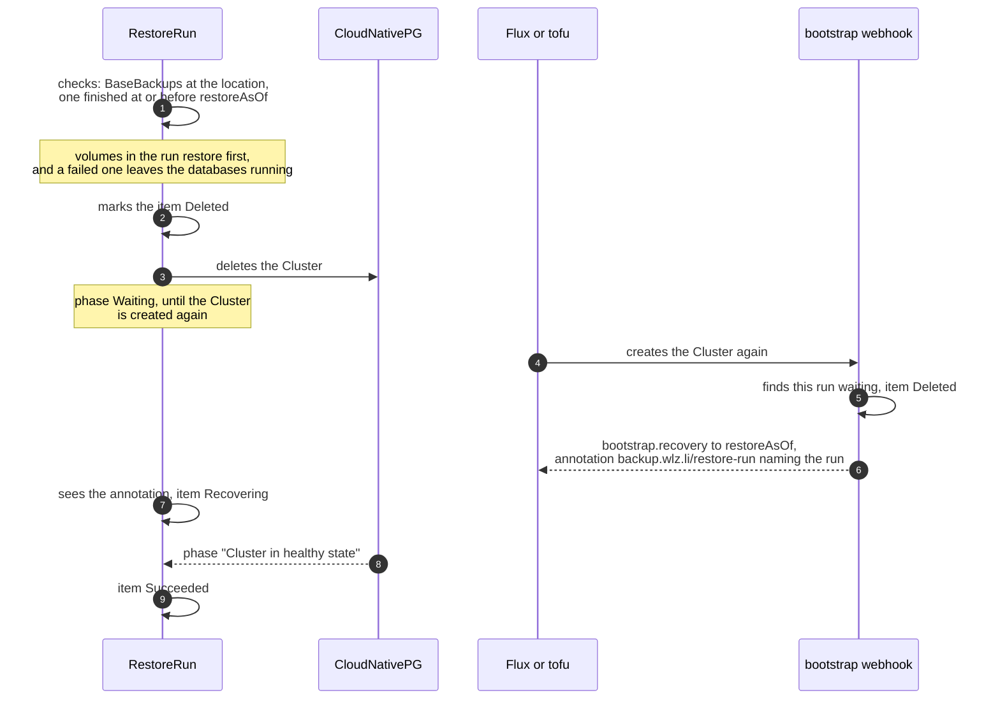
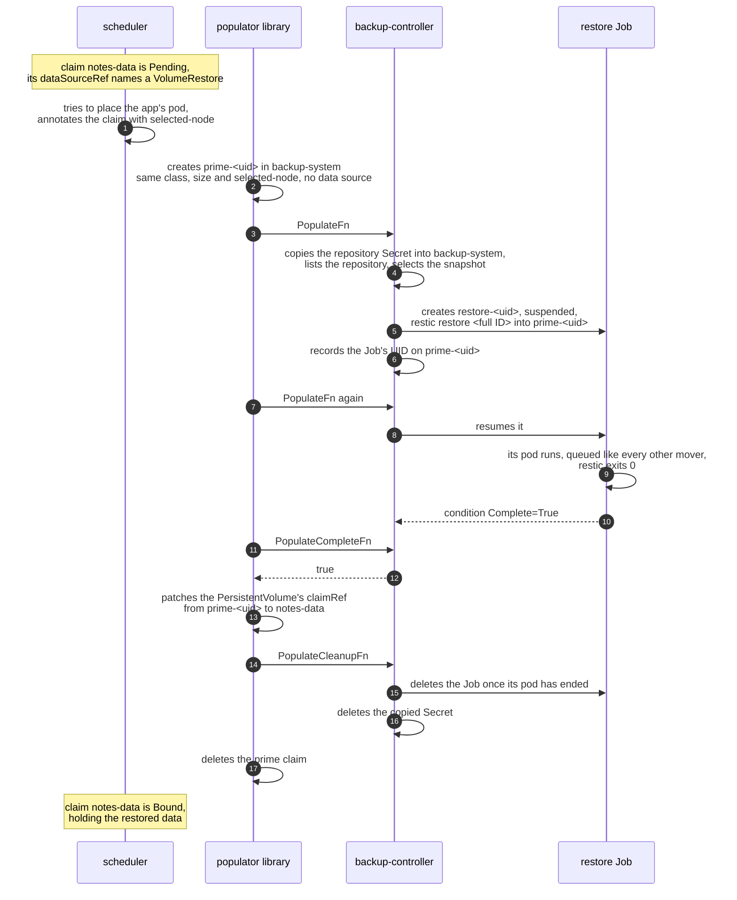

# Architecture

## Three parts in one binary

| Part | Package | Acts on |
| --- | --- | --- |
| the populator | internal/populator, on lib-volume-populator | a claim whose `dataSourceRef` names a VolumeRestore, while it is Pending |
| the run manager | internal/runs, on controller-runtime | BackupRun and RestoreRun objects, and the scheduler that creates a BackupRun at each tick of a Namespace's `backup.wlz.li/schedule`. The run manager also runs the populator's orphan reconciler from internal/populator. This reconciler releases a deleted claim whose VolumeRestore is gone |
| the bootstrap webhook | internal/bootstrap | a CloudNativePG Cluster on CREATE, and a recovered one on UPDATE |

internal/restorejob builds, reads and stops the restore Job that the
populator and a RestoreRun both create
([How the restore Job is built](#how-the-restore-job-is-built)).
internal/restic reads the snapshots of a repository for three uses: the
restore checks, the populator's choice of snapshot and the snapshot of each
BackupRun. internal/restic also rewrites the snapshots of a quiesced run.

The Databases section below covers the database side of all three parts. The
sections after it are about the populator. The volume runs are in
[namespace-backups.md](namespace-backups.md).

## Objects the controller writes

In the app's namespace:

| Object | Written by | Lifetime |
| --- | --- | --- |
| BackupRun `scheduled-<yyyymmdd-hhmm>` | the scheduler, once per tick | deleted 30 days after it finishes |
| Kueue Workload, one per run, named in the run's `status.workload` | each BackupRun, which also writes its `PodsReady` condition | deleted when the run ends |
| ReplicationSource named after each claim marked `backup.wlz.li/enabled` | each BackupRun, owned by the claim and labelled `app.kubernetes.io/managed-by: backup-controller` | stays, and goes with the claim. A failed mover leaves it in place, and VolSync keeps retrying |
| CloudNativePG Backup `<cluster>-<suffix>` | each BackupRun, one per Cluster marked `backup.wlz.li/enabled` | stays, as CloudNativePG's backup record |
| restore Job `restore-<run uid>-<item index>`, with the run as its controller | a RestoreRun that restores a volume: in place, or with `claim:` and `into:`, or with `repository:` and `into:`. The run creates the Job suspended. The run resumes the Job after the run's status records it | the run stops and deletes the Job after the item's end is in the run's status. If the run never recorded a Job, the garbage collector deletes that Job when the run goes |
| Lease `backup-controller-claim-<claim uid>` and `backup-controller-repo-<secret uid>` | a run, immediately before it creates its ReplicationSource trigger or restore Job for an item | the run releases the Lease after two conditions are true. The item's end is in the run's status. No pod of its stopped restore Job can still write. Another run takes over the Lease when its holder is gone or finished |
| Lease `backup-controller-quiesce` in the run's namespace | a run, before it records the plan that stops the workloads of a BackupRun with `all: true`, or of a RestoreRun that lists `quiesce` | the run releases the Lease after the run's stored status shows the workloads back. Another run takes over the Lease when its holder finished, is gone or gave the workloads back |
| a scratch claim named by `into:` | a RestoreRun with `into:`, owned by the run. The claim carries no data source, and the run's restore Job fills it | deleted with the RestoreRun, the claim's dataset included |

In the controller's namespace, three objects exist for each claim that the
populator fills:

- a copy of the repository Secret, which is gone when the fill ends.
- the restore Job `restore-<claim uid>`, which is gone when the fill ends.
- the prime claim, which the library creates and hands over.

The Job names the prime claim as its owner. Thus, if the populator lost track
of a Job, the garbage collector deletes that Job after the library deletes the
prime. If someone deletes the claim after its VolumeRestore, the orphan
reconciler stops the Job and deletes the other two objects
([A claim whose VolumeRestore is gone](#a-claim-whose-volumerestore-is-gone)).

On objects the controller does not own:

| Object | Write | When |
| --- | --- | --- |
| Deployment or StatefulSet marked `backup.wlz.li/quiesce` | the replica count to 0, then back to the recorded value, through the `scale` subresource. The run reads the Scale, then sends an update without a resourceVersion. This update changes only `spec.replicas` (internal/quiesce/stop.go) | during a BackupRun with `all: true` |
| Deployment or StatefulSet a RestoreRun's `quiesce` lists | the same | from the RestoreRun's start until the run restores its volumes and deletes its databases |
| the workload's Flux Kustomization | `spec.suspend` on, then off, only when the run found it running and its `status.inventory` lists the workload | the same as its workload |
| a snapshot in the volume's restic repository | a new snapshot file at the run's `restartedAt`, tagged `quiesced`, replacing the one the mover wrote, under a lock file in locks/ | after the mover of a BackupRun that stopped workloads |
| a new CloudNativePG Cluster | `bootstrap` swapped for `recovery`, an `externalClusters` entry, the `cnpg.io/skipEmptyWalArchiveCheck` annotation, and `backup.wlz.li/restore-run` when a run waits for it | on CREATE, in the webhook |
| a recovered Cluster | the `initdb` a GitOps tool applies again, dropped | on UPDATE, in the webhook |
| a Cluster in a database RestoreRun | deleted, so that its owner creates it again and the webhook recovers it | when the restore starts |
| a claim that the populator fills | the library's `backup.wlz.li` annotations and finalizer | while the fill runs |
| the prime claim `prime-<claim uid>` | the annotation `backup.wlz.li/restore-job-uid` with the UID of its restore Job, through a merge patch that carries the prime's UID | when the populator creates the Job. The populator resumes only the Job this annotation names |
| a claim with a deletion in progress, whose VolumeRestore is gone | the orphan reconciler removes the library's finalizer `backup.wlz.li/populate-target-protection`, and writes its WaitingForMover and DataSourceGone events | once no pod of the claim's restore Jobs can still write, and its Secret copy and prime claim are gone |
| the VolumeRestore a claim fills from | the finalizer `backup.wlz.li/volume-populator` | while its `status.claims` lists a claim. The populator adds the finalizer on its first call for a claim. The library makes that call after the claim's prime claim is bound |

A backup and a restore of one claim or repository never run at the same
time. Each run acquires a `coordination.k8s.io` Lease for the claim and one for
the repository. The run does this before it triggers its backup mover or
creates its restore Job. If two runs reach that moment together, the API server
admits exactly one of them. A run that finds a Lease held waits with reason
SourceBusy.
[namespace-backups.md](namespace-backups.md#one-mover-at-a-time) has the
messages and the takeover rule.

Two runs also never stop the workloads of one namespace at the same time.
Before a run records a stop plan, it acquires the namespace's Lease
`backup-controller-quiesce` in the same way. The run holds the Lease until its
stored status shows every workload back and every Kustomization resumed. A
second run waits while the app runs. The second run records its plan only after
the first run gave the workloads back. Before a run acquires the Lease, it also
waits for a RestoreRun that deleted a Cluster and did not yet see it created
again.
[namespace-backups.md](namespace-backups.md#one-quiesce-at-a-time) has the
messages and the release rule.

The controller's BackupRuns and RestoreRuns carry a finalizer. The finalizer
releases all that a run changed when the run fails, times out or is deleted.

The sources that the controller writes make VolSync create the clone claim
`volsync-<claim>-src`, the restic cache claims and the backup mover Jobs. Those
are VolSync's objects. The restore Jobs are the controller's own objects. The
cache claim of the pod of each restore Job is an ephemeral volume that goes
with the pod.

## Databases

The controller moves no database byte. The barman-cloud plugin archives WAL and
writes base backups. The controller asks the plugin for a base backup, reads
what the plugin wrote, and decides how a new Cluster bootstraps. The controller
reads CloudNativePG objects as unstructured, so it carries no dependency on
CloudNativePG's Go module.

### Where a database's backups are

Every database operation starts by finding the archive. `bootstrap.Archiver`
reads the `barman-cloud.cloudnative-pg.io` entries in the Cluster's
`spec.plugins` with the rules of plugin-barman-cloud 0.15.0:

| Value | Where Archiver reads it |
| --- | --- |
| the store | `barmanObjectName` of the last entry, enabled or not |
| the server name | the Cluster's name, replaced by `serverName` of each enabled entry that sets it, also by an empty value. The last such entry wins |

A Cluster with no enabled entry, or with an empty store, archives nowhere, and
every database operation leaves it alone. `isWALArchiver` does not change the
result, because CloudNativePG gives each WAL segment to every loaded plugin
that can archive.
[compatibility.md](compatibility.md#plugin-barman-cloud-0150-and-barman-3200)
has the source lines.

`bootstrap.ResolveLocation` then turns the store's name into an S3 location:

| Read | From | Becomes |
| --- | --- | --- |
| the ObjectStore | the Cluster's namespace, by `barmanObjectName` | |
| `spec.configuration.destinationPath` | `s3://prod-cluster-backup-cnpg/canary-namespace-backup` | bucket `prod-cluster-backup-cnpg`, and the prefix `canary-namespace-backup/canary-namespace-backup-pg` after `ResolveLocation` appends the server name |
| `spec.configuration.endpointURL` | `https://…` or `http://…`. A bare host, with or without a port, reads as HTTPS | the S3 endpoint |
| `s3Credentials.accessKeyId`, `secretAccessKey` | the Secret and keys they name | the key pair |
| `endpointCA`, when present | the Secret and key it names | a PEM bundle added to the image's public roots |

`bootstrap.S3Prober` reads that location with the minio client, in two ways:

| Method | Caller | Reads |
| --- | --- | --- |
| Survey | the webhook | lists `<prefix>/base/` with the `/` delimiter, one entry per backup directory. Then it reads the `backup.info` files newest first, with eight GETs in flight. It stops at the first DONE backup. If there is a target, it stops at the first DONE backup that finished by the target. When it stops, it starts no more GETs and waits for the GETs in flight to finish, so that no GET of it reaches the store after it returned. When `base/` holds no directory, it lists one key under `<prefix>/` to learn whether the prefix is empty |
| BaseBackups | the RestoreRun checks | the same listing and parallel reads without the early stop. It keeps every backup whose `status` is `DONE` and orders them by `end_time` |

Both methods count a directory with no `backup.info` as not DONE, as barman
does. barman names the directory of each backup by its start time. Thus a sort
of the IDs as strings sorts them by time. In a healthy store, the newest backup
has the status DONE, or STARTED while a backup runs. barman-cloud writes no
`backup_id` into backup.info, so the ID is the directory's name, such as
`20260924T221544`.

If its context ends before it has an answer, Survey returns an error that
carries its counts. This is also true during a listing. minio-go ends a
listing without an error item when the context ends. Thus Survey checks the
context after each listing, and an expired budget never reads as an empty
prefix.

The S3 credential in the ObjectStore's Secret needs two permissions:

- `s3:ListBucket` on `<prefix>/`, the whole server prefix.
- `s3:GetObject` on `<prefix>/base/*/backup.info`.

The barman-cloud plugin already lists `<prefix>/wals/` with the same
credential for its empty-archive check. Thus a store that archives has the
permission, unless a policy allows the listing on narrower prefixes only. If
the store refuses a listing, the webhook's answer ends in
`(HTTP 403 AccessDenied)`.

### A base backup

A run with `database:` or `all: true` has one item per enabled Cluster. For
each, it:

1. skips the Cluster when it carries `cnpg.io/hibernation: "on"`. The reason
   is that CloudNativePG fails a Backup of a hibernated Cluster, and the Backup
   stays failed after the Cluster wakes.
2. creates a CloudNativePG Backup named `<cluster>-<first 8 characters of the
   run's UID>`, with `method: plugin` and `pluginConfiguration.name:
   barman-cloud.cloudnative-pg.io`, labelled
   `app.kubernetes.io/managed-by: backup-controller`. The name comes from the
   run, so a restarted controller finds the Backup it made.
3. reads the Backup's `status.phase` on every reconcile. It marks the item
   Succeeded on `completed`, or Failed with `status.error` on `failed`.

The Backup stays after the run, as CloudNativePG's record of the base backup.
The plugin's retention window decides when the plugin deletes the backup
itself.

### A database restore


```mermaid
sequenceDiagram
    autonumber
    participant run as RestoreRun
    participant cnpg as CloudNativePG
    participant owner as Flux or tofu
    participant hook as bootstrap webhook

    run->>run: checks: BaseBackups at the location,<br/>one finished at or before restoreAsOf
    Note over run: volumes in the run restore first,<br/>and a failed one leaves the databases running
    run->>run: marks the item Deleted
    run->>cnpg: deletes the Cluster
    Note over run: phase Waiting, until the Cluster<br/>is created again
    owner->>hook: creates the Cluster again
    hook->>hook: finds this run waiting, item Deleted
    hook-->>owner: bootstrap.recovery to restoreAsOf,<br/>annotation backup.wlz.li/restore-run naming the run
    run->>run: sees the annotation, item Recovering
    cnpg-->>run: phase "Cluster in healthy state"
    run->>run: item Succeeded
```

The run marks the item Deleted before it deletes the Cluster. The reason is
that the webhook recovers a Cluster for a run only when that run's item says
Deleted. The same status write records the old Cluster's UID in
`status.items[].clusterUID`. The delete carries that UID as a precondition.
Thus the delete never reaches a Cluster of the same name that someone created
after the run read it.

While the item says Deleted, the run sorts the Cluster it finds by name:

| Cluster found | What the run does |
| --- | --- |
| none, or one with a deletion in progress | waits |
| the UID in `clusterUID`, carrying `backup.wlz.li/bootstrap: initdb` or declaring its own bootstrap method | marks the item Skipped and never deletes it |
| the UID in `clusterUID` | deletes it again: the old Cluster, which a failed delete or a controller restart after the mark did not reach |
| another UID, with `backup.wlz.li/restore-run` naming the run | marks the item Recovering |
| any other Cluster | fails the item and leaves the Cluster alone. The failure names the cause: the Cluster archives nowhere, another run recovered it, or the webhook did not mark it |

The UID settles what the annotation alone cannot settle. The webhook's
`backup.wlz.li/restore-run` stays on a recovered Cluster permanently. Thus a
run created again under the same name would also find the annotation on the
old Cluster, and would take the old database for its recovery.

A run deletes only the Cluster that it recorded. If a Cluster comes back
without that run's recovery, the run reports it and leaves it alone. An item
without a `clusterUID` comes from a run that found no Cluster at its start. The
run also reports and leaves alone every Cluster that such an item finds.
[namespace-backups.md](namespace-backups.md#a-database-restore) has those
messages. If someone deletes a recovered Cluster before it becomes healthy,
the item fails.

### A Cluster being created

The webhook's checks run in this order:

1. An update goes to the recovered-Cluster handler below, and any other
   operation but a create passes. A dry-run create passes unchanged.
2. The webhook gives the rest of the create a 10-second budget.
3. A Cluster that archives nowhere passes unchanged.
4. ResolveLocation reads the ObjectStore and its Secrets. A failure refuses
   the Cluster.
5. The shared-archive check lists every Cluster and every ObjectStore once,
   reads none of their Secrets, and refuses the Cluster when another one
   archives to the same bucket and prefix. A failed list refuses it too.
6. A Cluster carrying `backup.wlz.li/bootstrap: initdb` and declaring no other
   bootstrap method gets a Survey without a target. It passes unchanged when
   the listing finds no WAL under `<prefix>/wals/`. The webhook refuses it
   when WAL is there.
7. The webhook looks for a RestoreRun that waits for this Cluster. A Cluster
   that declares a bootstrap method other than `initdb` passes unchanged. If a
   run waits for it, the webhook refuses it.
8. The target comes from the run or from `backup.wlz.li/restore-as-of`. A
   target that does not parse refuses the Cluster.
9. Survey reads the store. A complete backup (its `backup.info` has
   `begin_time` and `end_time`), by the target when there is one, leads to the
   recovery patch below. Without such a backup, the result is one of these:
   - If a run or the annotation asks for a recovery, the webhook refuses the
     Cluster. If a complete backup exists but finished too late, the refusal
     names the oldest complete backup.
   - If the listing finds WAL under `<prefix>/wals/`, the webhook refuses the
     Cluster.
   - If the ObjectStore status records a completed backup for the serverName,
     the webhook refuses the Cluster.
   - Otherwise the Cluster passes unchanged and starts empty.

If the budget ends during a Kubernetes read in steps 4, 5 or 7, the webhook
answers HTTP 500 and names the step. If the budget ends during a Survey, the
webhook refuses the Cluster with the counts that Survey read.
[restores.md](restores.md) has what each outcome does and the text of each
refusal.

A Cluster it recovers gets, in one patch:

| Field | Value |
| --- | --- |
| `spec.bootstrap.recovery` | `source: backup-controller`, `recoveryTarget.targetTime` when there is a target, and the `database`, `owner` and `secret` its `initdb` named |
| `spec.bootstrap.initdb` | removed |
| `spec.externalClusters` | an entry `backup-controller` naming the same plugin, `barmanObjectName` and `serverName` |
| `cnpg.io/skipEmptyWalArchiveCheck` | `enabled`, so the database archives into the prefix it recovered from |
| `backup.wlz.li/restore-run` | the run's name, when a RestoreRun waits for it |

The webhook must carry `database` and `owner` over. CloudNativePG sets a
recovery's database and owner to `app` by default. Without them, a Cluster
created with database `canary` would come back with its data in `canary`, an
empty `app` beside it, and the `<cluster>-app` Secret that points at the empty
one.

On UPDATE of a Cluster whose stored recovery has `source: backup-controller`,
the webhook drops the `initdb` that a GitOps tool applies again from its
source. Without this, CloudNativePG would refuse the `initdb` as a second
bootstrap method.

## Process, probes and rollout

One pod runs all three parts. The populator library runs in the main
goroutine. Beside it, a controller-runtime manager runs the run reconcilers,
the scheduler, the populator's orphan reconciler and the webhook server. The
container listens on four ports:

| Port | Flag | Serves |
| --- | --- | --- |
| 8080 | `--metrics-addr` | the populator library's metrics |
| 8081 | `--runs-metrics-addr` | the scheduler's metrics, listed in [namespace-backups.md](namespace-backups.md#metrics) |
| 8082 | `--health-probe-addr` | `/healthz` and `/readyz` for the manager. `0` serves neither |
| 9443 | `--webhook-port` | the bootstrap webhook, when `--webhook-cert-dir` has a value |

The Deployment probes `/healthz` every 20 seconds for liveness and `/readyz`
every 5 seconds for readiness. `/healthz` answers while the manager runs.
`/readyz` answers after the webhook server accepts TLS connections. Thus the
webhook's Service sends the API server to a pod only after that pod can answer
an admission request. A controller started without a webhook is ready at once.
The populator library serves no health route of its own.

The manager can stop while the process must still run, for example because
its caches failed to sync. Then the process logs `the run controllers
stopped, exiting so the pod restarts` and exits with status 1. Without the
manager, the pod would serve no webhook and reconcile no run. The webhook's
`failurePolicy: Fail` would then refuse every Cluster create on the cluster
until someone restarted the pod. The exit makes the kubelet restart the container. The
populator library ends the process itself when it fails, through
`klog.Fatalf`.

The controller runs without leader election, so two pods would run two
schedulers and two sets of reconcilers. The Deployment's strategy is Recreate.
A rollout stops the old pod before it starts the new one. The default
RollingUpdate would run both pods for a while.

The client of the run manager and the client of the populator callbacks carry
no client-side rate limit. Each Cluster create makes several reads: the
ObjectStore and its Secrets, one list of every Cluster, one list of every
ObjectStore and the RestoreRun list. A cluster rebuild creates every Cluster
at the same time. client-go's default is 5 requests a second, with a burst of
10. At that rate, a few dozen creates would wait in a queue past the webhook's
10-second budget, and each create would fail closed. The API server's priority
and fairness divides the requests.

[packaging.md](packaging.md#rbac-the-controller-needs) lists the ClusterRole
of the process, rule by rule.

## How the restore Job is built

Every volume restore writes through one Job shape. restorejob.Build
(internal/restorejob/spec.go:219) is the only code that writes this shape. A
RestoreRun creates one Job per volume item in the run's namespace. The
populator creates one Job per claim in the controller's namespace, beside the
prime claim.

| Part | Value |
| --- | --- |
| name | `restore-<run uid>-<item index>` for a RestoreRun, `restore-<claim uid>` for the populator. At most 48 characters, so never shortened |
| owner | a controller reference to the RestoreRun, or a plain reference to the populator's prime claim |
| labels, on the Job and its pod | `app.kubernetes.io/managed-by: backup-controller`, `app.kubernetes.io/component: restore`, and `backup.wlz.li/restore-run: <run uid>` or `backup.wlz.li/restore-claim: <claim uid>`. The pod also carries the settings' `moverPodLabels`, under these, which win over a key they share. The Job itself never carries the Kueue queue label |
| annotations | `backup.wlz.li/snapshot-id` (the full ID), `backup.wlz.li/claim` and `backup.wlz.li/repository` |
| spec | `suspend: true` at creation, one pod at a time, `backoffLimit: 3` and `podReplacementPolicy: Failed`. A pod failure policy fails the Job immediately on exit code 10 or 12. The policy ignores a pod with the condition DisruptionTarget or TerminationTarget |
| init container `unlock` | `restic unlock`, with the cache and /tmp mounted and no data |
| container `restore` | `restic restore <full ID> --target /data --include-xattr user.* --retry-lock 30m --delete`, run directly as the container's command with no shell |
| image | the controller's `--restore-image`, for both containers |
| environment | `envFrom` the repository Secret, then `RESTIC_CACHE_DIR=/cache` |
| security | no ServiceAccount token. The settings' `moverSecurityContext` is the pod security context. Each container drops ALL capabilities, allows no privilege escalation and has a read-only root filesystem. In a namespace annotated `volsync.backube/privileged-movers: "true"` it also runs as user 0 with DAC_OVERRIDE, CHOWN and FOWNER, the way VolSync's restic mover does there |
| volumes | the claim at /data. A generic ephemeral volume at /cache of `cacheStorageClassName` and `cacheCapacity`, 1Gi without one. An in-memory emptyDir at /tmp |
| termination message | `FallbackToLogsOnError` on both containers, so a failed container's status carries the tail of restic's log |

The owner creates the Job suspended and records its name and UID. A
RestoreRun records them in the item's `job` and `jobUID`. The populator
records them in the prime claim's `backup.wlz.li/restore-job-uid` annotation.
A later pass reads that record back from the API server. Only then does it
resume the Job, with a merge patch that carries the Job's UID.

The API server can answer a create with an error but store the Job anyway.
Then no record names that Job. The Job stays suspended with no pod until its
owner stops it or the garbage collector deletes it.

restorejob.Read (internal/restorejob/read.go:120) decides on the Job's
terminal conditions alone. `Complete=True` is success and `Failed=True` is
failure. The Job controller adds either condition only after every pod of the
Job ended. The exit code, restic's last lines and the reason a pod waits come
from the pods whose `batch.kubernetes.io/controller-uid` label is the Job's
UID. The controller shows these to a person, and they decide nothing.

restorejob.Stop (internal/restorejob/stop.go:125) does these steps:

1. It suspends a running Job.
2. It waits until one read shows all of these:
   - `spec.suspend` is true.
   - the Job has the condition `Suspended=True`.
   - every pod with the Job's UID ended, or was never scheduled and has a
     deletion in progress.
3. It deletes the Job with Foreground propagation and a UID precondition.

Stop reads the Job and the pods directly from the API server, never from a
cache. If the Job is gone, Stop goes directly to the pod check on its recorded
UID. Thus, if someone deleted a Job with Orphan propagation, the pods of that
Job still hold the stop until they end.

The ClusterRole grants create and delete on every Job in the cluster, which
RBAC cannot narrow to these Jobs. The admission policy
[in packaging.md](packaging.md#admission-policy-on-the-restore-jobs) lets the
controller's ServiceAccount create and change only Jobs of this shape, and
[decisions.md](decisions.md#narrow-the-jobs-grant-with-an-admission-policy)
records what it leaves open.

## Built on lib-volume-populator

The controller is a thin provider on top of
[kubernetes-csi/lib-volume-populator](https://github.com/kubernetes-csi/lib-volume-populator).
The library owns all of the PersistentVolumeClaim steps. Its
`populator-machinery` package exposes two entry points:

```go
func RunController(masterURL, kubeconfig, imageName, httpEndpoint, metricsPath,
  namespace, prefix string, gk schema.GroupKind, gvr schema.GroupVersionResource,
  mountPath, devicePath string, populatorArgs func(bool, *unstructured.Unstructured)
  ([]string, error))

func RunControllerWithConfig(vpcfg VolumePopulatorConfig)
```

Use the second. `VolumePopulatorConfig` accepts either a `PodConfig` or a
`ProviderFunctionConfig`. This controller passes a `ProviderFunctionConfig`.
Thus the library runs no pod of ours, and the three callbacks below do the
work:

| Callback | This controller's implementation |
| --- | --- |
| `PopulateFn` | copy the repository Secret and select the snapshot. Create the suspended restore Job `restore-<claim uid>`, which writes the snapshot into the prime claim. Record the Job's UID on the prime claim, and resume the Job on a later call. For a failed Job, record RestoreFailed, stop the Job, and replace it after it is gone |
| `PopulateCompleteFn` | report true in one of two cases. In the first case, the claim's restore Job is for this prime claim and has `Complete=True`. In the second case, there is no Job, the repository holds no snapshot at all, and nothing pins the claim |
| `PopulateCleanupFn` | stop every restore Job of the claim, and return an error until none of its pods can still write. Then delete the Secret copy |

Each callback receives `PopulatorParams`, which carries the Kubernetes client,
the original claim, the prime claim, the storage class, the data source object
and an event recorder. go.mod pins the library at
`github.com/kubernetes-csi/lib-volume-populator/v3 v3.3.0`.

## What the library does around those three calls

| Step | Detail |
| --- | --- |
| watches | claims whose `dataSourceRef` names the GroupKind the controller registers |
| creates the prime claim | named `prime-<uid of the app's claim>`, in the controller's own namespace, with the app claim's access modes, resources and storage class, and no data source |
| carries the node over | when the storage class binds WaitForFirstConsumer, the library copies the app claim's `volume.kubernetes.io/selected-node` annotation onto the prime claim |
| calls the provider | `PopulateFn`, then `PopulateCompleteFn` until it returns true |
| rebinds | after the prime claim is bound, the library patches the PersistentVolume's `claimRef` to name the app's claim. It records the data source reference in an annotation on the PV |
| cleans up | deletes the prime claim and calls `PopulateCleanupFn` |

A mutator hook can change the prime claim before the library creates it. This
controller does not need one today.
[decisions.md](decisions.md#keep-the-prime-claims-storage-class-and-node)
records why the prime claim keeps the app claim's storage class.

## Which node the volume lands on

The copied `selected-node` annotation is the reason this design also settles a
placement problem the snapshot path has.

With VolSync's populator, two independent decisions pick a worker. The
scheduler picks one for the app's pod and writes it onto the claim. VolSync's
restore mover goes where its own affinity puts it, and VolSync makes the clone
wherever the mover ran. The two can disagree, and then the volume wins. The
pod has to run on the worker that holds the volume, whatever node the
scheduler first chose. The walzen test cluster
showed exactly that on 2026-09-13: a claim annotated
`selected-node: talos-unraid-w-2` whose PersistentVolume sat on
talos-unraid-w-1.

Here the library carries the annotation onto the prime claim. Thus the volume
is on the worker that the scheduler chose for the pod. The restore Job's pod
sets no node selector, so it follows the volume that it has to mount. The scheduler picks
the worker once, and the volume and the restore both go to it.

## Object flow for one restore

This is the path of a new claim whose `dataSourceRef` names a VolumeRestore.
A RestoreRun writes into a claim with the same restore Job, in the app's
namespace and without the populator library.
[restores.md](restores.md#submitting-a-restore) has those runs.


```mermaid
sequenceDiagram
    autonumber
    participant sched as scheduler
    participant lib as populator library
    participant ctl as backup-controller
    participant job as restore Job

    Note over sched: claim notes-data is Pending,<br/>its dataSourceRef names a VolumeRestore
    sched->>sched: tries to place the app's pod,<br/>annotates the claim with selected-node

    lib->>lib: creates prime-<uid> in backup-system<br/>same class, size and selected-node, no data source
    lib->>ctl: PopulateFn
    ctl->>ctl: copies the repository Secret into backup-system,<br/>lists the repository, selects the snapshot
    ctl->>job: creates restore-<uid>, suspended,<br/>restic restore <full ID> into prime-<uid>
    ctl->>ctl: records the Job's UID on prime-<uid>

    lib->>ctl: PopulateFn again
    ctl->>job: resumes it
    job->>job: its pod runs, queued like every other mover,<br/>restic exits 0
    job-->>ctl: condition Complete=True

    lib->>ctl: PopulateCompleteFn
    ctl-->>lib: true

    lib->>lib: patches the PersistentVolume's claimRef<br/>from prime-<uid> to notes-data
    lib->>ctl: PopulateCleanupFn
    ctl->>job: deletes the Job once its pod has ended
    ctl->>ctl: deletes the copied Secret
    lib->>lib: deletes the prime claim

    Note over sched: claim notes-data is Bound,<br/>holding the restored data
```

Every object the restore created is gone by the end. What survives is the
PersistentVolume, now bound to the app's claim, and it is an ordinary dataset
with no origin.

The populator resumes the Job only while two conditions are true. The app
claim has no volume yet, and the prime's PersistentVolume still names the
prime in its `claimRef`. The populator reads both directly from the API
server. Thus a Job never starts to write into a volume that the library
already handed to the app.

## Why the repository Secret is copied

The restore Job reads the repository Secret through `envFrom`, which names a
Secret in the Job's own namespace. The prime claim lives in the controller's
namespace, so the Job does too, and the app's repository Secret is in the
app's namespace.

The controller copies that Secret into its own namespace for the length of the
restore, and deletes it in `PopulateCleanupFn`. The name of the copy comes from
the claim's UID, so two restores never collide. The copy exists only while a
restore runs. A RestoreRun's Job runs in the app's namespace and reads the
app's Secret where it is.

[decisions.md](decisions.md) records the alternative that the design
considered: a repository Secret that lives in the controller's namespace from
the start.

## Failure behaviour

| Case | What happens |
| --- | --- |
| the repository has no snapshot at all yet, a first deploy | the populator creates no restore Job, and `PopulateCompleteFn` returns true. The library hands the empty volume to the app's claim, so the app starts on an empty volume. This matches what the snapshot path does. A wrong repository prefix in the Secret looks the same |
| the repository holds snapshots, and none has a VolSync mover's layout (host `volsync`, paths `[/data]`) | the VolumeRestore reports NoBackupInReach and names the snapshots it passed over. The populator creates no Job, and the claim stays Pending. Nothing binds empty |
| the restore fails | the Job ends with `Failed=True`. The populator records RestoreFailed on the VolumeRestore, with `claim <name>: ` and restic's exit code and last lines. It stops the Job. After the Job is gone, it selects the snapshot again and creates a new Job. The library never hands the volume over in that time. The app's claim stays Pending and its pod does not start. RestoreFailed also stays while other claims of the same VolumeRestore restore or finish |
| the API server refuses the restore Job, such as the admission policy refusing the VolumeRestore's `moverSecurityContext` | the VolumeRestore reports RestoreJobRefused with the API server's answer, the claim stays Pending, and every sync tries again |
| the Job's pod never starts, such as an image it cannot pull | prod's Kueue evicts it after five minutes, and the Job starts another. The claim stays Pending, and the VolumeRestore's Restoring message shows why the pod waits |
| the claim's `restoreAsOf` is older than every snapshot | the VolumeRestore reports NoBackupInReach, and the controller creates no restore Job. The claim stays Pending until someone changes the moment or creates the claim again without it |
| the VolumeRestore is deleted mid-restore | its finalizer `backup.wlz.li/volume-populator` keeps it Terminating until every claim that it fills finished or is gone. Before that, the cleanup of each claim stops that claim's restore Job and deletes its Secret copy |
| the VolumeRestore is deleted before a claim's prime claim binds | the VolumeRestore carries no finalizer yet and goes immediately. The claim stays Pending. After someone deletes the claim, the orphan reconciler cleans up after it ([A claim whose VolumeRestore is gone](#a-claim-whose-volumerestore-is-gone)) |
| the controller is down | claims stay Pending. Nothing is half-written and no app starts on an empty volume. A process whose run manager stopped exits, so the kubelet restarts it |
| the controller restarts mid-restore | the Job's name comes from the app claim's UID, so the next call finds it and creates no second one |
| the library creates the prime claim again under the same name | the populator stops and replaces a Job whose owner reference names the earlier prime. That Job's Complete condition never completes the new prime |
| two apps restore at once | each Job's pod carries the backup queue label from `moverPodLabels`, so Kueue admits them the way it admits every other mover |
| the app's claim is deleted while the app runs | the pod loses its volume and stays down until the refill completes, which is what deleting a claim already does |
| the app's claim is deleted mid-restore | the library calls `PopulateCleanupFn`, which stops the Job before the prime claim goes, and removes the Secret copy |
| the app's claim is deleted after its VolumeRestore | the library can no longer clean up, and the orphan reconciler does the cleanup ([A claim whose VolumeRestore is gone](#a-claim-whose-volumerestore-is-gone)) |

Every class on the walzen cluster binds WaitForFirstConsumer. There, the
provisioner provisions the prime claim for the node that the library copied
onto it. On a class that binds Immediate, the PersistentVolume controller
could bind the prime to an Available static PersistentVolume of that class.
The Job's `--delete` would then remove the other files of that volume. The
declared setup has no such volume.

## A claim whose VolumeRestore is gone

The library gets a claim's VolumeRestore before anything else. When the
VolumeRestore is gone, the library records an event and returns. It never
gets to the branch that cleans up after a deleted claim (lib-volume-populator
v3.3.0 populator-machinery/controller.go:661-671). A claim deleted after its
VolumeRestore would keep the library's finalizer
`backup.wlz.li/populate-target-protection` and stay Terminating. Its prime
claim, Secret copy and restore Job would stay in the controller's
namespace.

A VolumeRestore can go before its claim in two ways:

- The VolumeRestore carries no `backup.wlz.li/volume-populator` finalizer until
  the claim's prime claim is bound. Thus a delete before then removes it
  immediately.
- Later, the cleanup that empties `status.claims` removes that finalizer. The
  library deletes the prime claim and its own finalizer only after that. If a
  deletion of the VolumeRestore is in progress, the VolumeRestore goes between
  the two. If the library's delete of the prime claim fails there, its next
  pass finds no VolumeRestore.

The orphan reconciler finishes the cleanup. It runs in the run manager and logs
as populator-orphans. It acts on a claim with all of these properties:

- A deletion of the claim is in progress.
- The claim still carries `backup.wlz.li/populate-target-protection`.
- The claim's `dataSourceRef` names a VolumeRestore in its own namespace.
- The claim is outside the controller's namespace.

The run manager queues such a claim each time the claim changes. It also
queues the claims that name a VolumeRestore when someone deletes that
VolumeRestore. After a start, the manager's first list sends every claim
through the reconciler. Thus the reconciler releases a claim that was stuck
before the controller started, on that start.

For such a claim, the reconciler reads the claim and its VolumeRestore with
uncached reads from the API server. It continues only when the API server
answers NotFound for the VolumeRestore. If the VolumeRestore exists in any
state, the reconciler leaves the claim to the library. Then, in the
controller's namespace, the reconciler:

1. stops every restore Job of the claim the way `PopulateCleanupFn` does. It
   stops the Job `restore-<uid>` by its own UID. Then it lists the pods
   labelled `backup.wlz.li/restore-claim: <uid>`, and waits for the pods of
   every Job UID they carry. This finds the pods of a Job that someone deleted,
   and of every earlier Job of the claim. While one of them may still write,
   the reconciler records WaitingForMover on the claim and looks again 30
   seconds later.
2. deletes the Secret copy and the prime claim `prime-<uid>`.
3. removes `backup.wlz.li/populate-target-protection` from the claim, and
   records DataSourceGone.

The reconciler deletes the Secret copy and the prime claim only after no pod
of the claim's restore Jobs can still write. A restore stopped half way may
still write to the prime. Its restic holds a lock in the repository until
restic ends. Every delete accepts an object that is already gone, and the
finalizer goes last. Thus a pass that fails part way starts again from step 1
and finishes on a later pass.

| Event | Type | Message |
| --- | --- | --- |
| WaitingForMover | Normal | `VolumeRestore <name> is gone; <what the stop waits for> before the cleanup goes on`, where the wait reads, for example, `restore Job restore-<uid>: waiting for pods restore-<uid>-x7k2p to end` or `restore Job restore-<uid>: waiting for the Job controller to suspend it` |
| DataSourceGone | Warning | `VolumeRestore <name> was deleted before the populator finished with this claim; stopped restore Job restore-<uid>, deleted Secret copy <secret> and prime claim prime-<uid> in <namespace>, and removed finalizer backup.wlz.li/populate-target-protection` |

To follow one claim's cleanup, read the claim's events:

```
kubectl -n <app namespace> events --for pvc/<claim>
```

### Known limitation: a prime claim left behind

The library reads claims from its own informer caches. The orphan reconciler
does not use these caches. The caches can still show the deleted claim but no
longer show its prime claim. Then the library can create `prime-<uid>` again
after the reconciler deleted it. No component deletes that prime claim afterwards.
It stays in the controller's namespace, unbound, with no claim left to hand a
volume to. This is rare. The name of every prime claim comes from its own
claim's UID, so a left-behind one blocks no other restore.

A left-behind prime claim is a `prime-<uid>` whose `<uid>` matches no claim in
the cluster.

#### Step 1: List the prime claims whose claim is gone

```
primes=$(kubectl -n backup-system get pvc -o name | sed -n 's#^persistentvolumeclaim/prime-##p')
uids=$(kubectl get pvc -A -o jsonpath='{range .items[*]}{.metadata.uid}{"\n"}{end}')
for uid in $primes; do echo "$uids" | grep -qx "$uid" || echo "prime-$uid"; done
```

Replace backup-system with the controller's namespace. The commands list the
prime claims before the claims. Thus a claim created between the two commands
still has its UID in the second list.

Expected result: no output. Each name printed is a prime claim left behind.

#### Step 2: Delete each prime claim listed

```
kubectl -n backup-system delete pvc prime-<uid>
```

A prime claim of a restore still running has a claim with its UID, so step 1
never lists it.

## What runs where for one fill

| Object | Namespace | Lifetime |
| --- | --- | --- |
| the controller Deployment | the controller's namespace | always |
| the webhook Service, its cert-manager Issuer and Certificate, and the MutatingWebhookConfiguration | the controller's namespace, and cluster-scoped for the configuration | always |
| the VolumeRestore | the app's namespace | as long as the app declares it |
| the prime claim | the controller's namespace | one restore |
| the restore Job and its pod | the controller's namespace | one restore. The populator deletes it after its pod ended |
| the copied repository Secret | the controller's namespace | one restore |
| the restore pod's restic metadata cache claim | the controller's namespace | the life of the pod, as a generic ephemeral volume |
| the restored PersistentVolume | cluster-scoped | the life of the app's claim |
