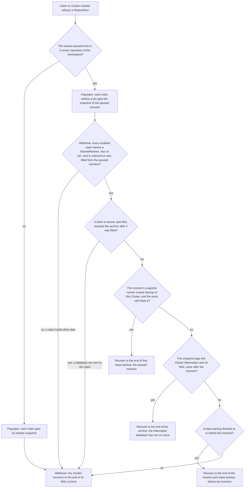
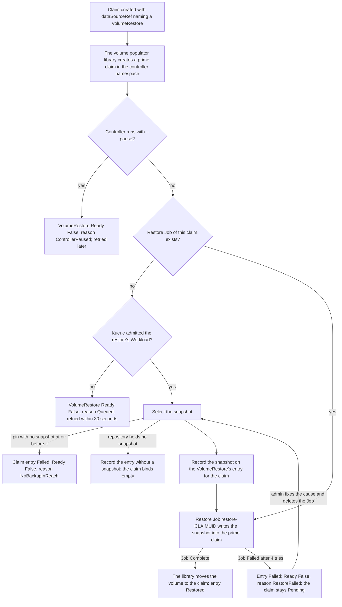
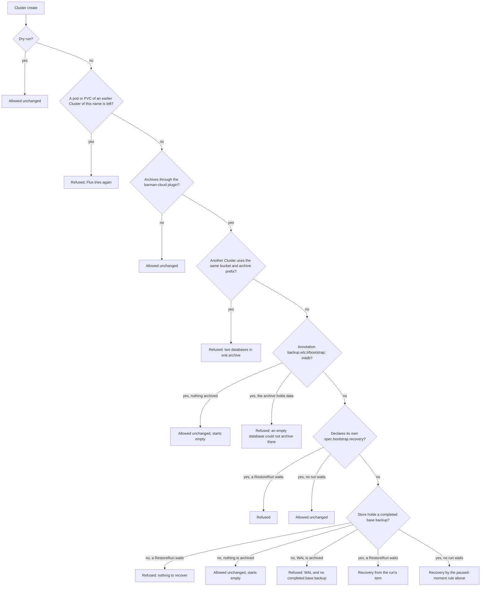

# Automatic restores

When a namespace is rebuilt, Flux applies its claims and its Clusters again,
and nobody creates a RestoreRun. Two parts of the controller bring the data
back on their own:

| Part | Acts on | Fills |
| --- | --- | --- |
| Populator | a new claim whose dataSourceRef names a VolumeRestore | the claim, from its restic repository |
| Webhook | a new Cluster, at its create | the Cluster's recovery from its archive |

A Cluster deleted by hand and created again by Flux goes through the same
webhook.

## Back to one moment when the namespace allows it

Both parts first look for the namespace's paused moment: the time of the
newest paused snapshot in the namespace, when every restic repository of the
namespace holds a paused snapshot of that time. A BackupRun with all: true
writes such a snapshot for every claim, with one time, while the app is
paused, and only when every database backup of the run completed
(docs/backups.md).

A namespace has no paused moment when one repository lacks the newest paused
time, even when an older time is common to all of them. That happens when a
claim held no files at the newest paused backup, so VolSync wrote no
snapshot, or when a VolumeRestore names a repository that no BackupRun writes
to any more. Going back to the older common time would bring every other
volume and the databases back further than their newest paused backup, so the
restore uses the newest backups.

The populator and the webhook read the same repositories, so they find the
same paused moment. The webhook counts a claim as coming back from the paused
moment when it names a VolumeRestore in its dataSourceRef, has no pin
(backup.wlz.li/restore-as-of on the claim or spec.restoreAsOf on the
VolumeRestore), and is either not bound yet, so the populator fills it from
the moment, or bound with a VolumeRestore entry that says the populator
filled it from the moment.

A claim filled from the moment still holds live data once a database has run
next to it. The WAL archive shows that: when WAL reached the archive after
the populator started to fill a bound claim, the Cluster recovers to the end
of its archive. So a Cluster deleted while its app runs keeps every row, and
a rebuild whose Cluster comes after its claims, in a later Kustomization or
after a failed first create, still comes back to the paused moment.

A Cluster that was hibernated during the paused backup got no base backup;
the snapshots name it in a hibernated/CLUSTER tag. A hibernated database
writes nothing, so when no WAL came after the moment, the end of its archive
is its state at the moment.

Whenever the claims come back from the paused moment, the database comes back
to that moment or to a base backup before it. One exception is left: when
retention has pruned every base backup at or before the moment, nothing older
is left to recover from, and the database comes back with its whole archive,
ahead of the volumes. That needs the paused backups of the namespace to fail
for longer than the barman retention, while the backup alert fires. In every
other case the claims hold live data or their newest snapshots, and the
database comes back with everything its archive holds.

## Populator

The populator selects the snapshot in this order:

| Condition | Snapshot |
| --- | --- |
| The claim carries backup.wlz.li/restore-as-of, else the VolumeRestore sets spec.restoreAsOf | the newest snapshot at or before that time |
| The namespace has a paused moment and this repository holds a snapshot of it | that snapshot |
| Otherwise | the newest snapshot |
| The repository holds no snapshot yet, as on a first deploy | none; the claim binds empty |

A failed restore is not tried again on its own, since the cause, such as a
wrong password or a forbidden security context, needs a fix first.
docs/operations.md gives the steps.

Before it reads the repository, the populator asks Kueue for one
backup-controller.wlz.li/run through the LocalQueue of the controller
namespace, the same quota the BackupRuns and RestoreRuns use
(docs/operations.md). A rebuild of many namespaces therefore fills a few
claims at a time, and the slot goes back once the restore Job ends.

The restore Job runs in the controller namespace with a copy of the repository
Secret, and uses the image from --restore-image. The VolumeRestore's
moverPodLabels go onto the Job, except Kueue's queue label.

The VolumeRestore keeps one entry per claim in status.claims, with the
snapshot ID and time, and the phase Restoring, Restored or Failed. The entry
stays after the restore, because the webhook reads it.

## Webhook

The webhook answers every create and update of a CloudNativePG Cluster. It
reads the Cluster's ObjectStore to learn where the Cluster archives: the
bucket and the archive prefix, destinationPath's prefix followed by the
server name (the Cluster's name, unless the plugin sets serverName).

A RestoreRun waits for a Cluster when its item for that Cluster has the phase
Deleted. The recovery the webhook writes replaces spec.bootstrap.initdb with
spec.bootstrap.recovery, keeps initdb's database, owner and secret, adds an
externalClusters entry named backup-controller that reads through the
barman-cloud plugin, and sets cnpg.io/skipEmptyWalArchiveCheck: enabled so the
recovered database archives into the prefix it recovered from.

An update of a Cluster that the webhook recovered drops spec.bootstrap.initdb,
so Flux can apply its manifest, which still declares initdb, without
CloudNativePG refusing two bootstrap methods.

### Refusals

| Refusal | Why | What to do |
| --- | --- | --- |
| A pod or PVC of an earlier Cluster of the same name still exists | A Cluster deleted a moment ago shuts its instance down, and the garbage collector deletes its PVCs after it; a new Cluster would meet them | Nothing: Flux applies the Cluster again on its next reconcile, and the create goes through once they are gone |
| Another Cluster archives to the same bucket and prefix | Two databases in one archive mix their WAL, and neither can be recovered | Give the new Cluster another destinationPath or serverName |
| WAL and no completed base backup | There is nothing to recover from, and the barman-cloud plugin refuses to archive a new database over WAL | Delete everything under the archive prefix, or give the Cluster another serverName |
| A RestoreRun waits and the store holds no completed base backup | The run asks for a recovery there is nothing for | Delete the RestoreRun |
| A RestoreRun waits and the Cluster declares its own recovery | Two recoveries for one Cluster | Remove the declared recovery, or delete the RestoreRun |
| backup.wlz.li/bootstrap: initdb over an archive that holds data | The barman-cloud plugin refuses to archive the new database there | Delete everything under the archive prefix, or give the Cluster another serverName |

Flux shows a refusal on the Kustomization that applies the Cluster, with the
webhook's message. The endpoint URL is not part of the shared-archive check:
two URLs can name the same S3 service, so the webhook compares only the bucket
and the prefix.
