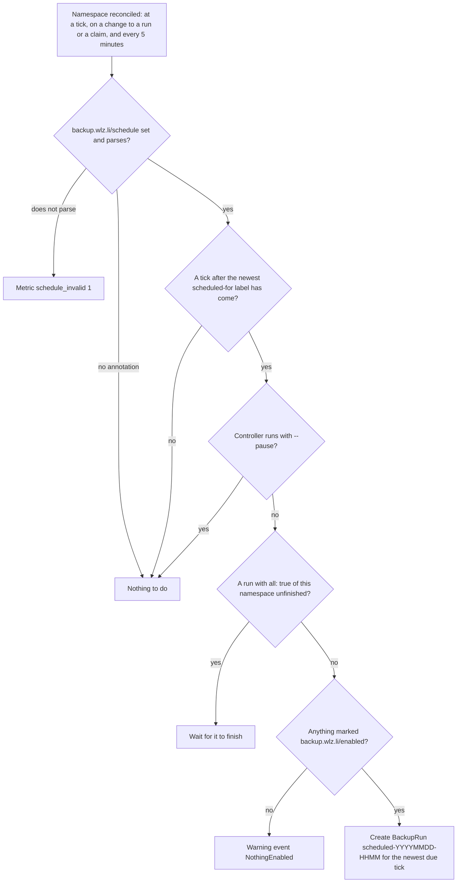
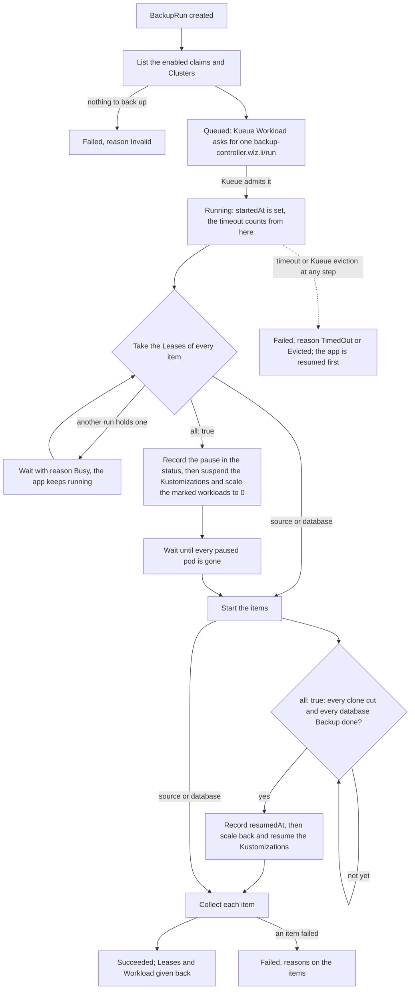

# Backups

The controller backs up two kinds of data in a namespace. A claim marked
backup.wlz.li/enabled: "true" goes into a restic repository through a VolSync
ReplicationSource. A CloudNativePG Cluster marked the same way gets a base
backup through the barman-cloud plugin; its WAL archive runs all the time,
independent of the controller.

A BackupRun is one backup. The scheduler creates one for each tick of a
namespace's schedule, and a user can create one by hand.

## Mark what to back up

| Object | Annotation | Value |
| --- | --- | --- |
| Claim | backup.wlz.li/enabled | "true" |
| Claim | backup.wlz.li/retain-last, retain-hourly, retain-daily, retain-weekly, retain-monthly, retain-yearly | a positive count |
| Claim | backup.wlz.li/retain-within | a restic span such as 30d or 1y6m |
| Cluster | backup.wlz.li/enabled | "true" |
| Deployment or StatefulSet | backup.wlz.li/pause-during-backup | "true" |
| Namespace | backup.wlz.li/schedule | a cron schedule, see below |
| Namespace | backup.wlz.li/timeout | a Go duration such as 2h, see below |
| Namespace | backup.wlz.li/prune-interval-days | a positive count of days, 1 when unset |

A claim needs at least one retain annotation. Without one, restic would keep
every snapshot for good, so the backup of that claim fails with a message that
names the claim. A claim also needs a VolumeRestore: the one its
dataSourceRef names, or else the one with the claim's own name. The
VolumeRestore names the Secret of the claim's restic repository.

## Schedule

The namespace annotation backup.wlz.li/schedule holds a standard five-field
cron schedule. It may start with a CRON_TZ= prefix, such as
`CRON_TZ=Europe/Berlin 0 3 * * *`.

At each tick the scheduler creates a BackupRun named
scheduled-YYYYMMDD-HHMM (the tick in UTC) with all: true and a time to live
of 30 days. The label backup.wlz.li/scheduled-for on the run holds the tick
in Unix seconds, and the scheduler reads its progress back from those labels,
so a restarted controller continues where it stopped.

| Situation | What the scheduler does |
| --- | --- |
| Several ticks passed while the controller was down or paused | One run, for the newest tick |
| The previous run with all: true has not finished | The tick waits until it finishes |
| Nothing in the namespace carries backup.wlz.li/enabled: "true" | No run; a Warning event NothingEnabled on the Namespace |
| The schedule does not parse | No run; the metric backup_controller_namespace_schedule_invalid is 1 |
| The controller runs with --pause | No run until the pause ends |

## One BackupRun from start to end

The run items are one ReplicationSource per claim and one Cluster per
database. Each item records its own phase, and the run's Ready condition gives
the reason the run waits or ended.

### Admission and timeout

Every run first creates a Kueue Workload in the namespace's LocalQueue. The
Workload asks for one backup-controller.wlz.li/run, and the ClusterQueue gives
that resource a quota of 5, so at most five runs work at once in the whole
cluster. The rest wait in the queue with reason Queued and do no work: the
controller reads no repository and pauses no app before admission.

The timeout counts from admission. It is the run's spec.timeout, else the
namespace's backup.wlz.li/timeout, else 1 hour. A run past its timeout
resumes the app, ends Failed with reason TimedOut, and gives its Leases and
its Workload back.

### Leases

Before a run acts, it holds one coordination.k8s.io Lease for each object it
works on, in the run's namespace:

| Lease | Object |
| --- | --- |
| backup-claim-CLAIM | the claim |
| backup-repository-SECRET | the restic repository that the Secret names |
| backup-cluster-CLUSTER | the Cluster |
| backup-pause | the workloads the run pauses |

A run whose Lease another run holds waits with reason Busy, and its Ready
message names the Lease and the holder, such as "Lease backup-claim-data is
held by RestoreRun/back/UID". A backup and a restore of the same claim
therefore take turns. A Lease whose holder no longer exists or has finished
goes to the next run that asks for it, so a deleted or crashed run never
blocks the object for good. Operations covers the rules in detail
(docs/operations.md).

## Pause the app during a backup

A run with all: true pauses every Deployment and StatefulSet in the namespace
that carries backup.wlz.li/pause-during-backup: "true". The pause keeps the
database from running ahead of the volume: while the app is stopped, nothing
writes to either.

1. The run records each workload's replica count and the Flux Kustomization
   that applies it in status.paused and status.suspendedKustomizations, and
   writes the status.
2. It suspends those Kustomizations, so Flux does not scale the workloads back
   up, and scales each workload to 0.
3. It waits until every pod of the paused workloads is gone.
4. It starts the items. VolSync cuts a clone of each claim and backs up the
   clone; CloudNativePG writes a base backup of each Cluster.
5. Once every clone is cut and every database Backup completed or failed, the
   run records status.resumedAt, writes the status, and scales each workload
   back to its recorded count and resumes the Kustomizations.

The run writes each step into its status before it acts, so a controller that
restarts in the middle applies the recorded pause again, or resumes from the
record. A Kustomization that was already suspended before the run stays
suspended afterwards.

The app stays paused until the database backups completed. The timeout is
the only limit on the pause: a run that times out or fails resumes the app
before it ends.

### What a paused backup records

Each volume's snapshot gets the time status.resumedAt and the tag paused. For
each database whose base backup completed while the app was paused, the
snapshot also gets the tag base-backup/CLUSTER=BACKUPID, such as
base-backup/db=20260928T093012. A synced restore and an automatic restore use
these tags to bring the database back to the same moment as the volume
(docs/restores.md, docs/automatic-restore.md).

A database Backup that completes after the run resumed the app gets no tag,
since its end holds writes from after the resume. A Cluster that is
hibernated gets no Backup; the snapshots carry hibernated/CLUSTER instead,
since a hibernated database writes nothing and the end of its archive holds
its state.

When a database Backup of the run fails, the volume snapshots keep the time
VolSync gave them and get no tag at all. A paused snapshot therefore always
comes with a base backup of every database the run backed up, and a restore
to the paused moment can bring each database to that moment. The namespace's
paused moment stays at the last run whose databases all completed.

## How the controller finds a volume's snapshot

The controller finds the snapshot from VolSync's status and the repository;
it never reads a mover's log.

1. The run writes its trigger into the ReplicationSource's
   spec.trigger.manual, and a new value into spec.restic.unlock, so the mover
   first removes a stale restic lock, such as one a killed mover left.
2. VolSync sets status.lastManualSync to the trigger, together with
   status.lastSyncTime and status.lastSyncDuration, when the sync completes.
3. The run lists the repository's snapshots and selects the newest one whose
   time lies between lastSyncTime minus lastSyncDuration and lastSyncTime. A
   sync with no snapshot in that window backed up an empty volume, and the
   item succeeds with empty: true.

A mover that fails never completes the sync. VolSync runs it again, up to 8
times, and then records the result Failed in status.latestMoverStatus. The
run then fails the item with a message that points at
`kubectl describe replicationsource CLAIM`.

## When a backup fails

| What happened | Run | Item | App |
| --- | --- | --- | --- |
| Nothing marked enabled, or a named claim or Cluster missing | Failed, Invalid | none | untouched |
| VolSync's mover failed 8 times | Failed | ReplicationSource Failed | resumed |
| The CloudNativePG Backup failed | Failed | Cluster Failed, with CloudNativePG's error | resumed |
| A ReplicationSource is still busy with an earlier trigger, run with all: true | waits with reason SourceBusy until the source is idle or the timeout passes | Pending | not paused yet |
| A ReplicationSource is still busy with an earlier trigger, run with source | Failed | ReplicationSource Failed, the message says how to clear it | untouched |
| The timeout passed | Failed, TimedOut | unfinished items Failed | resumed |
| Kueue evicted the Workload | Failed, Evicted | unfinished items Failed | resumed |

A failed run stays in the cluster until its time to live passes, and records a
Warning event. The alert on backup_controller_namespace_last_success_timestamp_seconds
fires when no run of the namespace succeeds in time (docs/operations.md).
