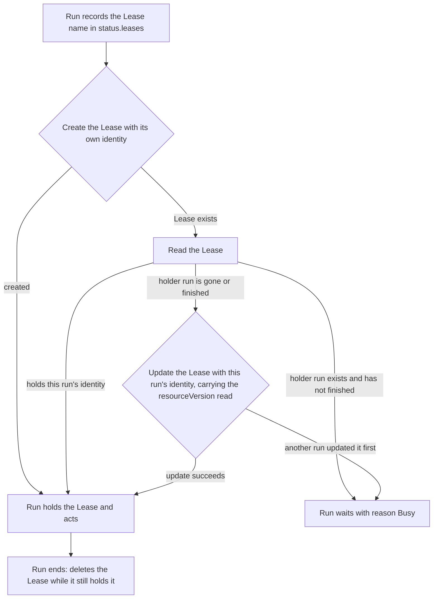
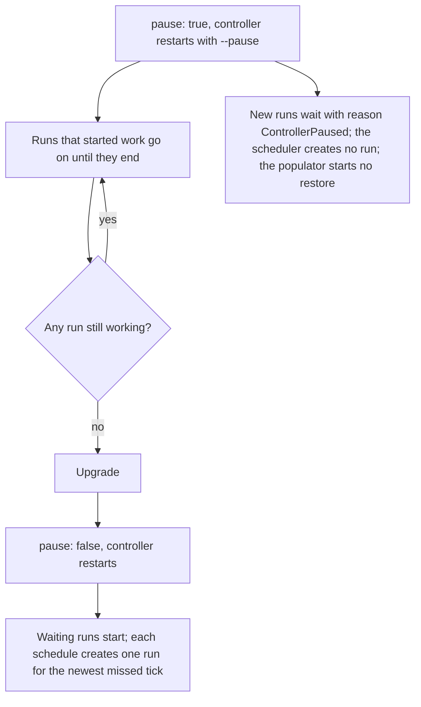

# Operations

This doc covers running the controller: how it limits its own load, how two
runs keep out of each other's way, how two replicas share the work, how to
pause it for an upgrade, and what to do when a run fails or hangs.

## Controller flags

| Flag | Default | Effect |
| --- | --- | --- |
| --restore-image | none, required | image of the restore Jobs; pass VolSync's mover image, whose restic wrote the repositories |
| --pause | false | new runs wait, runs that started work finish, the scheduler creates no run, the populator starts no restore |
| --leader-elect | false | the process runs its controllers only while it holds the Lease backup-controller in --namespace; deploy/ and the chart pass it |
| --namespace | backup-system | where the populator's prime claims and restore Jobs live |
| --webhook-cert-dir | none | directory with tls.crt and tls.key; empty serves no webhook |
| --webhook-port | 9443 | port of the admission webhook |
| --runs-metrics-addr | :8081 | listener of the run and schedule metrics, at /metrics |
| --metrics-addr, --metrics-path | :8080, /metrics | listener of the populator library's metrics |

The controller stops at startup when --restore-image is empty, since every
volume restore would fail later. It needs a memory limit of 512Mi.

## Load

One Kueue queue bounds all restic work the controller starts. Each of these
first creates a Kueue Workload that asks for one backup-controller.wlz.li/run,
and does nothing until Kueue admits it:

| Work | Workload in | Holds the slot until |
| --- | --- | --- |
| BackupRun | its namespace's LocalQueue | the run ends |
| RestoreRun | its namespace's LocalQueue | the run ends |
| Populator restore of a new claim | the LocalQueue of the controller namespace | its restore Job ends |

All these LocalQueues point at one ClusterQueue, which covers that resource:

```yaml
apiVersion: kueue.x-k8s.io/v1beta2
kind: ClusterQueue
metadata:
  name: backups
spec:
  namespaceSelector: {}
  resourceGroups:
    - coveredResources: [backup-controller.wlz.li/run]
      flavors:
        - name: default
          resources:
            - {name: backup-controller.wlz.li/run, nominalQuota: 5}
```

With a quota of 5, at most five runs and populator restores work at once,
however many namespaces reach their schedule in the same minute or are
rebuilt together. Work that waits for admission does nothing: a run shows
reason Queued and reads no repository, pauses no app and starts no mover; a
populator restore sets its VolumeRestore to reason Queued and reads no
repository. A run's timeout counts from admission, so time in the queue does
not count against it.

The ClusterQueue needs no pods quota. The runs' Workloads have no real pods,
and the populator's restore Jobs start only once their Workload is admitted,
so Kueue does not queue those Jobs a second time: the controller removes the
Kueue queue label from them.

Inside the controller, opening a restic repository is the expensive step:
restic derives each repository's key with scrypt, up to 60 MiB and 500 ms per
key. The controller keeps each repository's key after the first open, and
runs one scrypt at a time, so the webhook, which answers the API server
outside the queue, stays bounded too.

Work in a namespace without a LocalQueue waits, and its Ready message says
that the namespace has no Kueue LocalQueue. It starts once the LocalQueue
exists. A cluster that serves no Kueue keeps all work waiting the same way,
so nothing works outside the quota.

## Leases

A run holds a coordination.k8s.io Lease in its namespace for each object it
works on, before it acts on the object:

| Lease | Held while the run works on |
| --- | --- |
| backup-claim-CLAIM | the claim |
| backup-repository-SECRET | the restic repository the Secret names |
| backup-cluster-CLUSTER | the Cluster |
| backup-pause | the workloads the run pauses |



The Lease's spec.holderIdentity is KIND/NAME/UID of the run, such as
BackupRun/scheduled-20260928-0300/UID. The run records every Lease name in
status.leases before it creates the Lease, and deletes each Lease it still holds
when it ends.

| Situation | What happens |
| --- | --- |
| Another run holds the Lease | The run waits with reason Busy; its Ready message names the Lease and the holder |
| The holder run was deleted, or has finished | The next run that asks writes its own identity into the Lease |
| Two runs ask at the same moment | The API server lets one create or update succeed; the other waits |
| A Lease holds an identity this controller did not write | The run waits, the controller logs an error that names the Lease, and it never changes that Lease |

So a backup and a restore of one claim take turns, two restores of one
Cluster take turns, and a crashed or deleted run never blocks an object for
good.

## Replicas

deploy/ and the chart run two replicas with --leader-elect. Both serve the
admission webhook. Only the replica holding the Lease backup-controller in the
controller's namespace runs the BackupRun and RestoreRun controllers, the
scheduler and the populator:

| | Leader | Standby |
| --- | --- | --- |
| bootstrap webhook | answers | answers |
| BackupRun, RestoreRun, scheduler | run | wait for the Lease |
| populator, and its listener on :8080 | runs | not started |
| listener on :8081 | serves the schedule series | serves no schedule series |

The run Leases above tell runs apart by the run's identity, which says nothing
about the process. Two processes reconciling one run would both count as its
holder, so two replicas started without --leader-elect would both drive every
run. With the flag, only one process reconciles at a time.

| Event | What happens |
| --- | --- |
| the leader's pod is deleted or rolled | it stops the populator, then the manager releases the Lease, and the standby acquires it within a few seconds |
| the leader's node fails | the standby acquires the Lease once it expires, 15 seconds after the last renewal |
| the leader cannot renew the Lease | its manager stops and the process exits, so its populator never runs beside the new leader's |

Every state a run needs is in the API: its status, the run Leases, the
scheduled-for label on each scheduled BackupRun. A new leader reads all of it
on its first reconcile. Its only cold start is the restic key cache, so it runs
scrypt once for each repository it opens.

The webhook rejects a CloudNativePG Cluster create when no replica answers, by
design (deploy/webhook.yaml has the reason). With two replicas on different
nodes, one node failing leaves the webhook answering.

## Timeouts

| Run | Timeout, counted from admission |
| --- | --- |
| BackupRun | spec.timeout, else the namespace's backup.wlz.li/timeout, else 1 hour |
| RestoreRun | spec.timeout, 4 hours when omitted |

A run past its timeout resumes what it paused, deletes its restore Jobs,
releases its Leases and its Workload, and ends Failed with reason TimedOut.
The timeout is the only limit on how long an app stays paused.

## Pause the controller for an upgrade

Upgrade the controller, or a dependency it drives, while no run is working.



### Step 1: Start the controller with --pause

Set pause: true in the controller's terragrunt inputs and apply the unit. The
apply restarts the controller pod with --pause.

```
kubectl -n backup-system logs deploy/backup-controller | grep 'paused:'
```

Expected result: `paused: new runs wait, runs in progress finish`.

### Step 2: Wait until no run works

```
kubectl get backupruns,restoreruns -A -o json | jq -r '.items[] | select(.status.phase != "Succeeded" and .status.phase != "Failed") | select(.status.startedAt != null) | "\(.kind)\t\(.metadata.namespace)/\(.metadata.name)"'
```

Expected result: no output. A run listed here has started work; wait for it
and run the command again. Runs created during the pause wait with reason
ControllerPaused and are not listed, because they have not started.

### Step 3: Upgrade

Apply the upgrade of the controller or of the dependency.

### Step 4: End the pause

Set pause: false and apply the unit. The waiting runs start, and each
namespace schedule creates one run for the newest tick it missed.

## When a run fails or hangs

A failed run ends with phase Failed, a Ready reason, and a message on each
failed item. It records a Warning event, and it stays in the cluster until
spec.ttlSecondsAfterFinished passes (30 days for a scheduled run).

```
kubectl -n NAMESPACE get backuprun NAME -o jsonpath='{.status.items}'
```

| Reason or item message | Meaning | What to do |
| --- | --- | --- |
| Busy, for a long time | The run named in the message holds a Lease and works | Look at that run; it ends by itself or at its timeout |
| SourceBusy | A ReplicationSource is still retrying the backup of an earlier trigger | Fix what `kubectl describe replicationsource CLAIM` shows, or delete the ReplicationSource while no mover pod of it runs; the next backup writes it again |
| VolSync's mover failed to back up the volume | The mover failed 8 times | `kubectl describe replicationsource CLAIM`; wrong repository password, full bucket or unreachable S3 are the usual causes |
| restic failed to restore snapshot | The restore Job failed | `kubectl -n NAMESPACE logs job/NAME` |
| NoBackupInReach | No snapshot or base backup reaches the run's moment | Pick another moment; the run changed nothing |
| WaitingForRecreate, for a long time | The run deleted the Cluster and its owner has not created it again | Check the Flux Kustomization that applies the Cluster |
| TimedOut | The run did not finish in time | The app was resumed; the items say which step was left |

### Retry a failed populator restore

A claim whose restore failed stays Pending, and its VolumeRestore reports
Ready False with reason RestoreFailed. The restore Job keeps its pods, so its
log is there to read.

1. Read why the restore failed. CLAIMUID is the claim's metadata.uid; the
   VolumeRestore's Ready message names the Job too.

   ```
   kubectl -n backup-system logs job/restore-CLAIMUID
   ```

2. Fix what the log shows, in the app's manifests or the repository Secret,
   and let Flux apply it.

3. Delete the failed Job.

   ```
   kubectl -n backup-system delete job restore-CLAIMUID
   ```

   Expected result: the populator selects the snapshot again and starts a
   new Job, and the claim binds once the Job completes.

A restore Job waits up to 5 minutes for another process's lock on the
repository, and tries 4 times, so a short S3 outage or a concurrent retime
does not fail it.

### A mover left by a failed run

A BackupRun that fails or times out while VolSync's mover still works leaves
the mover running: VolSync finishes a sync it started, whatever happens to its
trigger. The run releases its Leases, and the next run of the claim waits with
reason SourceBusy until that sync ends. The mover reads a clone of the claim
and holds restic's lock while it writes, so a restore of the claim or a
restore from the repository in the meantime reads a consistent repository.
The controller does not stop the mover: stopping it mid-write leaves a stale
lock in the repository.

### Metrics and alerts

| Metric | Meaning |
| --- | --- |
| backup_controller_namespace_last_success_timestamp_seconds | when the namespace's newest run with all: true succeeded, else when the namespace was created |
| backup_controller_namespace_schedule_interval_seconds | seconds between two ticks of the schedule |
| backup_controller_namespace_next_run_timestamp_seconds | the schedule's first tick after now |
| backup_controller_namespace_schedule_info | 1, with the schedule annotation as written in the schedule label, as in `schedule="0 3 * * 0"` |
| backup_controller_namespace_schedule_invalid | 1 while the schedule annotation does not parse |
| backup_controller_restore_pinned | 1 for each claim with backup.wlz.li/restore-as-of |

An alert that compares the last success with the schedule interval fires for a
namespace whose backups fail, hang or stop, since the timestamp then stops
moving.

### Delete a run

Deleting a BackupRun or RestoreRun that has not finished makes the controller
resume what the run paused, delete its restore Jobs, and release its Leases and
its Workload before the run goes away. A database restore whose Cluster was
already deleted leaves the Cluster to its owner, and the webhook then
recovers it as a Cluster created without a RestoreRun
(docs/automatic-restore.md).
