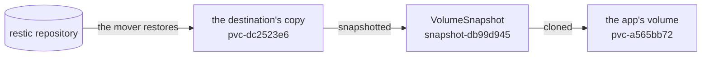
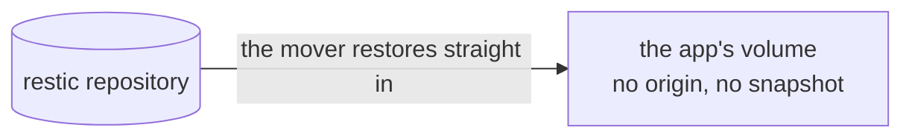
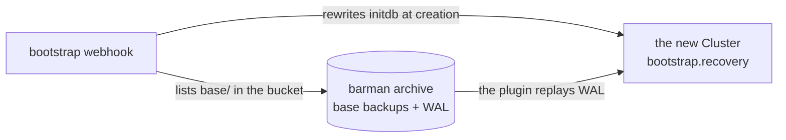

# Overview

backup-controller brings an app's data back when its objects are created again,
with no procedure anyone has to remember. A new PersistentVolumeClaim fills from
its restic repository without a ZFS clone behind it, and a new CloudNativePG
Cluster recovers from its barman archive. This page covers both of those; the
scheduled and on-demand runs the backups come from are in
[namespace-backups.md](namespace-backups.md).

## The mechanism it replaces

A claim that names a ReplicationDestination in `dataSourceRef` is filled by
VolSync's volume populator:

```yaml
spec:
  dataSourceRef:
    apiGroup: volsync.backube
    kind: ReplicationDestination
    name: notes-data
```

VolSync restores the last backup into a volume of its own, snapshots it,
publishes the snapshot as `status.latestImage`, and the populator provisions the
app's claim from that snapshot. Its documentation states the constraint that
makes this the only path: "The ReplicationDestination used with the volume
populator must use a copyMethod of `Snapshot`."

On a copy-on-write filesystem the last step is a clone. Read it from the driver
on a running cluster:

```
kubectl get zfsvolume -A -o custom-columns='NAME:.metadata.name,SNAP:.spec.snapname'
```

```
NAME                                       SNAP
pvc-a565bb72-…   (the app's claim)         pvc-dc2523e6-…@snapshot-db99d945-…
pvc-dc2523e6-…   (the destination's copy)  <none>
```

The app's dataset is a clone of a snapshot of the destination's dataset, and
those are the real names from that cluster:



Three consequences follow, and all three last for the life of the claim:

| | |
| --- | --- |
| the snapshot cannot be destroyed | ZFS answers `snapshot has dependent clones` |
| the destination's dataset cannot be destroyed | its snapshot is in use |
| every block the app overwrites is kept twice | the current version in the clone, the previous one in the snapshot |

The third grows with writes rather than with time. A volume that appends barely
notices. A volume that rewrites itself reaches a full second copy and stays
there.

## What this controller does instead

It implements the same Kubernetes mechanism, the volume populator, with a
different fill step.

```yaml
spec:
  dataSourceRef:
    apiGroup: backup.wlz.li
    kind: VolumeRestore
    name: notes-data
```

For a claim naming a VolumeRestore, the controller:

1. creates an ordinary empty volume with the claim's storage class, size and
   selected node, and no data source of any kind
2. creates a VolSync ReplicationDestination with `copyMethod: Direct` pointed at
   that volume, so VolSync's mover restores restic straight into it
3. waits for the mover to report the restore complete
4. deletes the ReplicationDestination
5. hands the filled volume to the app's claim, which binds



Two objects exist while that runs, the empty volume and the destination, and
both are gone when it ends. What stays on the pool is the one dataset the app
asked for.

The app's dataset is then a plain dataset with no origin. Nothing is pinned,
nothing drifts, and the destination keeps no permanent copy.

## What an app keeps

| Property | Before | After |
| --- | --- | --- |
| delete the claim and it refills | yes | yes |
| the pod cannot start on an empty volume | yes, the claim stays unbound | yes, the same |
| a rebuilt cluster comes back filled | yes | yes |
| the restore runs in the cluster's backup queue | yes | yes, the destination carries the same label |
| repository credentials live only where VolSync reads them | yes | yes |
| steady-state disk | one shared set of blocks, plus everything overwritten since | one dataset |

## Databases

### Why a database needs it

A CloudNativePG Cluster reads `spec.bootstrap` once, when it is created. A
Cluster whose manifest says `initdb`, which is every Cluster an app ships, comes
up as an empty database whenever it is created again: after a cluster rebuild,
after its namespace was destroyed, after someone deleted it. It reports healthy,
and its full archive sits untouched in the bucket beside it. Nobody is told.

Neither kustomize nor OpenTofu can choose `recovery` in its place, because both
render the manifest before anything has read the object store. An admission
webhook runs after the store can be read and before the Cluster is stored, which
is the one moment the choice can be made.

### What the controller does

| When | What happens |
| --- | --- |
| a Cluster is created | the bootstrap webhook finds the Cluster's archive through its ObjectStore. With a base backup there, it rewrites `initdb` to a `recovery` from that archive: to the end of the WAL, or to the moment a waiting RestoreRun or the Cluster's `backup.wlz.li/restore-as-of` names |
| a namespace run, scheduled or on demand | a CloudNativePG Backup through the barman-cloud plugin for each Cluster marked `backup.wlz.li/enabled`, skipping a hibernated one |
| a RestoreRun with `database:` or `all: true` | the run checks a base backup reaches the moment, deletes the Cluster, and waits; the webhook recovers the Cluster Flux or tofu creates again |

The webhook refuses a Cluster in three cases, and each refusal names what it
found: another database already archives to the same bucket and prefix, the
moment asked for comes before the oldest base backup, or the object store cannot
be read. The last one matters most during a rebuild, when the controller may
still be starting: letting the Cluster through would create the empty database
this page exists to prevent.



### What a database keeps

| Property | Before | After |
| --- | --- | --- |
| delete the Cluster and it comes back with its data | no, it comes back empty | yes, recovered to the end of its archive |
| a rebuilt cluster comes back with its databases | no | yes |
| restore to a moment | a git commit swapping the bootstrap, reverted afterwards | a RestoreRun with `restoreAsOf` |
| WAL archiving and base backup storage | the barman-cloud plugin | the same plugin, unchanged |
| start a database empty on purpose | the default | the annotation `backup.wlz.li/bootstrap: initdb` |

[restores.md](restores.md) has every case the webhook decides, and
[architecture.md](architecture.md#databases) how the controller resolves a
Cluster's archive, reads its base backups and follows a restore.

## What it needs from the cluster

| Requirement | Why |
| --- | --- |
| Kubernetes with `AnyVolumeDataSource` available | a claim has to be able to name a custom kind in `dataSourceRef`; the walzen test cluster runs v1.36.3 |
| VolSync installed, with its ReplicationSource and ReplicationDestination CRDs | the controller writes one source per backed-up claim and one destination per restore, and never moves data itself |
| a CSI driver whose ordinary provisioning makes an independent volume | true of zfs-localpv, which only clones when the source is a snapshot |
| a restic repository Secret in the app's namespace | named by the claim's VolumeRestore, and read by every mover of that volume |
| Kueue, for namespace runs | each BackupRun is admitted as one Workload through the namespace's LocalQueue |
| CloudNativePG and the barman-cloud plugin, for databases | the base backups the runs request, and the archives the webhook recovers from |
| cert-manager, for the webhook | its serving certificate and the CA injected into the webhook configuration |

[packaging.md](packaging.md) says what the install brings with it.

## Where the boundary sits

For a fill, the controller creates a ReplicationDestination, polls its status,
and deletes it. It reads and writes PersistentVolumeClaims and patches one
PersistentVolume per restore. It runs no mover and mounts no volume. If a
restore fails, the failure is VolSync's and is reported in VolSync's objects and
events.

It does read repositories, and writes one kind of file in them. The restore
checks and each BackupRun's `snapshotTime` read the restic repository's own
files through the S3 client in internal/restic, with the password and keys from
the repository Secret, and a BackupRun that stopped workloads writes each of its
snapshots again at the moment it restarted them. Copying that Secret for a fill
is why the ClusterRole can read Secrets. [decisions.md](decisions.md) records
both choices.

For a database, the controller creates CloudNativePG Backup objects, deletes a
Cluster for a restore, and patches a Cluster's bootstrap as it is created. It
reads the ObjectStore, the Secret holding its keys and the archive's
`backup.info` files, and writes nothing to the bucket. The barman-cloud plugin
archives every WAL segment, writes every base backup and replays every recovery;
a failed base backup or recovery is reported on the plugin's and
CloudNativePG's own objects.

[architecture.md](architecture.md) has the object flow, the library this is
built on, and every object the controller writes.
