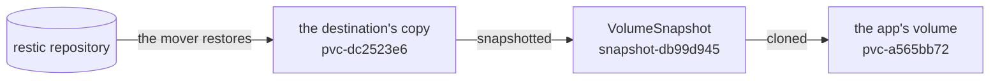
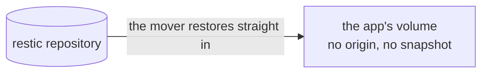

# Overview

backup-controller fills a new PersistentVolumeClaim from a restic repository
without leaving a ZFS clone behind.

## The mechanism it replaces

A claim that names a ReplicationDestination in `dataSourceRef` is filled by
VolSync's volume populator:

```yaml
spec:
  dataSourceRef:
    apiGroup: volsync.backube
    kind: ReplicationDestination
    name: notes-data
```

VolSync restores the last backup into a volume of its own, snapshots it,
publishes the snapshot as `status.latestImage`, and the populator provisions the
app's claim from that snapshot. Its documentation states the constraint that
makes this the only path: "The ReplicationDestination used with the volume
populator must use a copyMethod of `Snapshot`."

On a copy-on-write filesystem the last step is a clone. Read it from the driver
on a running cluster:

```
kubectl get zfsvolume -A -o custom-columns='NAME:.metadata.name,SNAP:.spec.snapname'
```

```
NAME                                       SNAP
pvc-a565bb72-…   (the app's claim)         pvc-dc2523e6-…@snapshot-db99d945-…
pvc-dc2523e6-…   (the destination's copy)  <none>
```

The app's dataset is a clone of a snapshot of the destination's dataset, and
those are the real names from that cluster:



Three consequences follow, and all three last for the life of the claim:

| | |
| --- | --- |
| the snapshot cannot be destroyed | ZFS answers `snapshot has dependent clones` |
| the destination's dataset cannot be destroyed | its snapshot is in use |
| every block the app overwrites is kept twice | the current version in the clone, the previous one in the snapshot |

The third grows with writes rather than with time. A volume that appends barely
notices. A volume that rewrites itself reaches a full second copy and stays
there.

## What this controller does instead

It implements the same Kubernetes mechanism, the volume populator, with a
different fill step.

```yaml
spec:
  dataSourceRef:
    apiGroup: backup.wlz.li
    kind: VolumeRestore
    name: notes-data
```

For a claim naming a VolumeRestore, the controller:

1. creates an ordinary empty volume with the claim's storage class, size and
   selected node, and no data source of any kind
2. creates a VolSync ReplicationDestination with `copyMethod: Direct` pointed at
   that volume, so VolSync's mover restores restic straight into it
3. waits for the mover to report the restore complete
4. deletes the ReplicationDestination
5. hands the filled volume to the app's claim, which binds



Two objects exist while that runs, the empty volume and the destination, and
both are gone when it ends. What stays on the pool is the one dataset the app
asked for.

The app's dataset is then a plain dataset with no origin. Nothing is pinned,
nothing drifts, and the destination keeps no permanent copy.

## What an app keeps

| Property | Before | After |
| --- | --- | --- |
| delete the claim and it refills | yes | yes |
| the pod cannot start on an empty volume | yes, the claim stays unbound | yes, the same |
| a rebuilt cluster comes back filled | yes | yes |
| the restore runs in the cluster's backup queue | yes | yes, the destination carries the same label |
| repository credentials live only where VolSync reads them | yes | yes |
| steady-state disk | one shared set of blocks, plus everything overwritten since | one dataset |

## What it needs from the cluster

| Requirement | Why |
| --- | --- |
| Kubernetes with `AnyVolumeDataSource` available | a claim has to be able to name a custom kind in `dataSourceRef`; the walzen test cluster runs v1.36.3 |
| VolSync installed, with its ReplicationDestination CRD | the controller creates one per restore and never moves data itself |
| a CSI driver whose ordinary provisioning makes an independent volume | true of zfs-localpv, which only clones when the source is a snapshot |
| a restic repository Secret in the app's namespace | the same Secret VolSync's ReplicationSource already uses |

## Where the boundary sits

The controller creates a ReplicationDestination, polls its status, and deletes
it. It reads and writes PersistentVolumeClaims and patches one PersistentVolume
per restore. It runs no mover, mounts no volume, holds no repository
credentials, and contains no restic code. If a restore fails, the failure is
VolSync's and is reported in VolSync's objects and events.

[architecture.md](architecture.md) has the object flow and the library this is
built on.
