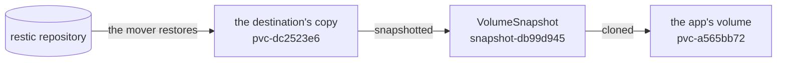
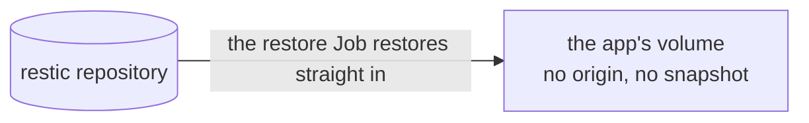
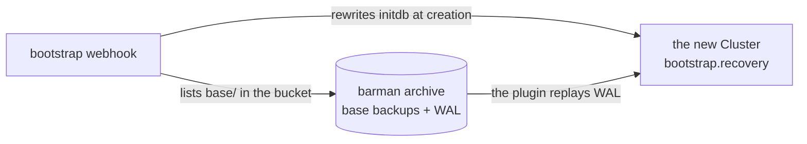

# Overview

backup-controller brings the data of an app back when something creates its
objects again. No person must remember a procedure for this. A new
PersistentVolumeClaim fills from its restic repository without a ZFS clone
behind it. A new CloudNativePG Cluster recovers from its barman archive. This
page covers these two cases. [namespace-backups.md](namespace-backups.md)
covers the scheduled and on-demand runs that make the backups.

## What VolSync's populator does

The volume populator of VolSync fills a claim that names a
ReplicationDestination in `dataSourceRef`:

```yaml
spec:
  dataSourceRef:
    apiGroup: volsync.backube
    kind: ReplicationDestination
    name: notes-data
```

The populator does these steps:

1. VolSync restores the last backup into a volume of its own.
2. VolSync makes a snapshot of that volume.
3. VolSync publishes the snapshot as `status.latestImage`.
4. The populator provisions the claim of the app from that snapshot.

The documentation of VolSync gives the constraint that makes this the only
path: "The ReplicationDestination used with the volume populator must use a
copyMethod of `Snapshot`."

On a copy-on-write filesystem, the last step is a clone. Read it from the
driver on a running cluster:

```
kubectl get zfsvolume -A -o custom-columns='NAME:.metadata.name,SNAP:.spec.snapname'
```

```
NAME                                       SNAP
pvc-a565bb72-…   (the app's claim)         pvc-dc2523e6-…@snapshot-db99d945-…
pvc-dc2523e6-…   (the destination's copy)  <none>
```

The dataset of the app is a clone of a snapshot of the dataset of the
destination. The diagram shows the real names from that cluster:


```mermaid
flowchart LR
    repo[("restic repository")]
    dest["the destination's copy<br/>pvc-dc2523e6"]
    snap["VolumeSnapshot<br/>snapshot-db99d945"]
    app["the app's volume<br/>pvc-a565bb72"]

    repo -- "the mover restores" --> dest
    dest -- "snapshotted" --> snap
    snap -- "cloned" --> app
```

This has three results. All three stay for the life of the claim:

| | |
| --- | --- |
| you cannot destroy the snapshot | ZFS answers `snapshot has dependent clones` |
| you cannot destroy the dataset of the destination | its snapshot is in use |
| ZFS keeps two copies of each block that the app overwrites | the current version in the clone, the previous one in the snapshot |

The third result grows with the data that the app overwrites. A volume that
nobody writes to does not grow. A volume that only appends holds almost no
data twice. A volume that writes all its data again reaches a full second copy
and stays at that size.

## What this controller does instead

It implements the same Kubernetes mechanism, the volume populator, with a
different fill step.

```yaml
spec:
  dataSourceRef:
    apiGroup: backup.wlz.li
    kind: VolumeRestore
    name: notes-data
```

For a claim that names a VolumeRestore, the controller does these steps:

1. It creates an ordinary empty volume with the storage class, size and
   selected node of the claim. The volume has no data source of any kind.
2. It lists the restic repository. It selects the newest snapshot with the
   layout that a VolSync mover writes. If the claim has
   `backup.wlz.li/restore-as-of`, it selects the newest such snapshot at or
   before that time.
3. It creates a restore Job that mounts that volume. The Job runs
   `restic restore` for that snapshot, named by its full ID. The Job uses the
   same restic image that VolSync backs up with.
4. It waits for the condition `Complete=True` of the Job. Then it deletes the
   Job after its pod has ended.
5. It gives the filled volume to the claim of the app, and the claim binds.


```mermaid
flowchart LR
    repo[("restic repository")]
    app["the app's volume<br/>no origin, no snapshot"]

    repo -- "the restore Job restores straight in" --> app
```

While this runs, two objects exist: the empty volume and the Job. When the Job
ends, it is gone. Only the one dataset that the app asked for stays on the
pool.

The dataset of the app is then a plain dataset with no origin. No snapshot
stays open for it. It never grows toward a second copy. No second dataset
keeps a permanent copy.

## What an app keeps

| Property | Before | After |
| --- | --- | --- |
| delete the claim and it refills | yes | yes |
| the pod cannot start on an empty volume | yes, the claim stays unbound | yes, the same |
| a rebuilt cluster comes back filled | yes | yes |
| the restore runs in the backup queue of the cluster | yes | yes, the pod of the restore Job has the same label |
| repository credentials are only where VolSync reads them | yes | the Secret of the app, and a copy in the namespace of the controller for the duration of a fill |
| steady-state disk | one shared set of blocks, plus all data overwritten since | one dataset |

## Databases

### Why a database needs it

A CloudNativePG Cluster reads `spec.bootstrap` once, at its creation. Each
Cluster that an app ships has a manifest that says `initdb`. Such a Cluster
starts as an empty database each time something creates it again. Examples are
a cluster rebuild, the loss of its namespace, or a manual delete. The Cluster
reports healthy, and its full archive stays untouched in the bucket beside it.
No condition, event or log line reports the lost data.

Kustomize and OpenTofu cannot select `recovery` in its place. Both render the
manifest before anything has read the object store. An admission webhook runs
after the store is readable and before the API server stores the Cluster.
This is the one moment when the choice is possible.

### What the controller does

| When | What happens |
| --- | --- |
| a Cluster is created | the bootstrap webhook finds the archive of the Cluster through its ObjectStore. If the archive has a completed base backup, the webhook rewrites `initdb` to a `recovery` from that archive. The recovery goes to the end of the WAL, or to the moment that a waiting RestoreRun or the `backup.wlz.li/restore-as-of` of the Cluster names |
| a namespace run, scheduled or on demand | a CloudNativePG Backup through the barman-cloud plugin for each Cluster with `backup.wlz.li/enabled`. The run skips a hibernated Cluster |
| a RestoreRun with `database:` or `all: true` | the run checks that a base backup reaches the moment, deletes the Cluster, and waits. The webhook recovers the Cluster that Flux or tofu creates again. The run does not touch a Cluster with `backup.wlz.li/bootstrap: initdb` |

The webhook refuses a Cluster when its admission would lose data, or would
leave the database unable to archive. Each refusal names what the webhook
found. The webhook refuses in these cases:

- Another database already archives to the same bucket and prefix.
- The prefix holds WAL or failed base backups but no completed one. Thus, a
  new database there could never archive.
- The requested moment comes before the oldest base backup.
- The object store does not answer, or answers too slowly for the time budget
  of the webhook.

The last refusal is most important during a rebuild, when the controller may
still be in its start phase. If the webhook let the Cluster through, it would create
the empty database that this page tells how to prevent.

A database restore deletes its Cluster and waits until the Cluster exists
again. A Cluster can come back without the recovery that the run recorded.
Then that item fails and the run does not touch the Cluster. Thus, a run never
deletes a Cluster that it did not recover.
[restores.md](restores.md#starting-a-database-empty) and
[namespace-backups.md](namespace-backups.md#a-database-restore) have the
messages.


```mermaid
flowchart LR
    archive[("barman archive<br/>base backups + WAL")]
    hook["bootstrap webhook"]
    cluster["the new Cluster<br/>bootstrap.recovery"]

    hook -- "lists base/ in the bucket" --> archive
    hook -- "rewrites initdb at creation" --> cluster
    archive -- "the plugin replays WAL" --> cluster
```

### What a database keeps

| Property | Before | After |
| --- | --- | --- |
| delete the Cluster and it comes back with its data | no, it comes back empty | yes, recovered to the end of its archive |
| a rebuilt cluster comes back with its databases | no | yes |
| restore to a moment | a git commit that changes the bootstrap, and a revert after the restore | a RestoreRun with `restoreAsOf` |
| WAL archiving and base backup storage | the barman-cloud plugin | the same plugin, unchanged |
| start a database empty on purpose | the default | the annotation `backup.wlz.li/bootstrap: initdb`, over a prefix with no WAL under `wals/`. First delete the old archive or give the Cluster a new `serverName` |

[restores.md](restores.md) has every case that the webhook decides.
[architecture.md](architecture.md#databases) tells how the controller finds
the archive of a Cluster, reads its base backups and follows a restore.

## What it needs from the cluster

| Requirement | Why |
| --- | --- |
| Kubernetes with `AnyVolumeDataSource` available | a claim must be able to name a custom kind in `dataSourceRef`. The walzen test cluster runs v1.36.3 |
| VolSync installed, with its ReplicationSource CRD | the controller writes one source per backed-up claim. The mover of VolSync writes every backup |
| a restic image, passed as `--restore-image` | the restore Job runs restic from it. The controller refuses to start without the flag. Give the image that VolSync runs its restic mover in, pinned by digest ([packaging.md](packaging.md#restore-image)) |
| Kubernetes 1.30 or later, for ValidatingAdmissionPolicy | the admission policy that limits the Job grant of the controller to restore Jobs of its own shape |
| a CSI driver whose ordinary provisioning makes an independent volume | true of zfs-localpv, which clones only when the source is a snapshot |
| a restic repository Secret in the namespace of the app | the VolumeRestore of the claim names it. Every backup mover and restore Job of that volume reads it |
| Kueue, for namespace runs | Kueue admits each BackupRun as one Workload through the LocalQueue of the namespace |
| CloudNativePG and the barman-cloud plugin, for databases | the base backups that the runs request, and the archives that the webhook recovers from |
| cert-manager, for the webhook | its serving certificate, and the CA that cert-manager injects into the webhook configuration |

[packaging.md](packaging.md) says what the install brings with it.

## Where the boundary sits

For a fill, the controller creates a restore Job and reads its conditions and
its pods. It also stops and deletes the Job. It reads and writes
PersistentVolumeClaims and patches one PersistentVolume per restore. The
process of the controller mounts no volume. The pod of the Job runs restic from
the image that the installer gives. The VolumeRestore reports a failed restore
with the exit code and last lines of restic. The Job and its pod hold the
remaining details.

The controller reads repositories, and it writes one kind of file in them.
These parts read the files of the restic repository through the S3 client in
internal/restic:

- the restore checks
- the snapshot selection of the populator
- the snapshot read of each BackupRun

They use the password and keys from the repository Secret. A BackupRun that
stopped workloads writes each of its snapshots again at the moment it
restarted the workloads. The copy of that Secret for a fill is the reason why
the ClusterRole can read Secrets. [decisions.md](decisions.md) records both
choices.

For a database, the controller creates CloudNativePG Backup objects. It
deletes a Cluster for a restore, and it patches the bootstrap of a Cluster at
its creation. It reads the ObjectStore and the Secret that holds its keys. It
lists the prefix of the archive and reads its `backup.info` files. It writes
nothing to the bucket. The barman-cloud plugin archives every WAL segment,
writes every base backup and replays every recovery. The plugin and
CloudNativePG report a failed base backup or recovery on their own objects.

[architecture.md](architecture.md) has the object flow, the library under the
controller, and every object that the controller writes.
