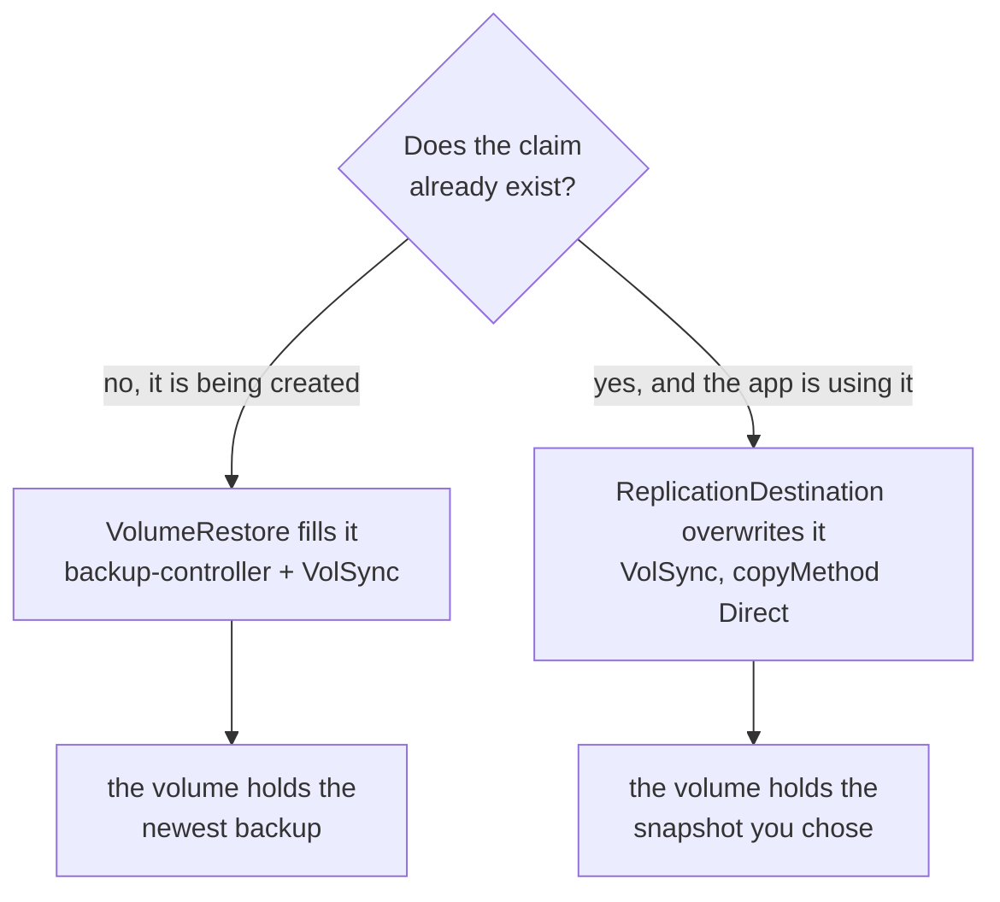
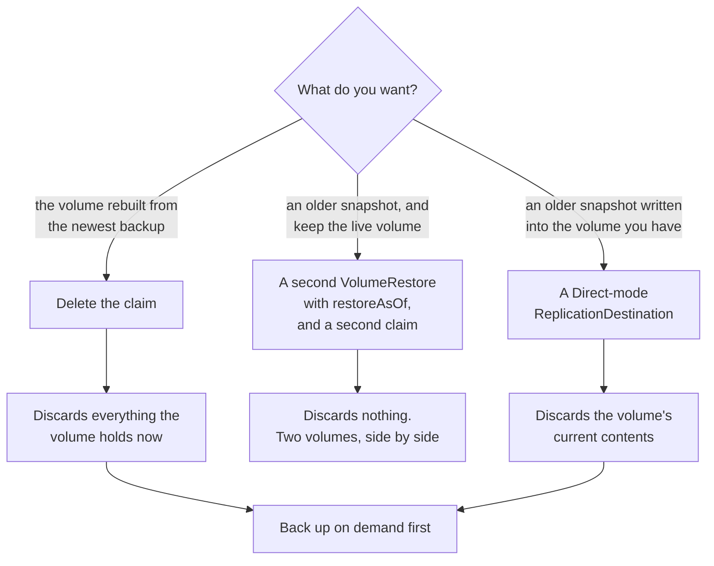
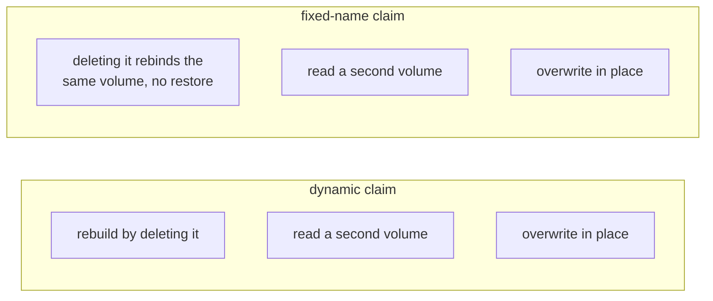

# Restores

Three operations bring data back, and they differ in what they discard. This
page owns that distinction; [api.md](api.md) describes the VolumeRestore field
by field and [architecture.md](architecture.md) has the object flow.

## The one thing to know first

A volume populator acts once, at the moment a claim is created. A VolumeRestore
is a standing declaration that says where a new volume's contents come from, and
it does nothing at all to a claim that already exists.

So "restore" splits into two unrelated mechanisms, and reaching for the wrong one
is how data is lost:



The left path is this controller. The right path is plain VolSync and is
unchanged by this project.

## Choosing



| To do this | Create | Stop the workload | What is discarded |
| --- | --- | --- | --- |
| rebuild from the newest backup | nothing, delete the claim | yes, to release the claim | the volume's current contents |
| read an older snapshot beside the live volume | a second VolumeRestore with `restoreAsOf`, and a claim naming it | no | nothing |
| write an older snapshot into the existing volume | a ReplicationDestination in Direct mode | yes, the mover mounts the claim | the volume's current contents |

The middle row is the one to reach for when the question is whether an older
backup is any better, because it answers that without betting the current data on
the answer. A VolumeRestore is a standing declaration rather than a one-shot job,
so any number of them can exist at once, each naming its own point in time.

## Which claim shapes each one works on

A claim is one of two shapes, and only the first mechanism cares which:

| Claim | How it gets its volume |
| --- | --- |
| dynamic, `dataSourceRef` names a VolumeRestore | the class provisions it, and backup-controller fills it at creation |
| fixed name, `volumeName` names a PersistentVolume | it binds that volume the moment it exists |



A fixed-name claim is never populated, because it is bound before anything could
fill it. Delete it and recreate it and it rebinds the same dataset with the same
contents, so restic reaches that volume only through a Direct-mode restore. That
makes the in-place restore the only way back for a fixed-name volume, and one of
two ways back for a dynamic one.

The Direct-mode restore itself is indifferent to the shape. It names
`destinationPVC` and writes into whatever claim that is, without knowing how the
claim was provisioned, so nothing about moving a volume onto a VolumeRestore
takes the in-place restore away from it.

## Why an in-place restore needs the workload stopped

The mover mounts the claim and writes into it. ReadWriteOnce restricts a claim to
one node rather than to one pod, and the mover and the app both land on the node
holding the volume, so Kubernetes permits both to mount it at once. Two writers
on one filesystem is how the volume being restored is corrupted.

Stopping the workload is what prevents it, and who does the stopping depends on
what deployed the app. The walzen infrastructure repository's terragrunt module
scales its Deployment to zero from a `restore:` input and sequences the
destination after it; a Flux app is suspended and scaled down by hand.
[integration.md](integration.md) has both.

## Back up before you discard

Two of the three operations discard what the volume holds. Whatever has not
reached the repository is gone with it, so take a backup on demand first
whenever the newest writes might matter. Submit a BackupRun and watch it the way
you would a Job:

```yaml
apiVersion: backup.wlz.li/v1alpha1
kind: BackupRun
metadata:
  name: before-the-rebuild
  namespace: canary-backup
spec:
  source: canary-backup
```

`kubectl -n canary-backup get brun` prints the source, the phase and the age,
which are the columns the CRD declares. The phase runs Running to Succeeded, or
to Failed with the reason on the Ready condition.

`status.snapshotTime` then holds the moment the repository captured, and the
object stays as the record. Set `ttlSecondsAfterFinished` to have it clean
itself up.

### Why this is an object rather than a procedure

A ReplicationSource accepts one trigger and a manual tag wins wherever both are
set, so running one backup by hand means writing a tag and taking it away again.
Leaving the tag behind is silent and permanent: the source reports healthy,
keeps its `lastSyncTime`, and takes no further backups, because the state
machine syncs only while `spec.trigger.manual` differs from
`status.lastManualSync`.

Nothing else clears it for you. Server-side apply prunes only the fields its own
manager set, and client-side apply leaves alone any live field absent from both
its last-applied annotation and its desired state, so the tag survives a
reconcile while the schedule comes back beside it. Measured on the walzen test
cluster on 2026-09-14: after `terragrunt apply`, the trigger read
`{"manual":"manual-test-1","schedule":"*/15 * * * *"}` with `nextSyncTime` empty.

The controller closes that. It clears the tag on success, on failure and on
timeout, and a finalizer means deleting the run mid-flight clears it too. The
schedule is never in the payload at all: the controller writes and removes
`spec.trigger.manual` and nothing else, so the field Flux and tofu declare stays
entirely theirs.

## Submitting a restore

Both restore shapes are one object. The claim's own VolumeRestore supplies the
repository, the cache class and the mover's queue label, so a run states only
which volume and how far back:

```yaml
apiVersion: backup.wlz.li/v1alpha1
kind: RestoreRun
metadata:
  name: back-to-friday
  namespace: canary-backup
spec:
  claim: canary-backup
  restoreAsOf: "2026-09-13T00:00:00Z"
```

That is the in-place restore, and it waits rather than stopping anything. While
a pod still mounts the claim the run sits in phase Waiting, with the reason
ClaimInUse and a message naming the pod that holds it. Stop the workload however
that app is deployed and the restore begins on its own.

Add `into:` for the shape that needs nothing stopped, because it writes a second
volume and leaves the app's alone:

```yaml
spec:
  claim: canary-backup
  into: canary-backup-friday
  restoreAsOf: "2026-09-13T00:00:00Z"
```

The controller writes a VolumeRestore carrying that point in time and a claim
naming it, so the ordinary populator path fills it. Mount `canary-backup-friday`
from a throwaway pod and compare. Deleting it takes its dataset with it.

To restore a repository no claim in the namespace owns, name the Secret instead
of a claim. It has to be a Secret in the run's own namespace: a run that could
name one anywhere would let whoever may create a run here read any backup in the
cluster, so copying a Secret into a namespace is the deliberate act that grants
that.

```yaml
spec:
  repository: other-app-restic
  into: scratch
```
