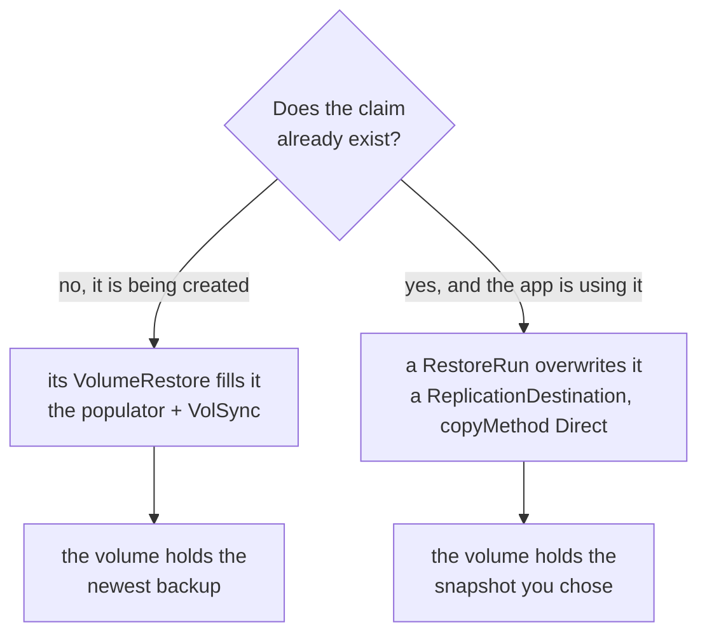
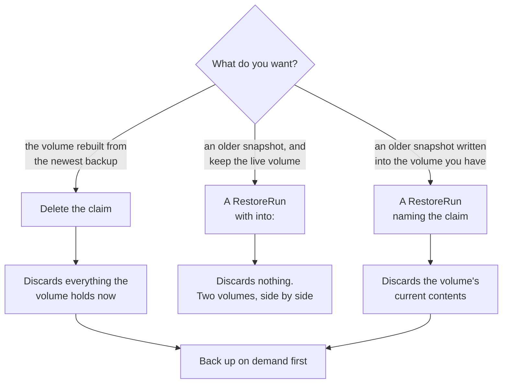
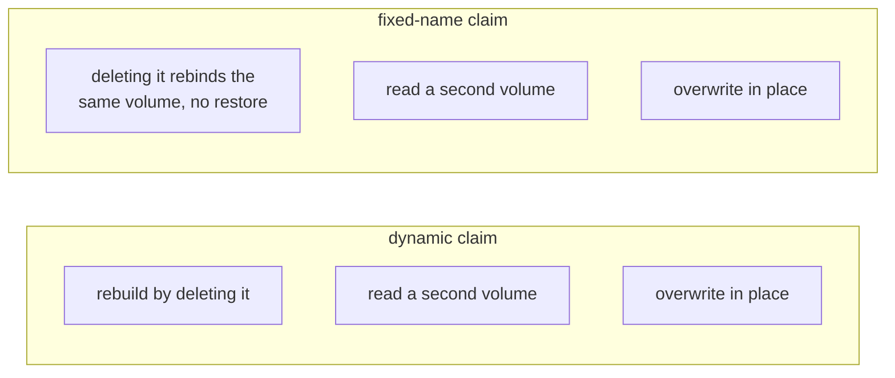

# Restores

Three operations bring data back, and they differ in what they discard. This
page owns that distinction; [api.md](api.md) describes VolumeRestore and
RestoreRun field by field and [architecture.md](architecture.md) has the object
flow.

## Know this first

A volume populator acts once, at the moment a claim is created. A VolumeRestore
is a standing declaration that says where a new volume's contents come from, and
it does nothing at all to a claim that already exists.

So "restore" splits into two unrelated mechanisms, and reaching for the wrong one
is how data is lost:



Both paths go through this controller. The left one acts on its own when a
claim is created; the right one runs only when someone submits a RestoreRun.

## Choosing



| To do this | Create | Stop the workload | What is discarded |
| --- | --- | --- | --- |
| rebuild from the newest backup | nothing, delete the claim | yes, to release the claim | the volume's current contents |
| read an older snapshot beside the live volume | a RestoreRun with `into:` | no | nothing |
| write an older snapshot into the existing volume | a RestoreRun naming the claim | yes, the mover mounts the claim | the volume's current contents |

The middle row is the one to reach for when the question is whether an older
backup is any better, because it answers that without betting the current data on
the answer. Any number of `into:` runs can exist at once, each with its own
point in time and its own claim.

## Which claim shapes each one works on

A claim is one of two shapes, and only the first mechanism cares which:

| Claim | How it gets its volume |
| --- | --- |
| dynamic, `dataSourceRef` names a VolumeRestore | the class provisions it, and backup-controller fills it at creation |
| fixed name, `volumeName` names a PersistentVolume | it binds that volume the moment it exists |



A fixed-name claim is never populated, because it is bound before anything could
fill it. Delete it and recreate it and it rebinds the same dataset with the same
contents, so restic reaches that volume only through an in-place RestoreRun.
That makes the in-place restore the only way back for a fixed-name volume, and
one of two ways back for a dynamic one. The runs find a fixed-name claim's
repository through the VolumeRestore carrying the claim's own name.

The in-place restore itself is indifferent to the shape. Its
ReplicationDestination names `destinationPVC` and writes into whatever claim
that is, without knowing how the claim was provisioned.

## Why an in-place restore needs the workload stopped

The mover mounts the claim and writes into it. ReadWriteOnce restricts a claim to
one node rather than to one pod, and the mover and the app both land on the node
holding the volume, so Kubernetes permits both to mount it at once. Two writers
on one filesystem is how the volume being restored is corrupted.

Stopping the workload is what prevents it. A RestoreRun with `quiesce` stops the
workloads that list names itself, as
[namespace-backups.md](namespace-backups.md#restore-a-whole-namespace-to-one-moment)
shows. Without that list the run stops nothing: it waits in phase Waiting,
reason ClaimInUse, until no pod mounts the claim. It lists the pods straight
from the API server on every pass, because a cached list that had not yet seen
a new pod would report the claim free. Who stops the workload then depends on
what deployed it. In the walzen infrastructure repository a Flux app is
suspended and scaled down by hand, and a terragrunt unit is applied with its
workload at zero; that repository's docs/cluster/backups/ has both procedures.

## Back up before you discard

Two of the three operations discard what the volume holds. Whatever has not
reached the repository is gone with it, so take a backup on demand first
whenever the newest writes might matter. Submit a BackupRun naming the claim, or
`all: true` for everything the namespace marks backup.wlz.li/enabled, and watch
it the way you would a Job:

```yaml
apiVersion: backup.wlz.li/v1alpha1
kind: BackupRun
metadata:
  name: before-the-rebuild
  namespace: canary-namespace-backup
spec:
  source: canary-namespace-backup-data
```

The phase runs Queued, Running and Succeeded, or Failed with the reason on the
Ready condition. `status.items[].snapshotTime` holds the time restic stamped on
the snapshot the mover saved, and the object stays as the record. Set
`ttlSecondsAfterFinished` to have it clean itself up.

The controller writes the claim's ReplicationSource itself and keeps the spent
manual tag on it between runs, because VolSync syncs a source with no trigger in
a tight loop. [namespace-backups.md](namespace-backups.md) has the whole
mechanism, the scheduler and the measured runs.

## Submitting a restore

Both restore shapes are one object. The claim's own VolumeRestore supplies the
repository, the cache class and the mover's queue label, so a run states only
which volume and how far back:

```yaml
apiVersion: backup.wlz.li/v1alpha1
kind: RestoreRun
metadata:
  name: back-to-friday
  namespace: canary-backup
spec:
  claim: canary-backup
  restoreAsOf: "2026-09-13T00:00:00Z"
```

That is the in-place restore. Without `quiesce` it stops nothing itself: while
a pod still mounts the claim, the run sits in phase Waiting, with the reason
ClaimInUse and a message naming the pod that holds it. Stop the workload however
that app is deployed and the restore begins on its own.

Add `into:` for the shape that needs nothing stopped, because it writes a second
volume and leaves the app's alone:

```yaml
spec:
  claim: canary-backup
  into: canary-backup-friday
  restoreAsOf: "2026-09-13T00:00:00Z"
```

The controller writes a VolumeRestore carrying the time of the snapshot the
run selected, and a claim naming it, so the ordinary populator path fills it on
the source claim's node. Mount `canary-backup-friday` from a throwaway pod and
compare. Both objects are owned by the RestoreRun, so deleting the run deletes
the claim and its dataset with it; keep the run until the comparison is done.

Before it creates anything, a run lists the repository's snapshots and fails
with reason NoBackupInReach when none is at or before `restoreAsOf`. VolSync's
mover would otherwise print `No eligible snapshots found`, exit 0, and report
success having written nothing.

`database: <cluster>` restores one database and `all: true` every enabled volume
and database in the namespace; [namespace-backups.md](namespace-backups.md)
shows both on the prod canary.

To restore a repository no claim in the namespace owns, name the Secret instead
of a claim. It has to be a Secret in the run's own namespace: a run that could
name one anywhere would let whoever may create a run here read any backup in the
cluster, so copying a Secret into a namespace is the deliberate act that grants
that.

```yaml
spec:
  repository: other-app-restic
  into: scratch
  intoSize: 5Gi
```

With no source claim, the run has no size to copy and no node to put the new
claim on, so `intoSize` is required. The run creates `scratch` as a plain claim
of that size with no data source, and a ReplicationDestination with
`copyMethod: Direct` whose mover writes the selected snapshot into it. The
mover pod is the claim's first consumer, so on a WaitForFirstConsumer class the
scheduler places the claim wherever the mover pod runs.
[decisions.md](decisions.md#restore-a-repository-into-a-plain-claim-through-a-direct-replicationdestination)
records why this path skips the populator.

`scratch` is Bound while the mover still writes into it, so wait for the run to
reach Succeeded before you mount it. A mover that fails ends the run Failed
with its logs, and a restore still unfinished at `timeout` ends it TimedOut with
`claim scratch had not been restored by <time>`.

### Which snapshot a run restores

The run compares `restoreAsOf` with each snapshot's time in whole seconds, the
way VolSync's mover does: the mover drops the fraction of a second from both
before it compares them. A snapshot taken at 06:00:00.7 is in reach of
`restoreAsOf: "2026-09-13T06:00:00Z"`, which is also the time a BackupRun
reports for it.

The run records the snapshot it selected in `status.items[].snapshot` and its
time in `status.items[].snapshotTime`. The mover, or the VolumeRestore of an
`into` restore, gets that time in whole seconds as `restoreAsOf`, with no
`previous`. Were the mover handed the run's own `restoreAsOf` and `previous`,
it would choose again when it starts, and a scheduled backup that finished in
between would change which snapshot is the newest, or the one before it.

## Databases restore themselves

Everything above is about volumes. A CloudNativePG database has the same gap
that a volume used to have, and the controller closes it the same way: by
deciding at creation time.

`spec.bootstrap` is read once, when CloudNativePG creates a Cluster, and never
again. So a Cluster created after a cluster rebuild bootstraps with `initdb`,
comes up empty, and reports healthy while its archive sits untouched in the
object store. Nobody is told.

The bootstrap webhook watches Clusters being created and looks in the object
store the Cluster archives through:

| What it finds | What it does |
| --- | --- |
| no completed base backup | nothing; the Cluster bootstraps as written |
| a completed base backup | rewrites the Cluster to recover from it, to the end of the archive |
| a completed base backup, and a RestoreRun that deleted this Cluster | rewrites it to recover to the run's `restoreAsOf`, and names the run in `backup.wlz.li/restore-run` |
| a completed base backup, and `backup.wlz.li/restore-as-of` on the Cluster | rewrites it to recover to that moment |
| no completed base backup, and a RestoreRun or the annotation asks for a recovery | refuses the Cluster: `... holds no completed base backup to recover from.` |
| no base backup finished by the moment a run or the annotation asks for | refuses the Cluster, naming the oldest base backup |
| the Cluster declares a bootstrap method other than `initdb`, such as `recovery` or `pg_basebackup` | nothing, unless a RestoreRun waits for this Cluster; then it refuses it with `declares its own spec.bootstrap.<method>. Remove the declared bootstrap ..., or delete the RestoreRun.`, so two sources cannot race |
| `backup.wlz.li/bootstrap: initdb` | nothing; an empty database was asked for on purpose |

A completed base backup is one whose backup.info says `status: DONE`. barman
writes a backup's directory under base/ when the backup starts, so a store
whose only base backups failed or never finished holds objects there and
nothing a recovery can start from. The webhook reads each backup.info in key
order and stops at the first DONE one. When it finds none, it admits the
Cluster as written and logs the reason `no completed base backup in the store`.
A RestoreRun's checks against such a store fail before the run deletes
anything, for the same reason.

The webhook leaves every bootstrap method but `initdb` alone because it can
only replace `initdb`. Adding a `recovery` beside a `pg_basebackup` would give
the Cluster two methods, which CloudNativePG refuses.

Neither kustomize nor OpenTofu can make that choice, because both render their
manifests before anything has spoken to the object store. Admission is the one
moment when the Cluster is known and the store is reachable.

A rewritten Cluster gets `bootstrap.recovery`, the `externalClusters` entry that
recovery names, and the annotation `cnpg.io/skipEmptyWalArchiveCheck`. The annotation is needed because
CloudNativePG refuses to archive into a prefix that already holds WAL, which is
true of every restore: the prefix a database recovers from is the prefix it
archives to.

### Updates to a recovered Cluster

A GitOps tool applies the Cluster from its source on every reconcile, and the
source still holds `initdb`. Server-side apply keeps the `recovery` the webhook
wrote and adds `initdb` back, and CloudNativePG refuses the result:

```text
admission webhook "vcluster.cnpg.io" denied the request: Cluster.cluster.cnpg.io
"canary-backup-aio-flux-pg" is invalid: spec.bootstrap: Forbidden: Only one
bootstrap method can be specified at a time
```

A second webhook entry receives updates. When the stored Cluster has a `recovery`
whose source is `backup-controller`, the handler drops `initdb` from the
incoming object. It reads nothing, so it also acts on dry-runs, which is where
Flux first hits the refusal. A Cluster without that recovery source is left as
the update wrote it.

The update entry is registered with `failurePolicy: Ignore`. An unavailable
controller then fails only a recovered Cluster's update, with the error above,
and blocks no update to any other Cluster.

### Refusing a shared archive

Before admitting a Cluster, the webhook checks that no other database already
archives to the same bucket and prefix on the same S3 service, and refuses it if
one does:

```text
other/app-pg already archives to backups/app/app-pg. Two databases writing one
archive interleave their WAL and leave it unrestorable. Give this Cluster an
archive of its own, or a serverName that is not "app-pg".
```

This is the one failure nothing else on the cluster can see. Each Cluster is
valid on its own; the pair is the problem. The damage is silent and permanent:
WAL filenames are timeline plus position and nothing else, so the second
database overwrites the first's segments, and a base backup whose WAL range is
gone can never reach consistency again.

A Cluster that declares its own recovery is checked like any other: where a
Cluster archives does not depend on how it bootstraps.

For every other archiving Cluster on the cluster, the webhook reads the
ObjectStore it names and compares three values with the new Cluster's:

| Value | From | Compared |
| --- | --- | --- |
| endpoint | `spec.configuration.endpointURL` | host and port, ignoring letter case, so `https://s3.example.com` and `S3.example.com` match |
| bucket | `spec.configuration.destinationPath` | exactly |
| prefix | the rest of `destinationPath`, plus the server name | exactly |

A holder matches only when all three do, so the same bucket and prefix on
another S3 service is admitted. Two Clusters can reach one prefix through
differently named ObjectStores, which is why the webhook compares these values
and never the store names. The Cluster being admitted is skipped by namespace
and name, so recreating a database is not a collision with the record of
itself, which is what makes restores work.

The check reads no Secret of any other Cluster. Where a database archives is
written in its ObjectStore, so a holder whose credentials Secret is missing
still counts. Each other Cluster needs one read, which keeps a create inside the
webhook's timeout on a cluster with many databases. A Cluster whose ObjectStore
cannot be read, or names no s3:// destination, is skipped: refusing a new
database because an unrelated one is misconfigured would block work this check
has no business blocking.

### Reaching an object store over TLS

The webhook talks to the object store directly, so it has to verify whatever
certificate that endpoint presents. Neither case is configured on this
controller and neither is hardcoded:

| The endpoint's certificate | What verifies it |
| --- | --- |
| signed by a public authority | the public roots in the image |
| signed by a private authority | the store's own `endpointCA` |

`endpointCA` is a field on the ObjectStore, a Secret name and key holding a PEM
bundle, and the Barman Cloud plugin already reads it for exactly this reason.
So an endpoint that needs a CA is described once, on the store, and the plugin
and this controller both pick it up. A store that needs none declares none.

### Refuse a Cluster the webhook cannot decide

The creation entry is registered with `failurePolicy: Fail`. When it cannot
run, or cannot read the object store, the Cluster is refused.

The alternative is worse than it sounds. Allowing the Cluster through would
create it exactly as written, which is `initdb`, which is an empty database
beside a full archive, reported as success. That failure arrives during a
cluster rebuild, when this controller is most likely to be starting up and an
admin is least likely to be reading Cluster events.

### Starting a database empty

With the webhook installed, deleting a Cluster brings its data back, which
leaves no way to discard a database. The opt-out is an annotation the webhook
honours and leaves alone:

```yaml
metadata:
  annotations:
    backup.wlz.li/bootstrap: initdb
```

Any other value is ignored, so a typo does not silently wipe a database.

A RestoreRun leaves an opted-out Cluster alone too:

| Run | What happens to the opted-out Cluster |
| --- | --- |
| `all: true` | its item is Skipped with `the Cluster carries backup.wlz.li/bootstrap: initdb, which asks for an empty database, so the run leaves it alone`, and the run restores everything else |
| `database: <cluster>` | the run ends Invalid before it touches anything |
| a Cluster that gains the annotation after the run marked it Deleted, or is created again with it | its item is Skipped, and the run never deletes it again |

The webhook admits an opted-out Cluster empty and never marks it as a run's
recovery. A run that deleted one would find it back empty, delete it again, and
repeat until its timeout. [decisions.md](decisions.md#leave-an-opted-out-cluster-out-of-a-restorerun)
has the decision.
