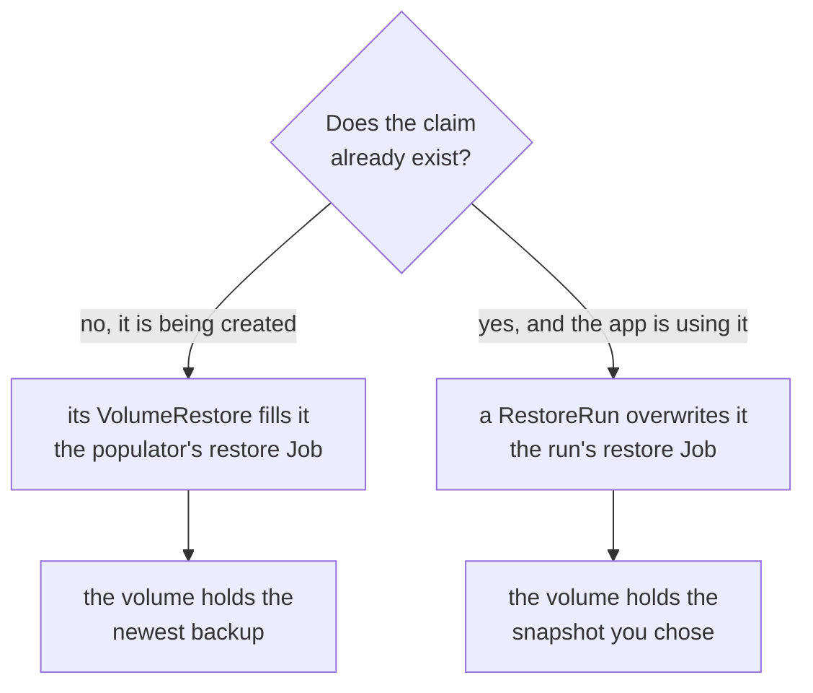
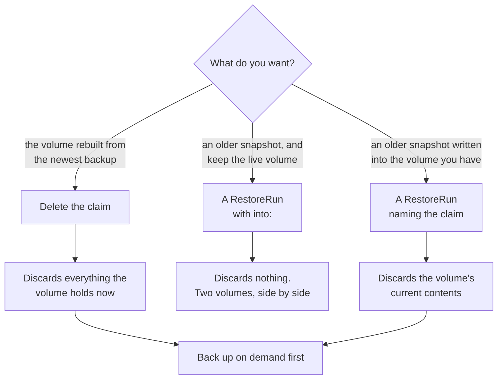
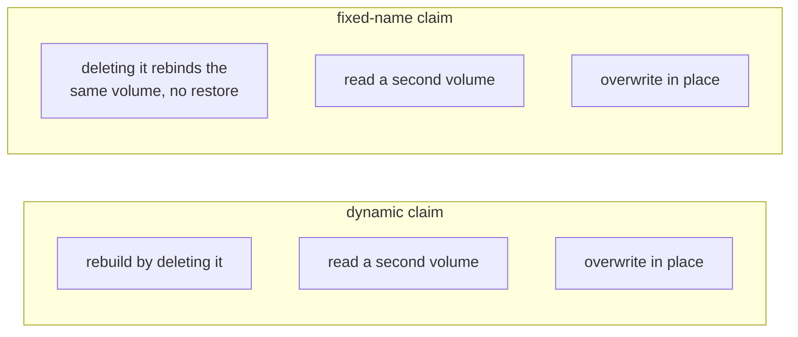

# Restores

Three operations bring data back. They differ in what they discard. This page
describes that difference. [api.md](api.md) describes VolumeRestore and
RestoreRun field by field. [architecture.md](architecture.md) shows the object
flow.

## Know this first

A volume populator acts once, at the moment a claim is created. A VolumeRestore
is a standing declaration. It says where the contents of a new volume come
from. It does nothing to a claim that already exists.

Thus "restore" has two unrelated mechanisms. If you use the wrong one, you lose
data:


```mermaid
flowchart TD
    Q{"Does the claim<br/>already exist?"}
    Q -- "no, it is being created" --> P["its VolumeRestore fills it<br/>the populator's restore Job"]
    Q -- "yes, and the app is using it" --> D["a RestoreRun overwrites it<br/>the run's restore Job"]

    P --> P1["the volume holds the<br/>newest backup"]
    D --> D1["the volume holds the<br/>snapshot you chose"]
```

Both paths go through this controller, and both write through the same
restore Job. That Job runs `restic restore` for one snapshot, which it names by
its full ID ([architecture.md](architecture.md#how-the-restore-job-is-built)
has its shape). The left path acts on its own when a claim is created. The
right path runs only when someone submits a RestoreRun.

## Choosing


```mermaid
flowchart TD
    S{"What do you want?"}

    S -- "the volume rebuilt from<br/>the newest backup" --> A["Delete the claim"]
    S -- "an older snapshot, and<br/>keep the live volume" --> B["A RestoreRun<br/>with into:"]
    S -- "an older snapshot written<br/>into the volume you have" --> C["A RestoreRun<br/>naming the claim"]

    A --> A1["Discards everything the<br/>volume holds now"]
    B --> B1["Discards nothing.<br/>Two volumes, side by side"]
    C --> C1["Discards the volume's<br/>current contents"]

    A1 --> W["Back up on demand first"]
    C1 --> W
```

| To do this | Create | Stop the workload | What is discarded |
| --- | --- | --- | --- |
| rebuild from the newest backup | nothing, delete the claim | yes, to release the claim | the volume's current contents |
| read an older snapshot beside the live volume | a RestoreRun with `into:` | no | nothing |
| write an older snapshot into the existing volume | a RestoreRun naming the claim | yes, the restore Job mounts the claim | the volume's current contents |

Use the middle row when you want to know if an older backup is better. It
answers that question and does not put the current data at risk. Any number of
`into:` runs can exist at the same time. Each has its own point in time and
its own claim.

## Which claim shapes each one works on

A claim has one of two shapes. Only the first mechanism depends on the shape:

| Claim | How it gets its volume |
| --- | --- |
| dynamic, `dataSourceRef` names a VolumeRestore | the class provisions it, and backup-controller fills it at creation |
| fixed name, `volumeName` names a PersistentVolume | it binds that volume the moment it exists |


```mermaid
flowchart LR
    subgraph dyn["dynamic claim"]
        d1["rebuild by deleting it"]
        d2["read a second volume"]
        d3["overwrite in place"]
    end

    subgraph fixed["fixed-name claim"]
        f1["deleting it rebinds the<br/>same volume, no restore"]
        f2["read a second volume"]
        f3["overwrite in place"]
    end
```

A populator never fills a fixed-name claim, because the claim is bound before
anything could fill it. If you delete it and create it again, it binds the same
dataset again, with the same contents. Thus restic reaches that volume only
through an in-place RestoreRun. The in-place restore is therefore the only way
back for a fixed-name volume. For a dynamic volume, it is one of two ways back.
The runs find the repository of a fixed-name claim through the VolumeRestore
that has the same name as the claim.

The shape of the claim does not change the in-place restore. Its restore Job
mounts the claim by name at /data. The Job writes into that claim, and it does
not know how the claim was provisioned.

## Why an in-place restore needs the workload stopped

The pod of the restore Job mounts the claim and writes into it. ReadWriteOnce
lets every pod on the node that has the claim attached mount it. Only
ReadWriteOncePod limits a claim to one pod. The Job's pod and the app both go
to the node that holds the volume, so Kubernetes lets both mount it at the same
time. Two writers on one filesystem corrupt the volume that the run restores.

To stop the workload prevents this. A RestoreRun with `quiesce` itself stops
the workloads in that list, as
[namespace-backups.md](namespace-backups.md#restore-a-whole-namespace-to-one-moment)
shows. A pod of one of them can still be terminating. Then the run waits in
phase Waiting with Ready reason Running and `waiting for pod <pod> to stop
before anything is restored`. It waits because a pod that shuts down can still
write.

Without that list, the run stops nothing. It waits in phase Waiting, reason
ClaimInUse, until no pod mounts the claim. On every pass, it lists the pods
directly from the API server. A cached list that did not yet see a new pod
would report the claim free. Without the list, the tool that deployed the
workload decides who stops it. In the walzen infrastructure repository, you
suspend a Flux app and scale it down by hand. You apply a terragrunt unit with
its workload at zero. The docs/cluster/backups/ directory of that repository
has both procedures.

Two in-place restores of one claim run one after the other. While the restore
Job of the first run has a pod that mounts the claim, the second run waits with
reason ClaimInUse. Its message names that pod. The first run keeps the Lease of
the claim until it stops its Job and every pod of the Job ends. Thus, after the
pod is gone, the second run waits with reason SourceBusy:

```text
RestoreRun back-to-friday holds Lease backup-controller-claim-3f2a1c7e-9d2b for notes-data; this run starts once that run has finished with it
```

The second run then starts on its own.

A run stops the app only when it can continue. The run checks every volume
item that it did not start yet. It does this on the pass that records its
plan, before it stops anything. The run waits in phase Waiting with reason
SourceBusy, and the workloads continue to run, in these cases:

- A backup of the claim or of its repository uploads data.
- Another run holds a Lease on the claim or on its repository.

A read that fails comes back as an error, and the run stops nothing. The check
immediately before the run creates the restore Job is still the check that
counts ([One mover at a time](namespace-backups.md#one-mover-at-a-time)).

A volume item whose repository Secret is gone fails in that same check. The
message is the one under
[Which snapshot a run restores](#which-snapshot-a-run-restores). A run with no
item left to restore stops nothing and ends. The run also waits for another run
that has stopped the workloads of this namespace
([One quiesce at a time](namespace-backups.md#one-quiesce-at-a-time)). A
Kustomization can apply Deployments or StatefulSets in two namespaces. Such a
Kustomization ends the run with reason `Invalid` before the run stops anything
([Which Kustomization a run suspends](namespace-backups.md#which-kustomization-a-run-suspends)).

## Back up before you discard

Two of the three operations discard what the volume holds. Data that did not
reach the repository is lost with it. Thus, if the newest writes might matter,
make a backup on demand first. Submit a BackupRun that names the claim, or
`all: true` for everything the namespace marks backup.wlz.li/enabled. Monitor
it as you monitor a Job:

```yaml
apiVersion: backup.wlz.li/v1alpha1
kind: BackupRun
metadata:
  name: before-the-rebuild
  namespace: canary-namespace-backup
spec:
  source: canary-namespace-backup-data
```

The phase goes from Queued to Running to Succeeded, or to Failed with the
reason on the Ready condition. `status.items[].snapshotTime` holds the time
that restic put on the snapshot that the mover saved. The object stays as the
record. Set `ttlSecondsAfterFinished`, and the object deletes itself.

The controller itself writes the ReplicationSource of the claim. It keeps the
used manual tag on the source between runs, because VolSync syncs a source
with no trigger in a tight loop. [namespace-backups.md](namespace-backups.md)
has the full mechanism, the scheduler and the measured runs.

## Submitting a restore

Both restore shapes use one object. The VolumeRestore of the claim gives the
repository, the cache class and the queue label of the restore Job's pod. Thus
a run states only which volume to restore and how far back:

```yaml
apiVersion: backup.wlz.li/v1alpha1
kind: RestoreRun
metadata:
  name: back-to-friday
  namespace: canary-backup
spec:
  claim: canary-backup
  restoreAsOf: "2026-09-13T00:00:00Z"
```

That is the in-place restore. Without `quiesce`, the run itself stops nothing.
While a pod still mounts the claim, the run stays in phase Waiting, with the
reason ClaimInUse and a message that names the pod. Stop the workload in the
way that the app is deployed. The restore then starts on its own.

Add `into:` for the shape that needs nothing stopped. It writes a second volume
and does not touch the volume of the app:

```yaml
spec:
  claim: canary-backup
  into: canary-backup-friday
  restoreAsOf: "2026-09-13T00:00:00Z"
```

The run creates `canary-backup-friday` empty, with the size and storage class
of the source claim. It also copies the node that holds the volume of the
source claim. The run's own restore Job writes the selected snapshot into that
claim, through a pod that the scheduler puts on that node. The run reads the
result from the Job, as it does for an in-place restore. When the run reaches
Succeeded, mount `canary-backup-friday` from a temporary pod and compare.

The claim has an ownerReference to the RestoreRun. Thus, when you delete the
run, the claim and its dataset are deleted with it. Keep the run until you
complete the comparison. The restore Job also has a controller reference to the
run. The run itself stops and deletes the Job when the restore ends, or when
the run is deleted.

The run writes only into a claim that it created itself. A claim named `into`
that the run does not control fails the run with reason IntoClaimTaken. A claim
named `into` that appears after the checks does the same:

```text
claim canary-backup-friday already exists and this run did not create it. spec.into names a new claim for the run to create, and a restore never writes into a claim it did not create. Choose a name no claim in this namespace has. To overwrite an existing claim, restore it in place with spec.claim.
```

Before it creates anything, a run lists the snapshots of the repository. If no
snapshot is at or before `restoreAsOf`, the run fails with reason
NoBackupInReach.

`database: <cluster>` restores one database. `all: true` restores every enabled
volume and database in the namespace. [namespace-backups.md](namespace-backups.md)
shows both on the prod canary.

To restore a repository that no claim in the namespace owns, name the Secret
instead of a claim. The Secret must be in the namespace of the run. If a run
could name a Secret in any namespace, then anyone who may create a run here
could read any backup in the cluster. Thus, to copy a Secret into a namespace
is the deliberate act that gives that access.

```yaml
spec:
  repository: other-app-restic
  into: scratch
  intoSize: 5Gi
```

With no source claim, the run has no size to copy and no node for the new
claim. Thus `intoSize` is required. The run creates `scratch` as a plain claim
of that size with no data source. It also creates a restore Job whose pod
writes the selected snapshot into the claim. That pod is the first consumer of
the claim. Thus, on a WaitForFirstConsumer class, the scheduler puts the claim
where the pod runs.
[decisions.md](decisions.md#restore-a-repository-into-a-plain-claim-the-restore-job-fills)
records why this path does not use the populator.

A run that names only `spec.repository` is refused before it creates anything:
`spec.repository alone
restores into a new claim, so spec.into is required, and it must name a claim
that does not exist yet. To overwrite an existing claim from this repository,
set spec.claim to it as well; the run then restores it in place once no pod
mounts it.`

`scratch` is Bound while the restore Job still writes into it. Thus, wait until
the run reaches Succeeded before you mount it. If the Job fails, the run ends
Failed with the exit code of restic. If the restore is not complete at
`timeout`, the run ends TimedOut with `claim scratch had not been restored by <time>`.

Before a run reports its final phase, the run stops each restore Job that it
created. It also does this before a deleted run drops its finalizer. The
steps are:

1. The run suspends a Job that still runs.
2. The Job controller deletes the pods of the Job. restic gets SIGTERM as the
   only process of the container, deletes its lock and exits.
3. The run waits in phase Waiting, with reason WaitingForShutdown, until every
   pod with the Job's UID in its `batch.kubernetes.io/controller-uid` label has
   ended.
4. The run deletes the Job with Foreground propagation.

A completed Job has only ended pods, so that wait passes immediately. The
message names what is left:

```text
waiting for the restore Job of claim scratch, which the run stopped, to end: restore Job restore-<run uid>-0: waiting for pods restore-<run uid>-0-x7k2p to end. The run gives the app back and lets other runs at the claim only after that
```

For this wait, the run reads the Job and its pods directly from the API
server. A cached list that is late could show a pod as ended while restic
still writes. A pod that was never scheduled and is already being deleted also
passes. The API server gives it grace period 0, and the scheduler can no longer
bind it (compatibility.md, Kubernetes).

If the run fails to suspend, read or delete the Job, or fails to list its pods,
it stays unfinished. It tries again on every pass. It reports RestartFailed
while a workload that it stopped is still down. It reports ReleaseFailed after
the app is back, or when it stopped no workload. The message names the step
and the error. It ends with what a person can delete by hand:

```text
could not stop its restore Job restore-<run uid>-0: <error>. The run retries until it can. Fix the cause, or delete Job restore-<run uid>-0 with its pods yourself (kubectl delete job restore-<run uid>-0 --cascade=foreground) and make sure none of its pods still runs; the run then finishes by itself.
```

A run with `quiesce` can report RestartFailed for this step. Its message then
also names the workloads to scale back once no restore Job of the run still
writes to its claims. [api.md](api.md#ready-reasons-of-a-restorerun) lists
every reason that a RestoreRun reports.

### Which snapshot a run restores

The run compares `restoreAsOf` with the time of each snapshot in whole seconds.
It drops the fraction of a second from both values before it compares them.
A snapshot taken at 06:00:00.7 is in reach of
`restoreAsOf: "2026-09-13T06:00:00Z"`. That is also the time that a BackupRun
reports for it. If snapshots have the same time, the one with the higher ID
counts as the newer. `previous` steps back through each of them, so each of two
snapshots in one second is reachable.

Only a snapshot with the layout that a VolSync mover writes is a candidate:
host `volsync` and paths exactly `[/data]`. A retimed `quiesced` copy keeps
both and counts. The restore Job writes the files of a snapshot at the root of
the claim. A snapshot of another directory would put them in a different
location. Thus, if a repository holds only such snapshots, the run ends with
reason NoBackupInReach. The message names the newest five snapshots that the
run did not use:

```text
the repository holds 3 snapshots, none written by a VolSync mover (host volsync, paths [/data]): 6e473100 (host laptop, paths [/home/me/notes]), 2edf5bab (host laptop, paths [/home/me/notes]), d1cb7739 (host laptop, paths [/home/me/notes])
```

The run records the snapshot that it selected in `status.items[].snapshotID`,
as its full 64-character ID. The short ID goes in `snapshot`, and its time goes
in `snapshotTime`. The restore Job runs `restic restore <full ID>`. restic reads
a full ID directly as that one snapshot file and applies no host, path or time
filter to it. Thus the Job restores exactly the snapshot that the checks
selected, or it fails. A scheduled backup that finished in between changes
nothing.

The run lists the repository once more immediately before it creates the
restore Job. Thus it creates nothing from a selection that the repository no
longer holds. The item fails with reason SnapshotChanged in these cases:

- After the checks, the `restic forget` of a backup deleted the selected
  snapshot.
- After the checks, a quiesced backup rewrote the snapshot under another ID and
  time.

The message says which case occurred. Each message is followed by `. Nothing was written to
claim <claim>. Create a new RestoreRun to select again`:

```text
snapshot 6e473100 (2026-09-26T09:03:53Z), which the checks selected, is no longer in the repository; a backup's retention (restic forget) removed it after the checks
```

```text
snapshot 6e473100, which the checks selected, was rewritten as 2edf5bab at 2026-09-26T09:05:00Z by a quiesced backup after the checks
```

If a repository Secret or a VolumeRestore is gone at that time, the item fails
in the same way, with the same ending.

Every restore Job is created suspended, so no pod runs restic before the run
records the Job. The status write that moves the item to Running records the
name of the Job in `job` and its UID in `jobUID`. A later pass reads the stored
run again directly from the API server. It resumes the Job only while that run
still has the item Running on the same Job and did not decide to end. Until
then, the message of the item is `starting: the restore Job was created
suspended, and the run resumes it once the status records it`. The API server
can refuse the resume as Forbidden or Invalid. Then the item fails with reason
RestoreJobRefused and `the API server refused to resume restore Job <job>,
which never ran: <answer>`, followed by the nothing-was-written ending.

A pass can create the Job and then lose the status write that records it. On
the next pass, the item is still Pending. That pass finds the Job under the
name of the item, restore-<run uid>-<item index>, with the label
`backup.wlz.li/restore-run` set to the UID of the run. The run adopts that Job
only when its `backup.wlz.li/snapshot-id` annotation is the full ID that the
item recorded. The item then moves to Running with that Job, and the restore
continues as if the write had succeeded.

A Job with another ID is a bug in the controller. The item then fails with
reason RestoreJobFailed, `restore Job <job> restores snapshot <a>, and the
run selected <b>; the run stops it`. If the run did not create a Job with that
name, the item fails with reason RestoreJobRefused. The run then does not touch
that Job. The pod of the Job may already mount the claim. The run does not wait
for it with ClaimInUse, because it is the run's own pod.

The API server can answer a create with an error, such as a 504 on a request
that outlived its deadline. It can still store the Job later, after a later
pass failed the item or after the run finished. The run never recorded such a
Job, so no pass resumes it, and the Job stays suspended with no pod. If the run
did not finish, it finds the Job by name and stops it with its other Jobs. A
Job stored after the run finished stays beside the finished run until the run
is deleted. The garbage collector then deletes it through its controller
reference.

One kind of snapshot holds data older than its time. When a BackupRun fails a
volume item, VolSync continues to retry that sync with the clone that it cut
when the sync started. restic stamps the snapshot of the retry with the time of
the retry. Thus the snapshot holds the data of that earlier moment.
[namespace-backups.md](namespace-backups.md#sources-the-controller-writes) has
the item message that says this. Such a snapshot has no `quiesced` tag, so a
`syncDatabaseToVolume` restore never selects it. A plain `restoreAsOf` may
select it. The volume then holds the newest data captured for that claim, with
a time later than the data.

### How a restore Job ends

Only the terminal conditions of the Job decide. The item succeeds when the Job
has `Complete=True`. The Job controller adds this condition only after restic
exited 0 for the snapshot of the item and the pod ended. The item fails with
reason RestoreJobFailed when the Job has `Failed=True`. The message then shows
the exit code of restic and the last lines of its log. The container status of
the pod carries these lines (`terminationMessagePolicy: FallbackToLogsOnError`).
If retention deleted the snapshot after the recheck, the restore ends with:

```text
the restore Job failed (BackoffLimitExceeded): restic exited 1 (failure) in container restore: "...Fatal: failed to find snapshot..."
```

The claim then holds what it held before, because restic failed before it
wrote anything. If no pod of the Job is left to read, the message is `the
restore Job failed (<reason>), and no pod of it shows how restic ended:
"<condition message>"`. The container is `unlock` when the init container
failed, and `restore` in all other cases.

| Exit code | Meaning the message gives | What the Job does |
| --- | --- | --- |
| 0 | success | completes |
| 1 | failure | retries, up to four pods |
| 3 | some source data could not be read | retries |
| 10 | no repository | fails at once |
| 11 | the repository is locked | retries. The unlock of the next pod deletes a lock that became stale |
| 12 | wrong password | fails at once |
| 130 | interrupted | the pod was stopped. See below |
| 137 | killed with SIGKILL, such as out of memory or at the end of its grace period | retries |
| other | unknown exit code, counted as a failure | retries |

Kubernetes or Kueue can stop a pod and mark it with the pod condition
DisruptionTarget or TerminationTarget. Such a pod does not count toward the
four attempts of the Job. The Job starts a replacement after that pod has
ended. The Kueue of prod evicts a pod that is not ready five minutes after
admission, and marks it in that way. Thus a pod that never starts never fails
the Job, for example a pod with an image that it cannot pull, or with a Secret
key that it cannot find. The item stays Running, and its message shows why the
newest pod waits:

```text
waiting: restore: ImagePullBackOff: "Back-off pulling image ..."
```

For a pod that the scheduler did not place, the message is `waiting: unscheduled:
<reason>: "<message>"`. The run ends at its `timeout`, and the message of the
item then shows the same wait.

Before the restore, the `unlock` init container runs `restic unlock`. This
command deletes only locks older than 30 minutes. A restic that died long ago
left such a lock. Without the unlock, `restic restore` would refuse the
repository with exit 11 at once. restic does not ignore a stale exclusive lock
when it gets its own lock.

The restore then waits up to 30 minutes for a live exclusive lock
(`--retry-lock 30m`). Examples are the controller's own rewrite of a quiesced
snapshot, or a `restic prune` that someone runs by hand. A lock can become stale
during that wait. It still blocks the restore: restic exits 11, the pod counts
as a failed attempt, and the `unlock` of the next pod deletes the lock. While
restic waits, its container runs. Thus a run that times out then shows no
waiting reason.

When a Job is stopped, its pod is deleted. restic gets SIGTERM directly,
because it is the command of the container with no shell in front of it. After
restic opened the repository, it deletes its lock and exits 130, well inside
the grace period of the pod. A stop before that ends restic with exit 1
(`config cannot be loaded:
context canceled`). The e2e test TestStoppingARestoreEndsResticAtOnce
(test/e2e/restore_job_test.go) watches it end. The claim then holds a partial
restore.

The Job runs no `sync` after restic exits. The kubelet unmounts the volume
after the container has ended. The next reader of the claim reads it through
the same filesystem. If a node crashes in the seconds after restic exits, it
can lose the last writes that did not reach the disk yet.

The Job restores with `--delete`. Thus it deletes files that the snapshot does
not hold, and the claim then holds exactly the snapshot. In a namespace
annotated `volsync.backube/privileged-movers: "true"`, the Job runs as root
with the capabilities DAC_OVERRIDE, CHOWN and FOWNER. restic then restores the
owner of each file, as the VolSync mover does in such a namespace.

A Job can be gone, or a Job with another UID can have its name. Then the Job
was deleted before it finished, and the item fails with reason
RestoreJobDeleted: `the
restore Job <job> was deleted before it finished`. When a Job with another UID
has the name, the message adds `, and a Job with
another UID holds its name now`. The run never creates a second Job for the
item. The pods keep the recorded UID in their controller-uid label. Thus the
run gives nothing back until each of them has ended, whatever propagation the
delete used. If the run no longer controls a Job, the item fails with reason
RestoreJobFailed, `the restore Job <job> is no longer controlled by
the run`. The run stops that Job in the same way.

A run can end early, by its timeout or an abort. Such a run first reads the
Job of each running item. If a Job completed as the deadline passed, the run
records the item Succeeded. If a Job failed, the run records the exit code of
restic. Only an item whose Job did not end gets the message of the run.

An in-place item also succeeds only into the claim that the run checked.
Immediately before it creates the restore Job of the item, the run creates or
updates the Lease of the claim. The name of this Lease holds the UID of the
claim. When the Job has completed, the run reads the claim again. The run fails
the item with reason ClaimLost in these cases:

- The claim is gone.
- The claim is being deleted.
- The claim has a UID that none of the run's claim Leases for the item holds.

The message says which case occurred:

```text
claim notes-data was deleted while its restore Job wrote into it, and the restored data went with it
claim notes-data was deleted while its restore Job wrote into it, and the restored data goes with it once the claim is released
claim notes-data was replaced while its restore Job wrote into it: the claim there now (UID <new>) is not the one the run checked and took its Lease on (UID <old>). The restore Job mounts claim notes-data by name, so it may have written into it; check its data, and create a new RestoreRun to restore it
the run holds no claim Lease for claim notes-data, so it can't tell whether its restore Job wrote into the claim that is there now. Check the claim's data, and create a new RestoreRun to restore it
```

The second message occurs when someone deletes the claim while the pod of the
Job mounts it. Kubernetes keeps the claim, Terminating, until that pod is gone
(pvc-protection). Thus the Job can finish into a claim that is about to go.

### When VolSync stops serving v1alpha1

A RestoreRun reads VolSync only to wait for a backup of its claim or repository
that is in progress. It reads the ReplicationSources at
volsync.backube/v1alpha1 (see
[compatibility](compatibility.md#following-the-versions-the-api-server-serves)).
The API server can serve ReplicationSource at another version. A run that
finds this changes nothing, shows reason VolSyncUnsupported on its Ready
condition, and tries again on every pass:

```text
the API server serves VolSync's ReplicationSource <versions> and no longer at volsync.backube/v1alpha1, the one version this backup-controller reads and writes; the run changes nothing and retries until that version is served again or spec.timeout has passed, and then ends TimedOut and gives the app back (see docs/compatibility.md): <error>
```

An app that the run already stopped stays stopped until then. The run needs no
VolSync object to stop its restore Jobs and give the app back. Thus a run that
passes its `timeout`, or that is deleted, still does both. Upgrade the
controller before VolSync, and no run gets that error.

## Databases restore themselves

Everything above is about volumes. A CloudNativePG database has the same gap
that a volume had before. The controller closes it in the same way: it decides
at creation time.

CloudNativePG reads `spec.bootstrap` once, when it creates a Cluster, and never
again. Thus a Cluster created after a cluster rebuild bootstraps with `initdb`.
It starts empty and reports healthy, while its archive stays untouched in the
object store. No condition, event or log line reports the lost data.

The bootstrap webhook watches Clusters that are being created. It looks in the
object store through which the Cluster archives:

| What it finds | What it does |
| --- | --- |
| nothing at all under the Cluster's prefix, and no completed backup in the ObjectStore status for its server name | nothing. The Cluster bootstraps as written, which is `initdb` |
| nothing at all under the prefix, and the ObjectStore status records a completed backup for the server name of the Cluster | refuses the Cluster: `The listing of s3://<bucket>/<prefix>/ found nothing. The status of ObjectStore ...` ([When the store status disagrees with the listing](#when-the-store-status-disagrees-with-the-listing) has the full text) |
| a completed base backup | rewrites the Cluster to recover from it, to the end of the archive |
| a completed base backup, and a RestoreRun that deleted this Cluster | rewrites it to recover to the run's `restoreAsOf`, and names the run in `backup.wlz.li/restore-run` |
| a completed base backup, and `backup.wlz.li/restore-as-of` on the Cluster | rewrites it to recover to that moment |
| a WAL file under `<prefix>/wals/`, and no completed base backup | refuses the Cluster: `s3://<bucket>/<prefix>/ holds an archive with no completed base backup ...` (the full text is below) |
| no completed base backup, and a RestoreRun or the annotation asks for a recovery | refuses the Cluster: `... holds no completed base backup to recover from.` |
| no base backup finished by the moment a run or the annotation asks for | refuses the Cluster, naming the oldest base backup |
| the Cluster declares a bootstrap method other than `initdb`, such as `recovery` or `pg_basebackup` | nothing, unless a RestoreRun waits for this Cluster. Then it refuses the Cluster with `declares its own spec.bootstrap.<method>. Remove the declared bootstrap ..., or delete the RestoreRun.`, so two sources cannot race |
| `backup.wlz.li/bootstrap: initdb`, and no WAL file under `<prefix>/wals/` | nothing. The annotation asks for an empty database on purpose. The ObjectStore status check of the second row applies here too |
| `backup.wlz.li/bootstrap: initdb`, and a WAL file under `<prefix>/wals/` | refuses the Cluster: `The Cluster asks for an empty database (backup.wlz.li/bootstrap: initdb), and s3://<bucket>/<prefix>/ still holds the archive of an earlier one. ...` ([Starting a database empty](#starting-a-database-empty) has the full text) |
| the store takes longer than the webhook's 10-second budget to answer | refuses the Cluster with what it read so far ([How long the webhook reads](#how-long-the-webhook-reads)) |

A completed base backup is one whose backup.info sets `begin_time` and
`end_time`, whatever its status. This is the rule of the plugin's catalog, which
picks the base backup of a recovery. barman
writes the directory of a backup under base/ when the backup starts, and marks
it STARTED. Later, barman marks it DONE or FAILED. barman never deletes a
failed or unfinished backup on its own. Its retention deletes only DONE backups
that became obsolete. The checks of a RestoreRun against a store with no
completed backup fail before the run deletes anything.

The webhook recovers a Cluster for a RestoreRun only while that run is
unfinished and not being deleted. A run can time out, fail or be deleted after
it deleted a Cluster and before Flux or tofu created it again. When the owner
then creates the Cluster, the webhook applies the second or the fourth row of
the table. The Cluster recovers to the end of its archive, or to the time in
its own `backup.wlz.li/restore-as-of` annotation. The moment that the run chose
no longer applies.

The item of the run says this, after the reason the run ended. A run that was
deleted also records a Warning event with reason ClusterLeftDeleted that says
the same. It does not record the event if its owner has created the Cluster
again by then. To find this, the run reads the Cluster. If that read fails, for
example because CloudNativePG is not installed or the controller has no access
to Clusters, the run logs the error and records no event for that Cluster. It
then removes its finalizer:

```text
Cluster notes-pg was deleted, and the run ended before it was created again. No run waits for it now, so when Flux or tofu creates it, the bootstrap webhook recovers it to the end of its archive, or to the time in its own backup.wlz.li/restore-as-of annotation; the moment this run chose no longer applies
```

To recover the Cluster to the moment of the run after all, set
`backup.wlz.li/restore-as-of` on the manifest of the Cluster to that moment. Do
this before its owner creates it.

The webhook lists base/ with the `/` delimiter. This gives one entry per backup
directory, as the catalog of barman reads it. When base/ holds no directory,
the webhook lists one key under `<prefix>/` to learn if anything at all is
there. Because of the trailing slash, `app/app-pg` does not match
`app/app-pg-old/`.

### A database that could never archive

With no completed base backup and no request for a recovery, the webhook admits
a Cluster only when `<prefix>/wals/` holds no WAL file. If a WAL file is
there, the webhook refuses the Cluster:

```text
s3://backups/app/app-pg/ holds an archive with no completed base backup (3
base backups under base/, none DONE). A database started empty here could
never archive its WAL, because CloudNativePG refuses a prefix that already
holds WAL, and a recovery has nothing to start from. If that archive is worth
nothing, delete everything under s3://backups/app/app-pg/ and create the
Cluster again. Otherwise give this Cluster a serverName that is not "app-pg".
```

When base/ is empty and something else is under the prefix, the parenthesis
reads `(no base backup under base/, but other objects, such as WAL, under the
prefix)`.

A Cluster started with `initdb` over such a prefix would start, serve traffic,
and never back anything up. The steps are:

1. CloudNativePG creates the marker file `.check-empty-wal-archive` after
   `initdb`.
2. While this file exists, the barman-cloud plugin runs
   `barman-cloud-check-wal-archive` before it archives each segment.
3. That check lists `<prefix>/wals/` and fails with `Expected empty archive` on
   any WAL file there.
4. Every `archive_command` then fails. The ContinuousArchiving condition of the
   Cluster turns False with reason ContinuousArchivingFailing, and `pg_wal`
   grows until the volume is full.

[compatibility.md](compatibility.md#cloudnativepg-1300) has the source lines.
v0.8.x admitted such a Cluster as written.
[upgrading.md](upgrading.md#v090) tells how to find a Cluster that it admitted.

The webhook applies the WAL file name filter of barman. It admits a prefix that
holds only failed base backups, or other objects, and no WAL, because the check
of barman passes there.
[decisions.md](decisions.md#refuse-a-new-database-over-an-archive-it-could-never-archive-into)
records why.

### When the store status disagrees with the listing

Before the webhook lets a Cluster start empty over an empty prefix, it reads
the status of the ObjectStore. After each backup, the sidecar of the
barman-cloud plugin writes `status.serverRecoveryWindow.<serverName>`. The
field `lastSuccessfulBackupTime` in that entry holds the end of the newest
completed base backup. If the listing found nothing and the plugin has set
this field, the webhook refuses the Cluster:

```text
The listing of s3://backups/app/app-pg/ found nothing. The status of
ObjectStore app/app-pg-store records a completed backup for serverName
"app-pg" (status.serverRecoveryWindow, lastSuccessfulBackupTime
2026-09-20T03:00:01Z). The webhook does not start an empty database while the
two disagree. Make sure that the destinationPath, endpointURL and credentials
of the ObjectStore reach the bucket that holds the backups. If you deleted
that archive on purpose, delete the old entry from the status with this
command, then create the Cluster again: kubectl -n app patch
objectstores.barmancloud.cnpg.io app-pg-store --subresource=status
--type=json -p '[{"op":"remove","path":"/status/serverRecoveryWindow/app-pg"}]'
```

The check applies to a Cluster with `backup.wlz.li/bootstrap: initdb` too. An
entry with only `lastFailedBackupTime`, an empty entry, or an entry for another
server name does not stop the Cluster. The plugin writes an entry without
`lastSuccessfulBackupTime` when its catalog holds no completed backup.

The listing and the status disagree for one of these causes:

| Cause | Repair |
| --- | --- |
| The webhook lists a place that the plugin does not write to, for example because the endpointURL or the credentials of the ObjectStore changed | Repair the ObjectStore, then create the Cluster again. The webhook then finds the base backup and recovers the Cluster. |
| You deleted the archive on purpose, and the status still holds the entry of the old database | Run the `kubectl patch` command from the message, then create the Cluster again |

The sidecar writes the status only while a Cluster runs. Thus the old entry
stays after the archive is gone, until you delete it.

### How long the webhook reads

The API server waits 15 seconds for the webhook (`timeoutSeconds` in
deploy/webhook.yaml). The webhook gives each create a budget of 10 of these
seconds. The budget starts when the webhook starts to decide. Its Kubernetes
reads and its object store reads share the budget. The other 5 seconds leave
time for TLS and the work of the API server.

The budget also limits the lookup of the versions at which the API server
serves Cluster and ObjectStore. The controller gets both versions when it
starts. Thus a create usually reads them from its cache. A create that finds
them missing reads the discovery of the API server. A discovery call that
stalls ends with the budget: `the webhook ran out of its 10s budget while
reading the ObjectStore <namespace>/<name>`.

Within that budget, the webhook reads the backup.info files newest first, eight
at a time. It stops at the first DONE backup, or at the first backup that
finished by the moment a run or the annotation asks for. barman names each
directory by the start time of the backup, so the IDs sort by time. In a
healthy store, the newest backup is DONE, or STARTED while a backup runs. The
answer then needs one listing and one or two reads. A directory with no
backup.info counts as not DONE, as it does for barman.

Failed backups can accumulate ahead of the newest DONE backup. The read of such
a store can take longer than the budget. The webhook then refuses the Cluster
and names what it read:

```text
Checking s3://backups/app/app-pg/base/ ran out of time: 412 base backups are
there, and the newest 400 read were none of them completed. barman never
deletes failed or unfinished backups. Delete the base/<id>/ directories whose
backup.info does not say status=DONE (barman-cloud-backup-delete --backup-id
<id> deletes one), then create the Cluster again.
```

If one backup.info failed to read during the check, the message names the
error. It also says that this file might be the completed backup. If the budget
ran out before the store listed base/ at all, the message reads `ran out of
time before
the object store listed its base backups`. A budget that runs out always
refuses the Cluster. The webhook never reads a listing that it could not finish
as an empty prefix. An empty prefix is the one answer that starts the database
empty.

To delete a failed backup, run barman's own tool with these values:

- the destinationPath and endpointURL of the ObjectStore
- the serverName of the Cluster
- the key pair of the store, in AWS_ACCESS_KEY_ID and AWS_SECRET_ACCESS_KEY

```
barman-cloud-backup-delete --cloud-provider aws-s3 --endpoint-url <endpointURL> --backup-id <id> --dry-run s3://<bucket>/<path> <serverName>
```

Drop `--dry-run` when the objects that it lists are the ones to delete.
`--backup-id` deletes the named backup, whatever its status.

The webhook does not change a bootstrap method other than `initdb`, because it
can only replace `initdb`. If it added a `recovery` beside a `pg_basebackup`,
the Cluster would have two methods. CloudNativePG refuses that.

Neither kustomize nor OpenTofu can make that choice. Both render their
manifests before anything connects to the object store. Admission is the one
moment when the Cluster is known and the store is reachable.

A rewritten Cluster gets `bootstrap.recovery`, the `externalClusters` entry that
the recovery names, and the annotation `cnpg.io/skipEmptyWalArchiveCheck`. The
annotation is necessary because CloudNativePG refuses to archive into a prefix
that already holds WAL. This is true of every restore, because a database
archives to the same prefix that it recovers from.

### Updates to a recovered Cluster

A GitOps tool applies the Cluster from its source on every reconcile, and the
source still holds `initdb`. Server-side apply keeps the `recovery` that the
webhook wrote and adds `initdb` again. CloudNativePG refuses the result:

```text
admission webhook "vcluster.cnpg.io" denied the request: Cluster.cluster.cnpg.io
"canary-backup-aio-flux-pg" is invalid: spec.bootstrap: Forbidden: Only one
bootstrap method can be specified at a time
```

A second webhook entry receives updates. When the stored Cluster has a
`recovery` whose source is `backup-controller`, the handler drops `initdb`
from the incoming object. The handler reads nothing, so it also acts on
dry-runs. Flux first gets the refusal on a dry-run. The handler does not change
a Cluster without that recovery source.

The update entry is registered with `failurePolicy: Ignore`. If the controller
is not available, only the update of a recovered Cluster fails, with the error
above. The webhook blocks no update to any other Cluster.

### Refusing a shared archive

Before the webhook admits a Cluster, it checks that no other database already
archives to the same bucket and prefix. It does this whatever endpoint either
one names. If another database archives there, the webhook refuses the Cluster:

```text
other/app-pg already archives to backups/app/app-pg. Two databases writing one
archive interleave their WAL and leave it unrestorable. Give this Cluster an
archive of its own, or a serverName that is not "app-pg". The check compares
bucket and prefix whatever the endpointURL says, because two endpoints can name
one service; if other/app-pg really archives to a different S3 service, give
one of the two its own prefix in destinationPath.
```

No other component on the cluster reports this case. Each Cluster is valid
alone, and only the pair is wrong. Nothing reports the damage, and the damage
is permanent. The name of a WAL file holds only the timeline and the position.
Thus the second database overwrites the segments of the first database. A base
backup whose WAL range is gone can never become consistent again.

The webhook checks a Cluster that declares its own recovery like any other
Cluster. It also checks a Cluster with `backup.wlz.li/bootstrap: initdb`. Where
a Cluster archives does not depend on how it bootstraps.

The webhook compares two values of every other archiving Cluster with those of
the new Cluster:

| Value | From | Compared |
| --- | --- | --- |
| bucket | the host part of `spec.configuration.destinationPath` | ignoring letter case, so `Backups` and `backups` match |
| prefix | the rest of `destinationPath`, plus the server name | exactly |

The webhook does not compare the endpoint. These pairs of names all reach one
store:

- `https://s3.example.com` and its `:443` form
- a Service name with and without `.cluster.local`
- an empty endpointURL and `https://s3.amazonaws.com`
- an Ingress host and the Service behind it

No comparison of two names can prove that they are different services. The
webhook also refuses two different S3 services that each hold a bucket of the
same name, with the same prefix in it. Give one of the two its own prefix. Put
the environment or the namespace in its `destinationPath`
(`s3://backups/staging/`), or set a `serverName`. No annotation overrides the
check.
[decisions.md](decisions.md#compare-only-bucket-and-prefix-for-a-shared-archive)
records why.

Move the Cluster that is being created. Never move the Cluster that already
archives there. When the `destinationPath` of a running database changes, the
database starts a new archive at the new prefix. This archive holds none of the
base backups or WAL of the old archive. If the Cluster is created again before
its first base backup there, it finds no completed base backup and is refused.
If it is created again after that backup, it recovers only to moments after
that backup. To move an existing database anyway, copy its archive to the new
prefix before you switch.

For each create, the webhook lists every Cluster on the cluster. When it finds
another archiving Cluster, it also lists every ObjectStore. It finds the store
of each archiving Cluster in that list by the namespace of the Cluster and the
name of the store. Thus the webhook makes two list calls, however many
databases the cluster holds. A cluster rebuild that creates every Cluster at
the same time therefore stays inside the budget of the webhook.

Two Clusters can reach one prefix through ObjectStores with different names.
For this reason, the webhook compares locations and never store names. The
webhook skips the Cluster that it admits, by namespace and name. Thus a
database that is created again does not collide with the record of itself.
This is what makes restores work.

The check reads no Secret of any other Cluster. The ObjectStore of a database
records where the database archives. Thus a holder whose credentials Secret is
missing still counts. If the ObjectStore of a Cluster is missing from the list,
or names no s3:// destination, the Cluster archives nowhere and the webhook
skips it. If either list fails, for a timeout or any other error, the webhook
refuses the create with an HTTP 500. Without the lists, it cannot exclude a
collision. The caller of the API server tries again (Flux on its next
reconcile), and the create succeeds when the lists answer.

### Reaching an object store over TLS

The webhook connects to the object store directly. Thus it must verify the
certificate that the endpoint presents. Neither case is configured on this
controller, and neither is hardcoded:

| The endpoint's certificate | What verifies it |
| --- | --- |
| signed by a public authority | the public roots in the image |
| signed by a private authority | the store's own `endpointCA` |

`endpointCA` is a field on the ObjectStore. It is a Secret name and key that
hold a PEM bundle. The Barman Cloud plugin already reads it for exactly this
reason. Thus you describe an endpoint that needs a CA once, on the store, and
the plugin and this controller both use it. A store that needs no CA declares
none.

### Refuse a Cluster the webhook cannot decide

The creation entry is registered with `failurePolicy: Fail`. When the webhook
cannot run, or cannot read the object store, the Cluster is refused.

If the webhook admitted the Cluster when it cannot decide, the Cluster would be
created exactly as written. That is `initdb`, which is an empty database beside
a full archive, reported as success. That failure occurs during a cluster
rebuild. At that time, this controller is most likely to be starting, and an
admin is least likely to read Cluster events.

| Case | Answer |
| --- | --- |
| the controller is down, or its webhook does not answer within 15 seconds | the API server refuses the create |
| the Cluster's ObjectStore or one of its Secrets cannot be read | HTTP 500 with the read's error |
| the Cluster list or the ObjectStore list of the shared-archive check fails | HTTP 500, `list the Clusters: ...` or `list the ObjectStores: ...` |
| a Kubernetes read is still running when the 10-second budget ends | HTTP 500, `the webhook ran out of its 10s budget while <step>: <error>`, where the step is, for example, `listing the Clusters and their ObjectStores` |
| the object store answers a listing or a read with an error | HTTP 500 ending in the store's answer, such as `(HTTP 403 AccessDenied)` |
| a backup.info fails to read and no DONE backup turns up elsewhere | HTTP 500, since the unread file might be the completed backup |
| the object store is still being read when the budget ends | refused with the counts read so far ([How long the webhook reads](#how-long-the-webhook-reads)) |

The API server treats an HTTP 500 as a refusal and returns its text. If the
webhook finds a DONE backup before a failed read, it still recovers the
Cluster. The DONE backup proves that a recovery can start.

### Starting a database empty

With the webhook installed, a deleted Cluster gets its data back. This leaves
no way to discard a database. The opt-out is an annotation that asks the
webhook for an empty database:

```yaml
metadata:
  annotations:
    backup.wlz.li/bootstrap: initdb
```

The webhook ignores any other value, so a typo does not silently wipe a
database.

An empty database can archive only into an empty prefix, for the reason in
[A database that could never archive](#a-database-that-could-never-archive).
Thus the webhook also reads the store for an opted-out Cluster. It admits the
Cluster unchanged when nothing exists under its prefix and the ObjectStore
status records no completed backup for its server name
([When the store status disagrees with the listing](#when-the-store-status-disagrees-with-the-listing)).
It refuses the Cluster
when anything exists there:

```text
The Cluster asks for an empty database (backup.wlz.li/bootstrap: initdb), and
s3://backups/app/app-pg/ still holds the archive of an earlier one.
CloudNativePG will not archive a new database into a prefix that holds WAL, so
this one would never be backed up. To discard the old archive, delete
everything under s3://backups/app/app-pg/ and create the Cluster again. To keep
it, give this Cluster a serverName that is not "app-pg".
```

Because the webhook reads the store, an opted-out Cluster needs answers from
its ObjectStore, from the Secrets of that store and from the object store
itself. A failure refuses it like any other create. The Cluster also goes
through the shared-archive check. An opted-out Cluster can declare a bootstrap
method other than `initdb`. The webhook treats it as a Cluster that declares
its own bootstrap. The annotation asks for what only `initdb` gives, so it
changes nothing there.

To discard a database, give its new Cluster an empty prefix before you create
it. There are two ways:

| The old archive | Do this |
| --- | --- |
| is worth nothing | delete everything under `s3://<bucket>/<prefix>/`, with the trailing slash so a sibling such as `<prefix>-old/` stays. Delete the entry of the server name from `status.serverRecoveryWindow` of the ObjectStore with the `kubectl patch` command in [When the store status disagrees with the listing](#when-the-store-status-disagrees-with-the-listing). Then create the Cluster |
| should stay | set a `serverName` in the Cluster's barman-cloud plugin parameters that no archive uses yet, then create the Cluster |

With the AWS CLI, the first way is:

```
aws s3 rm --recursive --endpoint-url <endpointURL> s3://<bucket>/<prefix>/
```

Never add `cnpg.io/skipEmptyWalArchiveCheck` to get a new database past the
refusal. barman uploads each segment to `<prefix>/wals/` by its name. A new
database on timeline 1 writes the same names as the old database, so it
overwrites the WAL of the old archive. The old base backups then do not have
the WAL that they need, but they still read DONE. The next create of the
Cluster then recovers from the mixed archive.

A RestoreRun also leaves an opted-out Cluster alone:

| Run | What happens to the opted-out Cluster |
| --- | --- |
| `all: true` | its item is Skipped with `the Cluster carries backup.wlz.li/bootstrap: initdb, which asks for an empty database, so the run leaves it alone`, and the run restores everything else. A run with nothing else to restore ends Failed with reason NoBackupInReach and `nothing was restored: Cluster <name>: <the item's message>` |
| `database: <cluster>` | the run ends Invalid before it touches anything |
| a Cluster that gains the annotation after the run marked it Deleted | its item is Skipped, and the run never deletes it again |
| a Cluster that is created again with the annotation after the run deleted it | its item is Failed: `Cluster <name> came back carrying backup.wlz.li/bootstrap: initdb after this run deleted it, so it started empty and nothing was restored. Remove the annotation from its manifest and create a new RestoreRun to recover it. The run leaves the Cluster alone` |

A run deletes again only the Cluster with the UID that the run recorded. Thus a
run never deletes a Cluster that it did not recover. Any other Cluster with the
name of the item fails the item. The message tells what the Cluster does
instead, such as `it archives
nowhere`, `RestoreRun <name> recovered it`, or one of the two messages above.
[namespace-backups.md](namespace-backups.md#a-database-restore) has the
messages.

One run at a time restores one Cluster. Another unfinished RestoreRun can have
an item in phase Pending, Deleted or Recovering for a Cluster. A RestoreRun
whose `database`, or whose `all`, covers that Cluster then ends at its checks
with reason Invalid, before it deletes anything:

```text
RestoreRun back-to-monday is restoring Cluster notes-pg. Create this RestoreRun again once that run has finished
```

Without that refusal, both runs would delete the Cluster. The webhook would
recover it for the first run that it lists, and the other run would fail.

The webhook never recovers an opted-out Cluster and never marks it as the
recovery of a run. A run that deleted such a Cluster would find it refused
because of its old archive, or back and empty. In the second case, the run
would delete it again and repeat this until its timeout.
[decisions.md](decisions.md#leave-an-opted-out-cluster-out-of-a-restorerun)
has the decision.

From v0.8.1, a RestoreRun treats a Cluster whose owner declares its own
bootstrap method in the same way. The item message is `the Cluster declares its
own spec.bootstrap.<method>, so the run leaves it alone`. This covers
`pg_basebackup` and a `recovery` that the owner wrote. A `recovery` whose
source is `backup-controller` is the one that this webhook wrote in an earlier
restore. That Cluster restores as usual.

Consider a run that deleted a Cluster that declares `pg_basebackup`. Flux would
create it again with that method, and the webhook would refuse it while the
run waits. The database would stay down until the timeout of the run, with
nothing restored. When such a Cluster does exist, the item fails with
`Cluster <name> came back declaring spec.bootstrap.pg_basebackup after this
run deleted it, so it started from that bootstrap and nothing was restored.
Remove spec.bootstrap.pg_basebackup from its manifest and create a new
RestoreRun to recover it. The run leaves the Cluster alone`.
