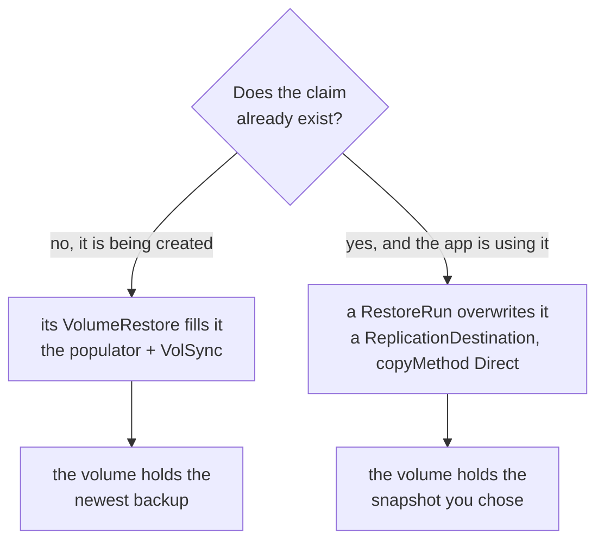
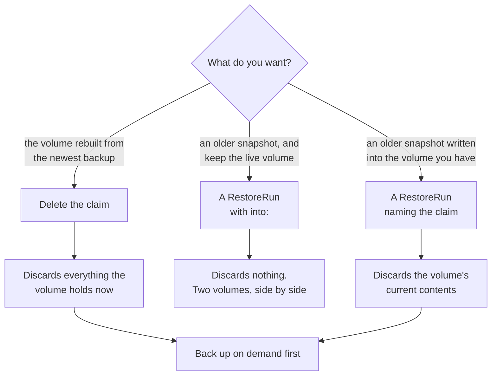
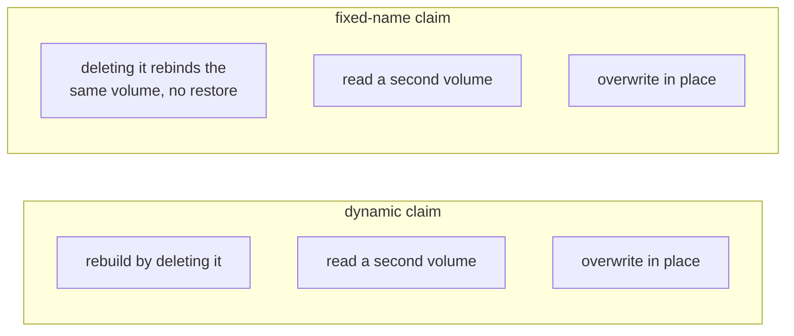

# Restores

Three operations bring data back, and they differ in what they discard. This
page owns that distinction; [api.md](api.md) describes VolumeRestore and
RestoreRun field by field and [architecture.md](architecture.md) has the object
flow.

## Know this first

A volume populator acts once, at the moment a claim is created. A VolumeRestore
is a standing declaration that says where a new volume's contents come from, and
it does nothing at all to a claim that already exists.

So "restore" splits into two unrelated mechanisms, and reaching for the wrong one
is how data is lost:


```mermaid
flowchart TD
    Q{"Does the claim<br/>already exist?"}
    Q -- "no, it is being created" --> P["its VolumeRestore fills it<br/>the populator + VolSync"]
    Q -- "yes, and the app is using it" --> D["a RestoreRun overwrites it<br/>a ReplicationDestination, copyMethod Direct"]

    P --> P1["the volume holds the<br/>newest backup"]
    D --> D1["the volume holds the<br/>snapshot you chose"]
```

Both paths go through this controller. The left one acts on its own when a
claim is created; the right one runs only when someone submits a RestoreRun.

## Choosing


```mermaid
flowchart TD
    S{"What do you want?"}

    S -- "the volume rebuilt from<br/>the newest backup" --> A["Delete the claim"]
    S -- "an older snapshot, and<br/>keep the live volume" --> B["A RestoreRun<br/>with into:"]
    S -- "an older snapshot written<br/>into the volume you have" --> C["A RestoreRun<br/>naming the claim"]

    A --> A1["Discards everything the<br/>volume holds now"]
    B --> B1["Discards nothing.<br/>Two volumes, side by side"]
    C --> C1["Discards the volume's<br/>current contents"]

    A1 --> W["Back up on demand first"]
    C1 --> W
```

| To do this | Create | Stop the workload | What is discarded |
| --- | --- | --- | --- |
| rebuild from the newest backup | nothing, delete the claim | yes, to release the claim | the volume's current contents |
| read an older snapshot beside the live volume | a RestoreRun with `into:` | no | nothing |
| write an older snapshot into the existing volume | a RestoreRun naming the claim | yes, the mover mounts the claim | the volume's current contents |

The middle row is the one to reach for when the question is whether an older
backup is any better, because it answers that without betting the current data on
the answer. Any number of `into:` runs can exist at once, each with its own
point in time and its own claim.

## Which claim shapes each one works on

A claim is one of two shapes, and only the first mechanism cares which:

| Claim | How it gets its volume |
| --- | --- |
| dynamic, `dataSourceRef` names a VolumeRestore | the class provisions it, and backup-controller fills it at creation |
| fixed name, `volumeName` names a PersistentVolume | it binds that volume the moment it exists |


```mermaid
flowchart LR
    subgraph dyn["dynamic claim"]
        d1["rebuild by deleting it"]
        d2["read a second volume"]
        d3["overwrite in place"]
    end

    subgraph fixed["fixed-name claim"]
        f1["deleting it rebinds the<br/>same volume, no restore"]
        f2["read a second volume"]
        f3["overwrite in place"]
    end
```

A fixed-name claim is never populated, because it is bound before anything could
fill it. Delete it and recreate it and it rebinds the same dataset with the same
contents, so restic reaches that volume only through an in-place RestoreRun.
That makes the in-place restore the only way back for a fixed-name volume, and
one of two ways back for a dynamic one. The runs find a fixed-name claim's
repository through the VolumeRestore carrying the claim's own name.

The in-place restore itself is indifferent to the shape. Its
ReplicationDestination names `destinationPVC` and writes into whatever claim
that is, without knowing how the claim was provisioned.

## Why an in-place restore needs the workload stopped

The mover mounts the claim and writes into it. ReadWriteOnce restricts a claim to
one node rather than to one pod, and the mover and the app both land on the node
holding the volume, so Kubernetes permits both to mount it at once. Two writers
on one filesystem is how the volume being restored is corrupted.

Stopping the workload is what prevents it. A RestoreRun with `quiesce` stops the
workloads that list names itself, as
[namespace-backups.md](namespace-backups.md#restore-a-whole-namespace-to-one-moment)
shows. Without that list the run stops nothing: it waits in phase Waiting,
reason ClaimInUse, until no pod mounts the claim. It lists the pods straight
from the API server on every pass, because a cached list that had not yet seen
a new pod would report the claim free. Who stops the workload then depends on
what deployed it. In the walzen infrastructure repository a Flux app is
suspended and scaled down by hand, and a terragrunt unit is applied with its
workload at zero; that repository's docs/cluster/backups/ has both procedures.

## Back up before you discard

Two of the three operations discard what the volume holds. Whatever has not
reached the repository is gone with it, so take a backup on demand first
whenever the newest writes might matter. Submit a BackupRun naming the claim, or
`all: true` for everything the namespace marks backup.wlz.li/enabled, and watch
it the way you would a Job:

```yaml
apiVersion: backup.wlz.li/v1alpha1
kind: BackupRun
metadata:
  name: before-the-rebuild
  namespace: canary-namespace-backup
spec:
  source: canary-namespace-backup-data
```

The phase runs Queued, Running and Succeeded, or Failed with the reason on the
Ready condition. `status.items[].snapshotTime` holds the time restic stamped on
the snapshot the mover saved, and the object stays as the record. Set
`ttlSecondsAfterFinished` to have it clean itself up.

The controller writes the claim's ReplicationSource itself and keeps the spent
manual tag on it between runs, because VolSync syncs a source with no trigger in
a tight loop. [namespace-backups.md](namespace-backups.md) has the whole
mechanism, the scheduler and the measured runs.

## Submitting a restore

Both restore shapes are one object. The claim's own VolumeRestore supplies the
repository, the cache class and the mover's queue label, so a run states only
which volume and how far back:

```yaml
apiVersion: backup.wlz.li/v1alpha1
kind: RestoreRun
metadata:
  name: back-to-friday
  namespace: canary-backup
spec:
  claim: canary-backup
  restoreAsOf: "2026-09-13T00:00:00Z"
```

That is the in-place restore. Without `quiesce` it stops nothing itself: while
a pod still mounts the claim, the run sits in phase Waiting, with the reason
ClaimInUse and a message naming the pod that holds it. Stop the workload however
that app is deployed and the restore begins on its own.

Add `into:` for the shape that needs nothing stopped, because it writes a second
volume and leaves the app's alone:

```yaml
spec:
  claim: canary-backup
  into: canary-backup-friday
  restoreAsOf: "2026-09-13T00:00:00Z"
```

The controller writes a VolumeRestore carrying the time of the snapshot the
run selected, and a claim naming it, so the ordinary populator path fills it on
the source claim's node. Mount `canary-backup-friday` from a throwaway pod and
compare. Both objects are owned by the RestoreRun, so deleting the run deletes
the claim and its dataset with it; keep the run until the comparison is done.

Before it creates anything, a run lists the repository's snapshots and fails
with reason NoBackupInReach when none is at or before `restoreAsOf`. VolSync's
mover would otherwise print `No eligible snapshots found`, exit 0, and report
success having written nothing.

`database: <cluster>` restores one database and `all: true` every enabled volume
and database in the namespace; [namespace-backups.md](namespace-backups.md)
shows both on the prod canary.

To restore a repository no claim in the namespace owns, name the Secret instead
of a claim. It has to be a Secret in the run's own namespace: a run that could
name one anywhere would let whoever may create a run here read any backup in the
cluster, so copying a Secret into a namespace is the deliberate act that grants
that.

```yaml
spec:
  repository: other-app-restic
  into: scratch
  intoSize: 5Gi
```

With no source claim, the run has no size to copy and no node to put the new
claim on, so `intoSize` is required. The run creates `scratch` as a plain claim
of that size with no data source, and a ReplicationDestination with
`copyMethod: Direct` whose mover writes the selected snapshot into it. The
mover pod is the claim's first consumer, so on a WaitForFirstConsumer class the
scheduler places the claim wherever the mover pod runs.
[decisions.md](decisions.md#restore-a-repository-into-a-plain-claim-through-a-direct-replicationdestination)
records why this path skips the populator.

`scratch` is Bound while the mover still writes into it, so wait for the run to
reach Succeeded before you mount it. A mover that fails ends the run Failed
with its logs, and a restore still unfinished at `timeout` ends it TimedOut with
`claim scratch had not been restored by <time>`.

### Which snapshot a run restores

The run compares `restoreAsOf` with each snapshot's time in whole seconds, the
way VolSync's mover does: the mover drops the fraction of a second from both
before it compares them. A snapshot taken at 06:00:00.7 is in reach of
`restoreAsOf: "2026-09-13T06:00:00Z"`, which is also the time a BackupRun
reports for it.

The run records the snapshot it selected in `status.items[].snapshot` and its
time in `status.items[].snapshotTime`. The mover, or the VolumeRestore of an
`into` restore, gets that time in whole seconds as `restoreAsOf`, with no
`previous`. Were the mover handed the run's own `restoreAsOf` and `previous`,
it would choose again when it starts, and a scheduled backup that finished in
between would change which snapshot is the newest, or the one before it.

## Databases restore themselves

Everything above is about volumes. A CloudNativePG database has the same gap
that a volume used to have, and the controller closes it the same way: by
deciding at creation time.

`spec.bootstrap` is read once, when CloudNativePG creates a Cluster, and never
again. So a Cluster created after a cluster rebuild bootstraps with `initdb`,
comes up empty, and reports healthy while its archive sits untouched in the
object store. Nobody is told.

The bootstrap webhook watches Clusters being created and looks in the object
store the Cluster archives through:

| What it finds | What it does |
| --- | --- |
| nothing at all under the Cluster's prefix | nothing; the Cluster bootstraps as written, which is `initdb` |
| a completed base backup | rewrites the Cluster to recover from it, to the end of the archive |
| a completed base backup, and a RestoreRun that deleted this Cluster | rewrites it to recover to the run's `restoreAsOf`, and names the run in `backup.wlz.li/restore-run` |
| a completed base backup, and `backup.wlz.li/restore-as-of` on the Cluster | rewrites it to recover to that moment |
| objects under the prefix, such as WAL or failed base backups, and no completed base backup | refuses the Cluster: `s3://<bucket>/<prefix>/ holds an archive with no completed base backup ...` (the full text is below) |
| no completed base backup, and a RestoreRun or the annotation asks for a recovery | refuses the Cluster: `... holds no completed base backup to recover from.` |
| no base backup finished by the moment a run or the annotation asks for | refuses the Cluster, naming the oldest base backup |
| the Cluster declares a bootstrap method other than `initdb`, such as `recovery` or `pg_basebackup` | nothing, unless a RestoreRun waits for this Cluster; then it refuses it with `declares its own spec.bootstrap.<method>. Remove the declared bootstrap ..., or delete the RestoreRun.`, so two sources cannot race |
| `backup.wlz.li/bootstrap: initdb`, and nothing under the prefix | nothing; an empty database was asked for on purpose |
| `backup.wlz.li/bootstrap: initdb`, and anything under the prefix | refuses the Cluster: `The Cluster asks for an empty database (backup.wlz.li/bootstrap: initdb), and s3://<bucket>/<prefix>/ still holds the archive of an earlier one. ...` ([Starting a database empty](#starting-a-database-empty) has the full text) |
| the store takes longer than the webhook's 10-second budget to answer | refuses the Cluster with what it read so far ([How long the webhook reads](#how-long-the-webhook-reads)) |

A completed base backup is one whose backup.info says `status: DONE`. barman
writes a backup's directory under base/ when the backup starts, marks it
STARTED, and later marks it DONE or FAILED. It never deletes a failed or
unfinished backup on its own: its retention deletes only DONE backups that
have become obsolete. A RestoreRun's checks against a store with no DONE
backup fail before the run deletes anything.

The webhook lists base/ with the `/` delimiter, which gives one entry per
backup directory, the way barman's own catalog reads it. When base/ holds no
directory, the webhook lists one key under `<prefix>/` to learn whether
anything at all is there. The trailing slash keeps `app/app-pg` from matching
`app/app-pg-old/`.

### A database that could never archive

With no completed base backup and nothing asking for a recovery, the webhook
admits a Cluster only when its prefix is empty. Anything under the prefix makes
it refuse:

```text
s3://backups/app/app-pg/ holds an archive with no completed base backup (3
base backups under base/, none DONE). A database started empty here could
never archive its WAL, because CloudNativePG refuses a prefix that already
holds WAL, and a recovery has nothing to start from. If that archive is worth
nothing, delete everything under s3://backups/app/app-pg/ and create the
Cluster again. Otherwise give this Cluster a serverName that is not "app-pg".
```

When base/ is empty and something else is under the prefix, the parenthesis
reads `(no base backup under base/, but other objects, such as WAL, under the
prefix)`.

A Cluster started with `initdb` over such a prefix would come up, serve
traffic, and never back anything up. CloudNativePG creates the marker file
`.check-empty-wal-archive` after `initdb`, and while it exists the barman-cloud
plugin runs `barman-cloud-check-wal-archive` before it archives each segment.
That check lists `<prefix>/wals/` and fails with `Expected empty archive` on any
WAL file there. Every `archive_command` then fails, the Cluster's
ContinuousArchiving condition turns False with reason
ContinuousArchivingFailing, and `pg_wal` grows until the volume is full.
[compatibility.md](compatibility.md#cloudnativepg-1300) has the source lines.
v0.8.x admitted such a Cluster as written; [upgrading.md](upgrading.md#v090)
says how to find one it admitted.

The webhook refuses a prefix holding only failed base backups and no WAL too,
although barman's check would pass there.
[decisions.md](decisions.md#refuse-a-new-database-over-an-archive-it-could-never-archive-into)
records why.

### How long the webhook reads

The API server waits 15 seconds for the webhook (`timeoutSeconds` in
deploy/webhook.yaml). The webhook gives each create a budget of 10 of them,
counted from the moment it starts deciding, so its Kubernetes reads and the
object store reads share it. The other 5 leave room for TLS and the API
server's own work.

Within that budget it reads the backup.info files newest first, eight at a
time, and stops at the first DONE backup, or the first one that finished by
the moment a run or the annotation asks for. barman names each directory by
the backup's start time, so the IDs sort by time. In a healthy store the
newest backup is DONE, or STARTED while a backup runs, and the answer needs one
listing and one or two reads. A directory with no backup.info counts as not
DONE, as it does for barman.

A store whose failed backups pile up ahead of the newest DONE one can outlast
the budget. The webhook then refuses the Cluster and names what it read:

```text
Checking s3://backups/app/app-pg/base/ ran out of time: 412 base backups are
there, and the newest 400 read were none of them completed. barman never
deletes failed or unfinished backups. Delete the base/<id>/ directories whose
backup.info does not say status=DONE (barman-cloud-backup-delete --backup-id
<id> deletes one), then create the Cluster again.
```

When one backup.info failed to read along the way, the message names the error
and says that file might be the completed backup. When the budget ran out
before the store listed base/ at all, the message reads `ran out of time before
the object store listed its base backups`. A budget that runs out always
refuses the Cluster. The webhook never reads a listing it could not finish as
an empty prefix, because an empty prefix is the one answer that starts the
database empty.

To clear a failed backup, run barman's own tool with the ObjectStore's
destinationPath and endpointURL, the Cluster's serverName, and the store's key
pair in AWS_ACCESS_KEY_ID and AWS_SECRET_ACCESS_KEY:

```
barman-cloud-backup-delete --cloud-provider aws-s3 --endpoint-url <endpointURL> --backup-id <id> --dry-run s3://<bucket>/<path> <serverName>
```

Drop `--dry-run` once the objects it lists are the ones to delete.
`--backup-id` deletes the named backup whatever its status.

The webhook leaves every bootstrap method but `initdb` alone because it can
only replace `initdb`. Adding a `recovery` beside a `pg_basebackup` would give
the Cluster two methods, which CloudNativePG refuses.

Neither kustomize nor OpenTofu can make that choice, because both render their
manifests before anything has spoken to the object store. Admission is the one
moment when the Cluster is known and the store is reachable.

A rewritten Cluster gets `bootstrap.recovery`, the `externalClusters` entry that
recovery names, and the annotation `cnpg.io/skipEmptyWalArchiveCheck`. The annotation is needed because
CloudNativePG refuses to archive into a prefix that already holds WAL, which is
true of every restore: the prefix a database recovers from is the prefix it
archives to.

### Updates to a recovered Cluster

A GitOps tool applies the Cluster from its source on every reconcile, and the
source still holds `initdb`. Server-side apply keeps the `recovery` the webhook
wrote and adds `initdb` back, and CloudNativePG refuses the result:

```text
admission webhook "vcluster.cnpg.io" denied the request: Cluster.cluster.cnpg.io
"canary-backup-aio-flux-pg" is invalid: spec.bootstrap: Forbidden: Only one
bootstrap method can be specified at a time
```

A second webhook entry receives updates. When the stored Cluster has a `recovery`
whose source is `backup-controller`, the handler drops `initdb` from the
incoming object. It reads nothing, so it also acts on dry-runs, which is where
Flux first hits the refusal. A Cluster without that recovery source is left as
the update wrote it.

The update entry is registered with `failurePolicy: Ignore`. An unavailable
controller then fails only a recovered Cluster's update, with the error above,
and blocks no update to any other Cluster.

### Refusing a shared archive

Before admitting a Cluster, the webhook checks that no other database already
archives to the same bucket and prefix, whatever endpoint either one names, and
refuses it if one does:

```text
other/app-pg already archives to backups/app/app-pg. Two databases writing one
archive interleave their WAL and leave it unrestorable. Give this Cluster an
archive of its own, or a serverName that is not "app-pg". The check compares
bucket and prefix whatever the endpointURL says, because two endpoints can name
one service; if other/app-pg really archives to a different S3 service, give
one of the two its own prefix in destinationPath.
```

This is the one failure nothing else on the cluster can see. Each Cluster is
valid on its own; the pair is the problem. The damage is silent and permanent:
WAL filenames are timeline plus position and nothing else, so the second
database overwrites the first's segments, and a base backup whose WAL range is
gone can never reach consistency again.

A Cluster that declares its own recovery is checked like any other, and so is
one carrying `backup.wlz.li/bootstrap: initdb`: where a Cluster archives does
not depend on how it bootstraps.

The webhook compares two values of every other archiving Cluster with the new
Cluster's:

| Value | From | Compared |
| --- | --- | --- |
| bucket | the host part of `spec.configuration.destinationPath` | ignoring letter case, so `Backups` and `backups` match |
| prefix | the rest of `destinationPath`, plus the server name | exactly |

The endpoint is not compared. `https://s3.example.com` and its `:443` form, a
Service name with and without `.cluster.local`, an empty endpointURL and
`https://s3.amazonaws.com`, or an Ingress host and the Service behind it all
reach one store, and no comparison of the two names can prove they are
different services. Two different S3 services that each hold a bucket of the
same name, with the same prefix in it, are refused too. Give one of the two its
own prefix: put the environment or the namespace in its `destinationPath`
(`s3://backups/staging/`), or set a `serverName`. There is no annotation to
override the check;
[decisions.md](decisions.md#compare-bucket-and-prefix-and-never-the-endpoint-for-a-shared-archive)
records why.

Move the Cluster being created, never the one that already archives there. A
running database whose `destinationPath` changes starts a new archive at the
new prefix, holding none of the old one's base backups or WAL. Created again
before its first base backup there, the Cluster finds no completed base backup
and is refused; created again after it, the Cluster recovers only to moments
after that backup. To move an existing database anyway, copy its archive to the
new prefix before you switch.

For each create, the webhook lists every Cluster on the cluster and, once it
meets another archiving Cluster, every ObjectStore. It looks each archiving
Cluster's store up in that list by the Cluster's namespace and the store's
name. That makes two list calls however many databases the cluster holds, so a
cluster rebuild that creates every Cluster at once stays inside the webhook's
budget. Two Clusters can reach one prefix through differently named
ObjectStores, which is why the webhook compares locations and never store
names. The Cluster being admitted is skipped by namespace and name, so
recreating a database is not a collision with the record of itself, which is
what makes restores work.

The check reads no Secret of any other Cluster. Where a database archives is
written in its ObjectStore, so a holder whose credentials Secret is missing
still counts. A Cluster whose ObjectStore is missing from the list, or names no
s3:// destination, archives nowhere and is skipped. When either list fails,
for a timeout or any other error, the webhook refuses the create with an HTTP
500: without the lists it cannot rule out a collision. The API server's caller
retries (Flux on its next reconcile), and the create goes through once the
lists answer.

### Reaching an object store over TLS

The webhook talks to the object store directly, so it has to verify whatever
certificate that endpoint presents. Neither case is configured on this
controller and neither is hardcoded:

| The endpoint's certificate | What verifies it |
| --- | --- |
| signed by a public authority | the public roots in the image |
| signed by a private authority | the store's own `endpointCA` |

`endpointCA` is a field on the ObjectStore, a Secret name and key holding a PEM
bundle, and the Barman Cloud plugin already reads it for exactly this reason.
So an endpoint that needs a CA is described once, on the store, and the plugin
and this controller both pick it up. A store that needs none declares none.

### Refuse a Cluster the webhook cannot decide

The creation entry is registered with `failurePolicy: Fail`. When it cannot
run, or cannot read the object store, the Cluster is refused.

The alternative is worse than it sounds. Allowing the Cluster through would
create it exactly as written, which is `initdb`, which is an empty database
beside a full archive, reported as success. That failure arrives during a
cluster rebuild, when this controller is most likely to be starting up and an
admin is least likely to be reading Cluster events.

| Case | Answer |
| --- | --- |
| the controller is down, or its webhook does not answer within 15 seconds | the API server refuses the create |
| the Cluster's ObjectStore or one of its Secrets cannot be read | HTTP 500 with the read's error |
| the Cluster list or the ObjectStore list of the shared-archive check fails | HTTP 500, `list the Clusters: ...` or `list the ObjectStores: ...` |
| a Kubernetes read is still running when the 10-second budget ends | HTTP 500, `the webhook ran out of its 10s budget while <step>: <error>`, where the step is, for example, `listing the Clusters and their ObjectStores` |
| the object store answers a listing or a read with an error | HTTP 500 ending in the store's answer, such as `(HTTP 403 AccessDenied)` |
| a backup.info fails to read and no DONE backup turns up elsewhere | HTTP 500, since the unread file might be the completed backup |
| the object store is still being read when the budget ends | refused with the counts read so far ([How long the webhook reads](#how-long-the-webhook-reads)) |

The API server treats an HTTP 500 as a refusal and passes its text on. A DONE
backup found before a failed read still recovers the Cluster, since it proves
a recovery can start.

### Starting a database empty

With the webhook installed, deleting a Cluster brings its data back, which
leaves no way to discard a database. The opt-out is an annotation that asks
the webhook for an empty database:

```yaml
metadata:
  annotations:
    backup.wlz.li/bootstrap: initdb
```

Any other value is ignored, so a typo does not silently wipe a database.

An empty database can archive only into an empty prefix, for the reason in
[A database that could never archive](#a-database-that-could-never-archive).
The webhook therefore reads the store for an opted-out Cluster too. It admits
the Cluster unchanged when nothing exists under its prefix, and refuses it
when anything does:

```text
The Cluster asks for an empty database (backup.wlz.li/bootstrap: initdb), and
s3://backups/app/app-pg/ still holds the archive of an earlier one.
CloudNativePG will not archive a new database into a prefix that holds WAL, so
this one would never be backed up. To discard the old archive, delete
everything under s3://backups/app/app-pg/ and create the Cluster again. To keep
it, give this Cluster a serverName that is not "app-pg".
```

Reading the store means an opted-out Cluster needs its ObjectStore, that
store's Secrets and the object store itself to answer, and a failure refuses
it like any other create. It goes through the shared-archive check as well. An
opted-out Cluster that declares a bootstrap method other than `initdb` is
treated as one declaring its own bootstrap: the annotation asks for what only
`initdb` gives, so it changes nothing there.

To discard a database, give its new Cluster an empty prefix before you create
it, in one of two ways:

| The old archive | Do this |
| --- | --- |
| is worth nothing | delete everything under `s3://<bucket>/<prefix>/`, with the trailing slash so a sibling such as `<prefix>-old/` stays, then create the Cluster |
| should stay | set a `serverName` in the Cluster's barman-cloud plugin parameters that no archive uses yet, then create the Cluster |

With the AWS CLI, the first way is:

```
aws s3 rm --recursive --endpoint-url <endpointURL> s3://<bucket>/<prefix>/
```

Never add `cnpg.io/skipEmptyWalArchiveCheck` to get a new database past the
refusal. barman uploads each segment to `<prefix>/wals/` by its name, and a new
database on timeline 1 writes the same names as the old one, so it overwrites
the old archive's WAL. The old base backups then lack the WAL they need, yet
still read DONE, and the next create of the Cluster recovers from the mixed
archive.

A RestoreRun leaves an opted-out Cluster alone too:

| Run | What happens to the opted-out Cluster |
| --- | --- |
| `all: true` | its item is Skipped with `the Cluster carries backup.wlz.li/bootstrap: initdb, which asks for an empty database, so the run leaves it alone`, and the run restores everything else |
| `database: <cluster>` | the run ends Invalid before it touches anything |
| a Cluster that gains the annotation after the run marked it Deleted, or is created again with it | its item is Skipped, and the run never deletes it again |

The webhook never recovers an opted-out Cluster and never marks it as a run's
recovery. A run that deleted one would find it refused over its old archive,
or back empty, and in the second case delete it again and repeat until its
timeout. [decisions.md](decisions.md#leave-an-opted-out-cluster-out-of-a-restorerun)
has the decision.

From v0.8.1 a RestoreRun treats a Cluster whose owner declares its own
bootstrap method the same way, with the item message `the Cluster declares its
own spec.bootstrap.<method>, so the run leaves it alone`. That covers
`pg_basebackup` and a `recovery` the owner wrote. A `recovery` whose source is
`backup-controller` is the one this webhook wrote in an earlier restore, and
that Cluster restores as usual. A run that deleted a Cluster declaring
`pg_basebackup` would see Flux create it again with that method, the webhook
refuse it while the run waits, and the database stay down until the run's
timeout with nothing restored.
