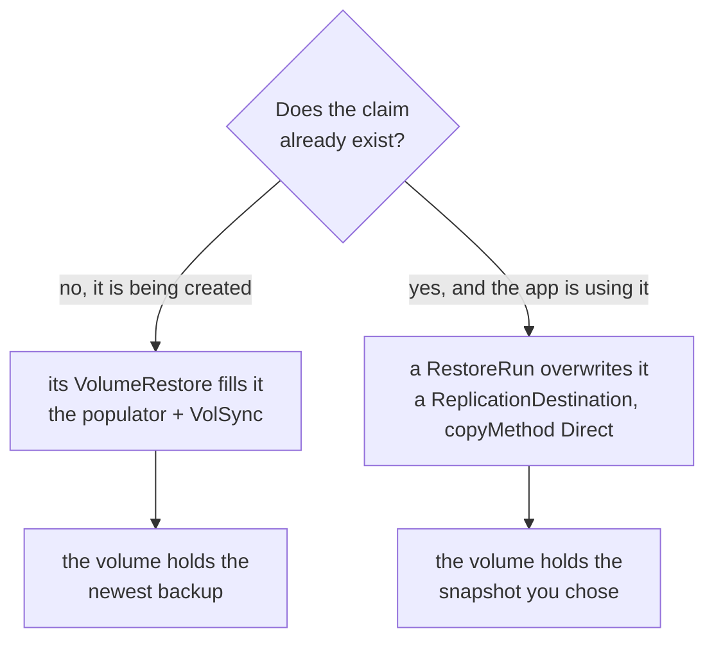
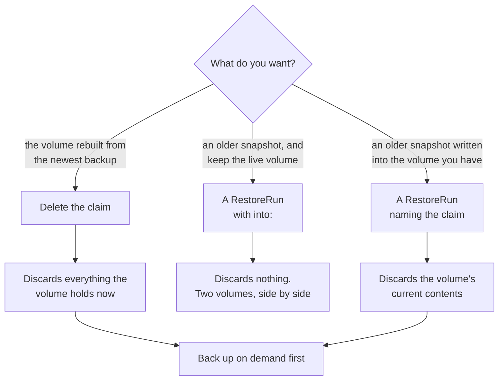
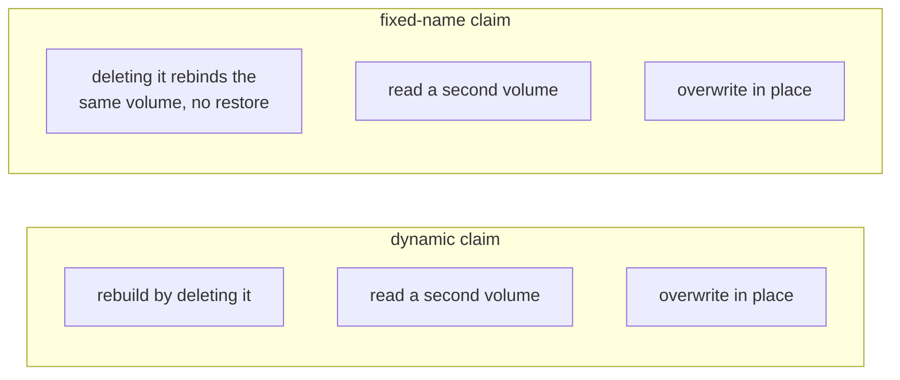

# Restores

Three operations bring data back, and they differ in what they discard. This
page owns that distinction; [api.md](api.md) describes VolumeRestore and
RestoreRun field by field and [architecture.md](architecture.md) has the object
flow.

## Know this first

A volume populator acts once, at the moment a claim is created. A VolumeRestore
is a standing declaration that says where a new volume's contents come from, and
it does nothing at all to a claim that already exists.

So "restore" splits into two unrelated mechanisms, and reaching for the wrong one
is how data is lost:


```mermaid
flowchart TD
    Q{"Does the claim<br/>already exist?"}
    Q -- "no, it is being created" --> P["its VolumeRestore fills it<br/>the populator + VolSync"]
    Q -- "yes, and the app is using it" --> D["a RestoreRun overwrites it<br/>a ReplicationDestination, copyMethod Direct"]

    P --> P1["the volume holds the<br/>newest backup"]
    D --> D1["the volume holds the<br/>snapshot you chose"]
```

Both paths go through this controller. The left one acts on its own when a
claim is created; the right one runs only when someone submits a RestoreRun.

## Choosing


```mermaid
flowchart TD
    S{"What do you want?"}

    S -- "the volume rebuilt from<br/>the newest backup" --> A["Delete the claim"]
    S -- "an older snapshot, and<br/>keep the live volume" --> B["A RestoreRun<br/>with into:"]
    S -- "an older snapshot written<br/>into the volume you have" --> C["A RestoreRun<br/>naming the claim"]

    A --> A1["Discards everything the<br/>volume holds now"]
    B --> B1["Discards nothing.<br/>Two volumes, side by side"]
    C --> C1["Discards the volume's<br/>current contents"]

    A1 --> W["Back up on demand first"]
    C1 --> W
```

| To do this | Create | Stop the workload | What is discarded |
| --- | --- | --- | --- |
| rebuild from the newest backup | nothing, delete the claim | yes, to release the claim | the volume's current contents |
| read an older snapshot beside the live volume | a RestoreRun with `into:` | no | nothing |
| write an older snapshot into the existing volume | a RestoreRun naming the claim | yes, the mover mounts the claim | the volume's current contents |

The middle row is the one to reach for when the question is whether an older
backup is any better, because it answers that without betting the current data on
the answer. Any number of `into:` runs can exist at once, each with its own
point in time and its own claim.

## Which claim shapes each one works on

A claim is one of two shapes, and only the first mechanism cares which:

| Claim | How it gets its volume |
| --- | --- |
| dynamic, `dataSourceRef` names a VolumeRestore | the class provisions it, and backup-controller fills it at creation |
| fixed name, `volumeName` names a PersistentVolume | it binds that volume the moment it exists |


```mermaid
flowchart LR
    subgraph dyn["dynamic claim"]
        d1["rebuild by deleting it"]
        d2["read a second volume"]
        d3["overwrite in place"]
    end

    subgraph fixed["fixed-name claim"]
        f1["deleting it rebinds the<br/>same volume, no restore"]
        f2["read a second volume"]
        f3["overwrite in place"]
    end
```

A fixed-name claim is never populated, because it is bound before anything could
fill it. Delete it and recreate it and it rebinds the same dataset with the same
contents, so restic reaches that volume only through an in-place RestoreRun.
That makes the in-place restore the only way back for a fixed-name volume, and
one of two ways back for a dynamic one. The runs find a fixed-name claim's
repository through the VolumeRestore carrying the claim's own name.

The in-place restore itself is indifferent to the shape. Its
ReplicationDestination names `destinationPVC` and writes into whatever claim
that is, without knowing how the claim was provisioned.

## Why an in-place restore needs the workload stopped

The mover mounts the claim and writes into it. ReadWriteOnce lets every pod on
the node that has the claim attached mount it, and only ReadWriteOncePod limits
a claim to one pod. The mover and the app both land on the node holding the
volume, so Kubernetes lets both mount it at once. Two writers
on one filesystem is how the volume being restored is corrupted.

Stopping the workload is what prevents it. A RestoreRun with `quiesce` stops the
workloads that list names itself, as
[namespace-backups.md](namespace-backups.md#restore-a-whole-namespace-to-one-moment)
shows; while a pod of one of them is still terminating, the run waits in phase
Waiting with Ready reason Running and `waiting for pod <pod> to stop
before anything is restored`, because a pod shutting down can still write.
Without that list the run stops nothing: it waits in phase Waiting,
reason ClaimInUse, until no pod mounts the claim. It lists the pods straight
from the API server on every pass, because a cached list that had not yet seen
a new pod would report the claim free. Who stops the workload then depends on
what deployed it. In the walzen infrastructure repository a Flux app is
suspended and scaled down by hand, and a terragrunt unit is applied with its
workload at zero; that repository's docs/cluster/backups/ has both procedures.

Two in-place restores of one claim run one after the other. Before it creates
its ReplicationDestination, a run lists the destinations in its namespace, and
while the restic mover of another destination writes into the claim, the run
waits with reason ClaimInUse:

```text
ReplicationDestination restore-1a2b3c4d-0 is restoring into claim notes-data
```

That check also catches a destination someone created by hand. Once the first
run has deleted its destination, the mover pod of the first run may still mount
the claim, and the second run waits with reason ClaimInUse and a message naming
that pod. The first run keeps the claim's Lease until its mover's Job and pods
are gone, so once the pod has gone the second run waits with reason SourceBusy
and a message naming the first run. The second run then starts on its own.

A run stops the app only when it can go on. On the pass that records its
plan, before it stops anything, it checks every volume item it has not started:
a backup of the claim or of its repository that is uploading, or a Lease
another run holds on either, makes it wait in phase Waiting with reason
SourceBusy and the workloads still running, and a read that fails comes back
as an error and stops nothing. The check at the mover object remains the one
that counts ([One mover at a time](namespace-backups.md#one-mover-at-a-time)).
A volume item whose repository Secret is gone fails in that same check, with
the message shown under [Which snapshot a run restores](#which-snapshot-a-run-restores),
and a run left with no item to restore stops nothing and ends. The run also
waits for another run that has stopped this namespace's workloads
([One quiesce at a time](namespace-backups.md#one-quiesce-at-a-time)). A
Kustomization that applies Deployments or StatefulSets in two namespaces ends
the run with reason `Invalid` before anything is stopped
([Which Kustomization a run suspends](namespace-backups.md#which-kustomization-a-run-suspends)).

## Back up before you discard

Two of the three operations discard what the volume holds. Whatever has not
reached the repository is gone with it, so take a backup on demand first
whenever the newest writes might matter. Submit a BackupRun naming the claim, or
`all: true` for everything the namespace marks backup.wlz.li/enabled, and watch
it the way you would a Job:

```yaml
apiVersion: backup.wlz.li/v1alpha1
kind: BackupRun
metadata:
  name: before-the-rebuild
  namespace: canary-namespace-backup
spec:
  source: canary-namespace-backup-data
```

The phase runs Queued, Running and Succeeded, or Failed with the reason on the
Ready condition. `status.items[].snapshotTime` holds the time restic stamped on
the snapshot the mover saved, and the object stays as the record. Set
`ttlSecondsAfterFinished` to have it clean itself up.

The controller writes the claim's ReplicationSource itself and keeps the spent
manual tag on it between runs, because VolSync syncs a source with no trigger in
a tight loop. [namespace-backups.md](namespace-backups.md) has the whole
mechanism, the scheduler and the measured runs.

## Submitting a restore

Both restore shapes are one object. The claim's own VolumeRestore supplies the
repository, the cache class and the mover's queue label, so a run states only
which volume and how far back:

```yaml
apiVersion: backup.wlz.li/v1alpha1
kind: RestoreRun
metadata:
  name: back-to-friday
  namespace: canary-backup
spec:
  claim: canary-backup
  restoreAsOf: "2026-09-13T00:00:00Z"
```

That is the in-place restore. Without `quiesce` it stops nothing itself: while
a pod still mounts the claim, the run sits in phase Waiting, with the reason
ClaimInUse and a message naming the pod that holds it. Stop the workload however
that app is deployed and the restore begins on its own.

Add `into:` for the shape that needs nothing stopped, because it writes a second
volume and leaves the app's alone:

```yaml
spec:
  claim: canary-backup
  into: canary-backup-friday
  restoreAsOf: "2026-09-13T00:00:00Z"
```

The run creates `canary-backup-friday` empty, with the source claim's size and
storage class, and copies the node the source claim's volume is on. A
ReplicationDestination of the run's own, with `copyMethod: Direct`, writes the
selected snapshot into that claim through a mover pod the scheduler places on
that node, so the mover's log says which snapshot it restored and the run
confirms it the way it does in place. Mount `canary-backup-friday` from a
throwaway pod once the run reaches Succeeded and compare. The claim carries an
ownerReference to the RestoreRun, so deleting the run deletes the claim and its
dataset with it; keep the run until the comparison is done. The
ReplicationDestination carries no ownerReference: the run deletes it itself
when the restore ends, or when the run is deleted, and waits for its mover to
stop.

The run writes only into a claim it created itself. A claim named `into`, or a
ReplicationDestination named restore-<first 8 characters of the run's UID>-<item
index>, that the run does not control fails the run, and so does a claim named
`into` that appears after the checks:

```text
claim canary-backup-friday already exists and this run did not create it. spec.into names a new claim for the run to create, and a restore never writes into a claim it did not create. Choose a name no claim in this namespace has. To overwrite an existing claim, restore it in place with spec.claim.
```

Before it creates anything, a run lists the repository's snapshots and fails
with reason NoBackupInReach when none is at or before `restoreAsOf`. VolSync's
mover would otherwise print `No eligible snapshots found`, exit 0, and report
success having written nothing.

`database: <cluster>` restores one database and `all: true` every enabled volume
and database in the namespace; [namespace-backups.md](namespace-backups.md)
shows both on the prod canary.

To restore a repository no claim in the namespace owns, name the Secret instead
of a claim. It has to be a Secret in the run's own namespace: a run that could
name one anywhere would let whoever may create a run here read any backup in the
cluster, so copying a Secret into a namespace is the deliberate act that grants
that.

```yaml
spec:
  repository: other-app-restic
  into: scratch
  intoSize: 5Gi
```

With no source claim, the run has no size to copy and no node to put the new
claim on, so `intoSize` is required. The run creates `scratch` as a plain claim
of that size with no data source, and a ReplicationDestination with
`copyMethod: Direct` whose mover writes the selected snapshot into it. The
mover pod is the claim's first consumer, so on a WaitForFirstConsumer class the
scheduler places the claim wherever the mover pod runs.
[decisions.md](decisions.md#restore-a-repository-into-a-plain-claim-through-a-direct-replicationdestination)
records why this path skips the populator. A run that names only
`spec.repository` is refused before it creates anything: `spec.repository alone
restores into a new claim, so spec.into is required, and it must name a claim
that does not exist yet. To overwrite an existing claim from this repository,
set spec.claim to it as well; the run then restores it in place once no pod
mounts it.`

`scratch` is Bound while the mover still writes into it, so wait for the run to
reach Succeeded before you mount it. A mover that fails ends the run Failed
with its logs, and a restore still unfinished at `timeout` ends it TimedOut with
`claim scratch had not been restored by <time>`.

Before a run records its end, and before a deleted run drops its finalizer, the
run deletes its ReplicationDestination and waits in phase Waiting, with reason
WaitingForShutdown, until the mover's Job and that Job's pods are gone. A Job
with no pod can still start one, and a restic restore killed half way leaves
its lock in the repository. The message names what is left:

```text
waiting for the mover of ReplicationDestination restore-9b7d4e21-0, which the run stopped while it restored scratch, to go: its Job volsync-dst-restore-9b7d4e21-0 is still there. The run gives the app back and lets other runs at the claim only after that
```

When the run fails to delete the destination, or to read the Job and its pods,
it stays unfinished and tries again on every pass. It reports RestartFailed while a
workload it stopped is still down, and ReleaseFailed once the app is back or
when it stopped none. The message names the step and the error, and ends with
what a person can delete by hand:

```text
could not stop the mover of its ReplicationDestination restore-9b7d4e21-0: <error>. The run retries until it can. Fix the cause, or delete ReplicationDestination restore-9b7d4e21-0, its mover's Job volsync-dst-restore-9b7d4e21-0 and that Job's pods yourself; either way the run then finishes by itself.
```

A run with `quiesce` that reports RestartFailed for this step adds the
workloads to scale back once no mover of the run still writes to its claims.
[api.md](api.md#ready-reasons-of-a-restorerun) lists every reason a RestoreRun
reports.

### Which snapshot a run restores

The run compares `restoreAsOf` with each snapshot's time in whole seconds, the
way VolSync's mover does: the mover drops the fraction of a second from both
before it compares them. A snapshot taken at 06:00:00.7 is in reach of
`restoreAsOf: "2026-09-13T06:00:00Z"`, which is also the time a BackupRun
reports for it.

The run records the snapshot it selected in `status.items[].snapshot` and its
time in `status.items[].snapshotTime`. The mover gets that time in whole seconds
as `restoreAsOf`, with no `previous`. Were the mover handed the run's own
`restoreAsOf` and `previous`, it would choose again when it starts, and a
scheduled backup that finished in between would change which snapshot is the
newest, or the one before it.

The mover gets a second, and no snapshot ID: it lists the snapshots itself and
restores the newest one in that second. So the
checks refuse a selection the mover would not restore, and the run ends Failed
with reason NoBackupInReach before anything is created. Each message says what
the mover would restore instead, or why nothing can be told:

| Case | Message |
| --- | --- |
| another snapshot shares the selected one's second | `snapshot 6e473100 (2026-09-26T09:03:53Z) shares its second with snapshot 2edf5bab, and VolSync's mover picks by the whole second, so it would restore 2edf5bab. Choose 2edf5bab or a snapshot in another second` |
| the other snapshot in that second is not tagged `quiesced`, which a `syncDatabaseToVolume` run requires | `... shares its second with snapshot 2edf5bab, which is not tagged quiesced, ... Set restoreAsOf before 2026-09-26T09:03:53Z, or previous, to choose a quiesced snapshot in another second` |
| two snapshots carry the same time to the nanosecond | `snapshot 6e473100 (2026-09-26T09:03:53Z) has the same time as snapshot 2edf5bab, to the nanosecond, and restic lists such snapshots in no set order, so VolSync's mover may restore 2edf5bab. Choose a snapshot in another second` |
| the selected snapshot has no path containing /data, as the mover writes them | `snapshot 6e473100 (2026-09-26T09:03:53Z) has no path containing /data (its paths: /, /etc), and VolSync's mover passes over such snapshots, so it cannot restore 6e473100. Choose a snapshot a VolSync mover took` |
| any snapshot in the repository lists /data after its first path, which the mover misreads | `snapshot 2edf5bab lists /data after its first path (its paths: /, /data), which VolSync's mover misreads as a snapshot of its own dated the day the mover runs, so the run cannot tell which snapshot the mover would restore from this repository. VolSync writes snapshots with /data as their only path; restore from a repository that holds only those` |

A repository holding such a snapshot is refused as a whole, whatever the run
selected.

The run lists the repository once more right before it creates the destination,
so nothing is created from a selection the repository no longer holds. A
backup's `restic forget` that removed the selected snapshot after the checks, or
a quiesced backup that rewrote it under another ID and time, fails the item and
says so, each followed by `. Nothing was written to claim <claim>. Create a new
RestoreRun to select again`:

```text
snapshot 6e473100 (2026-09-26T09:03:53Z), which the checks selected, is no longer in the repository; a backup's retention (restic forget) removed it after the checks
```

```text
snapshot 6e473100, which the checks selected, was rewritten as 2edf5bab at 2026-09-26T09:05:00Z by a quiesced backup after the checks
```

A repository Secret or a VolumeRestore that is gone by then fails the item the
same way, with the same ending.

A pass can create the destination and then lose the status write that records
it. The item is still Pending on the next pass, which finds the item's
ReplicationDestination, named restore-<first 8 characters of the run's
UID>-<item index>, carrying the run's trigger. The run adopts that
destination: the item moves to Running with it, and the restore goes on as if
the write had gone through. The pass that created the destination ran every
check first, and the item still succeeds only when the mover's log names the
selected snapshot (see [What the mover restored](#what-the-mover-restored)).
A mover pod of that destination may already mount the claim; the run does not
wait for it with `ClaimInUse`, since it is the run's own mover.

One kind of snapshot holds data older than its time. When a BackupRun fails a
volume item, VolSync keeps retrying that sync with the clone it cut when the
sync started, and restic stamps the retry's snapshot with the retry's own time,
so the snapshot holds the data of that earlier moment.
[namespace-backups.md](namespace-backups.md#sources-the-controller-writes) has
the item message that says this. Such a snapshot carries no `quiesced` tag, so a
`syncDatabaseToVolume` restore never chooses it. A plain `restoreAsOf` may, and
the volume then holds the newest data captured for that claim, stamped later
than the data is from.

### What the mover restored

VolSync completes a restore whatever its mover did, so the run reads the
mover's log. `status.latestMoverStatus` of the item's ReplicationDestination
holds the filtered log of the mover that completed the run's trigger, and the
item succeeds only when that log names the recorded snapshot:

```text
restoring snapshot 6e473100 of [/data] at 2026-09-26 09:03:53.753460659 +0000 UTC by root@volsync to .
```

An item whose log names no snapshot fails, and the message says why the run
cannot confirm what the claim holds: the log named another snapshot, the mover
found none, the log named a snapshot and also said it found none, the log was
empty, or the item records no snapshot to compare with. A mover that restored
another snapshot names both: `the mover restored snapshot 2edf5bab where the
checks selected 6e473100; claim canary-backup now holds 2edf5bab`. A mover that
found nothing says what the claim holds now: `the mover found no snapshot at or
before 2026-09-26T09:03:53Z and wrote nothing; claim canary-backup holds what it
held before`, or `claim scratch is empty` for an `into` restore.

VolSync keeps only the last `MOVER_LOG_MAX_BYTES` bytes of the filtered log,
1024 by default, so a mover whose log is cut short fails the item as well:
`the mover finished, but its logs name no snapshot, so the run cannot confirm
what claim canary-backup holds. VolSync keeps only the last MOVER_LOG_MAX_BYTES
bytes (1024 by default) of the filtered log. Logs: ...`. A VolSync installed
with `MOVER_LOG_MAX_BYTES` set to 0 or a very small value therefore leaves every
restore unconfirmed, and each one fails.

An in-place item also succeeds only into the claim its mover wrote. Right
before it creates the item's ReplicationDestination, the run creates or
updates the claim's Lease, whose name holds the claim's UID. When the mover's
log checks out, the run reads the claim again and fails the item if the claim
is gone, is being deleted, or has a UID that none of the run's claim Leases
for the item holds. The message says which:

```text
claim notes-data was deleted while the mover wrote into it, and the restored data went with it
claim notes-data was deleted while the mover wrote into it, and the restored data goes with it once the claim is released
claim notes-data was replaced while the mover wrote into it: the claim there now (UID <new>) is not the one the mover wrote into (UID <old>), and nothing was restored into it
the run holds no claim Lease for claim notes-data, so it can't tell whether the mover wrote into the claim that is there now. Check the claim's data, and create a new RestoreRun to restore it
```

The second message appears when someone deletes the claim while the mover's
pod mounts it: Kubernetes keeps the claim, Terminating, until that pod is gone
(pvc-protection), so the mover can finish into a claim that is about to go.

## Databases restore themselves

Everything above is about volumes. A CloudNativePG database has the same gap
that a volume used to have, and the controller closes it the same way: by
deciding at creation time.

`spec.bootstrap` is read once, when CloudNativePG creates a Cluster, and never
again. So a Cluster created after a cluster rebuild bootstraps with `initdb`,
comes up empty, and reports healthy while its archive sits untouched in the
object store. No condition, event or log line reports the lost data.

The bootstrap webhook watches Clusters being created and looks in the object
store the Cluster archives through:

| What it finds | What it does |
| --- | --- |
| nothing at all under the Cluster's prefix | nothing; the Cluster bootstraps as written, which is `initdb` |
| a completed base backup | rewrites the Cluster to recover from it, to the end of the archive |
| a completed base backup, and a RestoreRun that deleted this Cluster | rewrites it to recover to the run's `restoreAsOf`, and names the run in `backup.wlz.li/restore-run` |
| a completed base backup, and `backup.wlz.li/restore-as-of` on the Cluster | rewrites it to recover to that moment |
| objects under the prefix, such as WAL or failed base backups, and no completed base backup | refuses the Cluster: `s3://<bucket>/<prefix>/ holds an archive with no completed base backup ...` (the full text is below) |
| no completed base backup, and a RestoreRun or the annotation asks for a recovery | refuses the Cluster: `... holds no completed base backup to recover from.` |
| no base backup finished by the moment a run or the annotation asks for | refuses the Cluster, naming the oldest base backup |
| the Cluster declares a bootstrap method other than `initdb`, such as `recovery` or `pg_basebackup` | nothing, unless a RestoreRun waits for this Cluster; then it refuses it with `declares its own spec.bootstrap.<method>. Remove the declared bootstrap ..., or delete the RestoreRun.`, so two sources cannot race |
| `backup.wlz.li/bootstrap: initdb`, and nothing under the prefix | nothing; an empty database was asked for on purpose |
| `backup.wlz.li/bootstrap: initdb`, and anything under the prefix | refuses the Cluster: `The Cluster asks for an empty database (backup.wlz.li/bootstrap: initdb), and s3://<bucket>/<prefix>/ still holds the archive of an earlier one. ...` ([Starting a database empty](#starting-a-database-empty) has the full text) |
| the store takes longer than the webhook's 10-second budget to answer | refuses the Cluster with what it read so far ([How long the webhook reads](#how-long-the-webhook-reads)) |

A completed base backup is one whose backup.info says `status: DONE`. barman
writes a backup's directory under base/ when the backup starts, marks it
STARTED, and later marks it DONE or FAILED. It never deletes a failed or
unfinished backup on its own: its retention deletes only DONE backups that
have become obsolete. A RestoreRun's checks against a store with no DONE
backup fail before the run deletes anything.

The webhook recovers a Cluster for a RestoreRun only while that run is
unfinished and not being deleted. A run can time out, fail or be deleted after
it deleted a Cluster and before Flux or tofu created it again. When the owner
then creates the Cluster, the webhook applies the second or the fourth row of
the table: the Cluster recovers to the end of its archive, or to the time in
its own `backup.wlz.li/restore-as-of` annotation, and the moment the run chose
no longer applies. The run's item says so, after the reason the run ended, and
a run that was deleted records a Warning event with reason ClusterLeftDeleted
that says the same:

```text
Cluster notes-pg was deleted, and the run ended before it was created again. No run waits for it now, so when Flux or tofu creates it, the bootstrap webhook recovers it to the end of its archive, or to the time in its own backup.wlz.li/restore-as-of annotation; the moment this run chose no longer applies
```

To recover the Cluster to the run's moment after all, set
`backup.wlz.li/restore-as-of` on the Cluster's manifest to that moment before
its owner creates it.

The webhook lists base/ with the `/` delimiter, which gives one entry per
backup directory, the way barman's own catalog reads it. When base/ holds no
directory, the webhook lists one key under `<prefix>/` to learn whether
anything at all is there. The trailing slash keeps `app/app-pg` from matching
`app/app-pg-old/`.

### A database that could never archive

With no completed base backup and nothing asking for a recovery, the webhook
admits a Cluster only when its prefix is empty. Anything under the prefix makes
it refuse:

```text
s3://backups/app/app-pg/ holds an archive with no completed base backup (3
base backups under base/, none DONE). A database started empty here could
never archive its WAL, because CloudNativePG refuses a prefix that already
holds WAL, and a recovery has nothing to start from. If that archive is worth
nothing, delete everything under s3://backups/app/app-pg/ and create the
Cluster again. Otherwise give this Cluster a serverName that is not "app-pg".
```

When base/ is empty and something else is under the prefix, the parenthesis
reads `(no base backup under base/, but other objects, such as WAL, under the
prefix)`.

A Cluster started with `initdb` over such a prefix would come up, serve
traffic, and never back anything up. CloudNativePG creates the marker file
`.check-empty-wal-archive` after `initdb`, and while it exists the barman-cloud
plugin runs `barman-cloud-check-wal-archive` before it archives each segment.
That check lists `<prefix>/wals/` and fails with `Expected empty archive` on any
WAL file there. Every `archive_command` then fails, the Cluster's
ContinuousArchiving condition turns False with reason
ContinuousArchivingFailing, and `pg_wal` grows until the volume is full.
[compatibility.md](compatibility.md#cloudnativepg-1300) has the source lines.
v0.8.x admitted such a Cluster as written; [upgrading.md](upgrading.md#v090)
says how to find one it admitted.

The webhook refuses a prefix holding only failed base backups and no WAL too,
although barman's check would pass there.
[decisions.md](decisions.md#refuse-a-new-database-over-an-archive-it-could-never-archive-into)
records why.

### How long the webhook reads

The API server waits 15 seconds for the webhook (`timeoutSeconds` in
deploy/webhook.yaml). The webhook gives each create a budget of 10 of them,
counted from the moment it starts deciding, so its Kubernetes reads and the
object store reads share it. The other 5 leave room for TLS and the API
server's own work.

Within that budget it reads the backup.info files newest first, eight at a
time, and stops at the first DONE backup, or the first one that finished by
the moment a run or the annotation asks for. barman names each directory by
the backup's start time, so the IDs sort by time. In a healthy store the
newest backup is DONE, or STARTED while a backup runs, and the answer needs one
listing and one or two reads. A directory with no backup.info counts as not
DONE, as it does for barman.

A store whose failed backups pile up ahead of the newest DONE one can outlast
the budget. The webhook then refuses the Cluster and names what it read:

```text
Checking s3://backups/app/app-pg/base/ ran out of time: 412 base backups are
there, and the newest 400 read were none of them completed. barman never
deletes failed or unfinished backups. Delete the base/<id>/ directories whose
backup.info does not say status=DONE (barman-cloud-backup-delete --backup-id
<id> deletes one), then create the Cluster again.
```

When one backup.info failed to read along the way, the message names the error
and says that file might be the completed backup. When the budget ran out
before the store listed base/ at all, the message reads `ran out of time before
the object store listed its base backups`. A budget that runs out always
refuses the Cluster. The webhook never reads a listing it could not finish as
an empty prefix, because an empty prefix is the one answer that starts the
database empty.

To clear a failed backup, run barman's own tool with the ObjectStore's
destinationPath and endpointURL, the Cluster's serverName, and the store's key
pair in AWS_ACCESS_KEY_ID and AWS_SECRET_ACCESS_KEY:

```
barman-cloud-backup-delete --cloud-provider aws-s3 --endpoint-url <endpointURL> --backup-id <id> --dry-run s3://<bucket>/<path> <serverName>
```

Drop `--dry-run` once the objects it lists are the ones to delete.
`--backup-id` deletes the named backup whatever its status.

The webhook leaves every bootstrap method but `initdb` alone because it can
only replace `initdb`. Adding a `recovery` beside a `pg_basebackup` would give
the Cluster two methods, which CloudNativePG refuses.

Neither kustomize nor OpenTofu can make that choice, because both render their
manifests before anything has spoken to the object store. Admission is the one
moment when the Cluster is known and the store is reachable.

A rewritten Cluster gets `bootstrap.recovery`, the `externalClusters` entry that
recovery names, and the annotation `cnpg.io/skipEmptyWalArchiveCheck`. The annotation is needed because
CloudNativePG refuses to archive into a prefix that already holds WAL, which is
true of every restore: the prefix a database recovers from is the prefix it
archives to.

### Updates to a recovered Cluster

A GitOps tool applies the Cluster from its source on every reconcile, and the
source still holds `initdb`. Server-side apply keeps the `recovery` the webhook
wrote and adds `initdb` back, and CloudNativePG refuses the result:

```text
admission webhook "vcluster.cnpg.io" denied the request: Cluster.cluster.cnpg.io
"canary-backup-aio-flux-pg" is invalid: spec.bootstrap: Forbidden: Only one
bootstrap method can be specified at a time
```

A second webhook entry receives updates. When the stored Cluster has a `recovery`
whose source is `backup-controller`, the handler drops `initdb` from the
incoming object. It reads nothing, so it also acts on dry-runs, which is where
Flux first hits the refusal. A Cluster without that recovery source is left as
the update wrote it.

The update entry is registered with `failurePolicy: Ignore`. An unavailable
controller then fails only a recovered Cluster's update, with the error above,
and blocks no update to any other Cluster.

### Refusing a shared archive

Before admitting a Cluster, the webhook checks that no other database already
archives to the same bucket and prefix, whatever endpoint either one names, and
refuses it if one does:

```text
other/app-pg already archives to backups/app/app-pg. Two databases writing one
archive interleave their WAL and leave it unrestorable. Give this Cluster an
archive of its own, or a serverName that is not "app-pg". The check compares
bucket and prefix whatever the endpointURL says, because two endpoints can name
one service; if other/app-pg really archives to a different S3 service, give
one of the two its own prefix in destinationPath.
```

No other component on the cluster reports this case. Each Cluster is valid on
its own, and only the pair is wrong. Nothing reports the damage, and it cannot
be undone: a WAL file's name holds only the timeline and the position, so the
second database overwrites the first's segments, and a base backup whose WAL range is
gone can never reach consistency again.

A Cluster that declares its own recovery is checked like any other, and so is
one carrying `backup.wlz.li/bootstrap: initdb`: where a Cluster archives does
not depend on how it bootstraps.

The webhook compares two values of every other archiving Cluster with the new
Cluster's:

| Value | From | Compared |
| --- | --- | --- |
| bucket | the host part of `spec.configuration.destinationPath` | ignoring letter case, so `Backups` and `backups` match |
| prefix | the rest of `destinationPath`, plus the server name | exactly |

The endpoint is not compared. `https://s3.example.com` and its `:443` form, a
Service name with and without `.cluster.local`, an empty endpointURL and
`https://s3.amazonaws.com`, or an Ingress host and the Service behind it all
reach one store, and no comparison of the two names can prove they are
different services. Two different S3 services that each hold a bucket of the
same name, with the same prefix in it, are refused too. Give one of the two its
own prefix: put the environment or the namespace in its `destinationPath`
(`s3://backups/staging/`), or set a `serverName`. There is no annotation to
override the check;
[decisions.md](decisions.md#compare-only-bucket-and-prefix-for-a-shared-archive)
records why.

Move the Cluster being created, never the one that already archives there. A
running database whose `destinationPath` changes starts a new archive at the
new prefix, holding none of the old one's base backups or WAL. Created again
before its first base backup there, the Cluster finds no completed base backup
and is refused; created again after it, the Cluster recovers only to moments
after that backup. To move an existing database anyway, copy its archive to the
new prefix before you switch.

For each create, the webhook lists every Cluster on the cluster and, once it
meets another archiving Cluster, every ObjectStore. It looks each archiving
Cluster's store up in that list by the Cluster's namespace and the store's
name. That makes two list calls however many databases the cluster holds, so a
cluster rebuild that creates every Cluster at once stays inside the webhook's
budget. Two Clusters can reach one prefix through differently named
ObjectStores, which is why the webhook compares locations and never store
names. The Cluster being admitted is skipped by namespace and name, so
recreating a database is not a collision with the record of itself, which is
what makes restores work.

The check reads no Secret of any other Cluster. Where a database archives is
written in its ObjectStore, so a holder whose credentials Secret is missing
still counts. A Cluster whose ObjectStore is missing from the list, or names no
s3:// destination, archives nowhere and is skipped. When either list fails,
for a timeout or any other error, the webhook refuses the create with an HTTP
500: without the lists it cannot rule out a collision. The API server's caller
retries (Flux on its next reconcile), and the create goes through once the
lists answer.

### Reaching an object store over TLS

The webhook talks to the object store directly, so it has to verify whatever
certificate that endpoint presents. Neither case is configured on this
controller and neither is hardcoded:

| The endpoint's certificate | What verifies it |
| --- | --- |
| signed by a public authority | the public roots in the image |
| signed by a private authority | the store's own `endpointCA` |

`endpointCA` is a field on the ObjectStore, a Secret name and key holding a PEM
bundle, and the Barman Cloud plugin already reads it for exactly this reason.
So an endpoint that needs a CA is described once, on the store, and the plugin
and this controller both pick it up. A store that needs none declares none.

### Refuse a Cluster the webhook cannot decide

The creation entry is registered with `failurePolicy: Fail`. When it cannot
run, or cannot read the object store, the Cluster is refused.

Admitting the Cluster when the webhook cannot decide would create it exactly as
written, which is `initdb`, which is an empty database
beside a full archive, reported as success. That failure arrives during a
cluster rebuild, when this controller is most likely to be starting up and an
admin is least likely to be reading Cluster events.

| Case | Answer |
| --- | --- |
| the controller is down, or its webhook does not answer within 15 seconds | the API server refuses the create |
| the Cluster's ObjectStore or one of its Secrets cannot be read | HTTP 500 with the read's error |
| the Cluster list or the ObjectStore list of the shared-archive check fails | HTTP 500, `list the Clusters: ...` or `list the ObjectStores: ...` |
| a Kubernetes read is still running when the 10-second budget ends | HTTP 500, `the webhook ran out of its 10s budget while <step>: <error>`, where the step is, for example, `listing the Clusters and their ObjectStores` |
| the object store answers a listing or a read with an error | HTTP 500 ending in the store's answer, such as `(HTTP 403 AccessDenied)` |
| a backup.info fails to read and no DONE backup turns up elsewhere | HTTP 500, since the unread file might be the completed backup |
| the object store is still being read when the budget ends | refused with the counts read so far ([How long the webhook reads](#how-long-the-webhook-reads)) |

The API server treats an HTTP 500 as a refusal and passes its text on. A DONE
backup found before a failed read still recovers the Cluster, since it proves
a recovery can start.

### Starting a database empty

With the webhook installed, deleting a Cluster brings its data back, which
leaves no way to discard a database. The opt-out is an annotation that asks
the webhook for an empty database:

```yaml
metadata:
  annotations:
    backup.wlz.li/bootstrap: initdb
```

Any other value is ignored, so a typo does not silently wipe a database.

An empty database can archive only into an empty prefix, for the reason in
[A database that could never archive](#a-database-that-could-never-archive).
The webhook therefore reads the store for an opted-out Cluster too. It admits
the Cluster unchanged when nothing exists under its prefix, and refuses it
when anything does:

```text
The Cluster asks for an empty database (backup.wlz.li/bootstrap: initdb), and
s3://backups/app/app-pg/ still holds the archive of an earlier one.
CloudNativePG will not archive a new database into a prefix that holds WAL, so
this one would never be backed up. To discard the old archive, delete
everything under s3://backups/app/app-pg/ and create the Cluster again. To keep
it, give this Cluster a serverName that is not "app-pg".
```

Reading the store means an opted-out Cluster needs its ObjectStore, that
store's Secrets and the object store itself to answer, and a failure refuses
it like any other create. It goes through the shared-archive check as well. An
opted-out Cluster that declares a bootstrap method other than `initdb` is
treated as one declaring its own bootstrap: the annotation asks for what only
`initdb` gives, so it changes nothing there.

To discard a database, give its new Cluster an empty prefix before you create
it, in one of two ways:

| The old archive | Do this |
| --- | --- |
| is worth nothing | delete everything under `s3://<bucket>/<prefix>/`, with the trailing slash so a sibling such as `<prefix>-old/` stays, then create the Cluster |
| should stay | set a `serverName` in the Cluster's barman-cloud plugin parameters that no archive uses yet, then create the Cluster |

With the AWS CLI, the first way is:

```
aws s3 rm --recursive --endpoint-url <endpointURL> s3://<bucket>/<prefix>/
```

Never add `cnpg.io/skipEmptyWalArchiveCheck` to get a new database past the
refusal. barman uploads each segment to `<prefix>/wals/` by its name, and a new
database on timeline 1 writes the same names as the old one, so it overwrites
the old archive's WAL. The old base backups then lack the WAL they need, yet
still read DONE, and the next create of the Cluster recovers from the mixed
archive.

A RestoreRun leaves an opted-out Cluster alone too:

| Run | What happens to the opted-out Cluster |
| --- | --- |
| `all: true` | its item is Skipped with `the Cluster carries backup.wlz.li/bootstrap: initdb, which asks for an empty database, so the run leaves it alone`, and the run restores everything else. A run with nothing else to restore ends Failed with reason NoBackupInReach and `nothing was restored: Cluster <name>: <the item's message>` |
| `database: <cluster>` | the run ends Invalid before it touches anything |
| a Cluster that gains the annotation after the run marked it Deleted | its item is Skipped, and the run never deletes it again |
| a Cluster that is created again with the annotation after the run deleted it | its item is Failed: `Cluster <name> came back carrying backup.wlz.li/bootstrap: initdb after this run deleted it, so it started empty and nothing was restored. Remove the annotation from its manifest and create a new RestoreRun to recover it. The run leaves the Cluster alone` |

Only the Cluster that carries the UID a run recorded is deleted again, so a run
never deletes a Cluster it did not recover. Any other Cluster of the item's name
fails the item with what the Cluster is doing instead, such as `it archives
nowhere`, `RestoreRun <name> recovered it`, or one of the two messages above;
[namespace-backups.md](namespace-backups.md#a-database-restore) has the
messages.

One Cluster is restored by one run at a time. A RestoreRun whose `database`, or
whose `all`, covers a Cluster that another unfinished RestoreRun has an item
for in phase Pending, Deleted or Recovering ends at its checks with reason
Invalid, before it deletes anything:

```text
RestoreRun back-to-monday is restoring Cluster notes-pg. Create this RestoreRun again once that run has finished
```

Without that refusal both runs would delete the Cluster, the webhook would
recover it for the first run it lists, and the other run would fail.

The webhook never recovers an opted-out Cluster and never marks it as a run's
recovery. A run that deleted one would find it refused over its old archive,
or back empty, and in the second case delete it again and repeat until its
timeout. [decisions.md](decisions.md#leave-an-opted-out-cluster-out-of-a-restorerun)
has the decision.

From v0.8.1 a RestoreRun treats a Cluster whose owner declares its own
bootstrap method the same way, with the item message `the Cluster declares its
own spec.bootstrap.<method>, so the run leaves it alone`. That covers
`pg_basebackup` and a `recovery` the owner wrote. A `recovery` whose source is
`backup-controller` is the one this webhook wrote in an earlier restore, and
that Cluster restores as usual. A run that deleted a Cluster declaring
`pg_basebackup` would see Flux create it again with that method, the webhook
refuse it while the run waits, and the database stay down until the run's
timeout with nothing restored. When such a Cluster does exist, the item fails
with `Cluster <name> came back declaring spec.bootstrap.pg_basebackup after this
run deleted it, so it started from that bootstrap and nothing was restored.
Remove spec.bootstrap.pg_basebackup from its manifest and create a new
RestoreRun to recover it. The run leaves the Cluster alone`.
