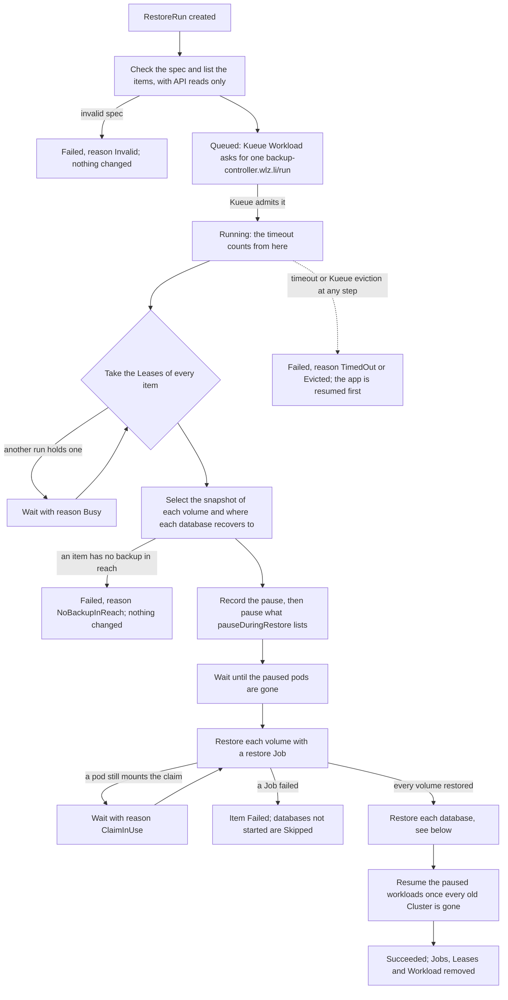
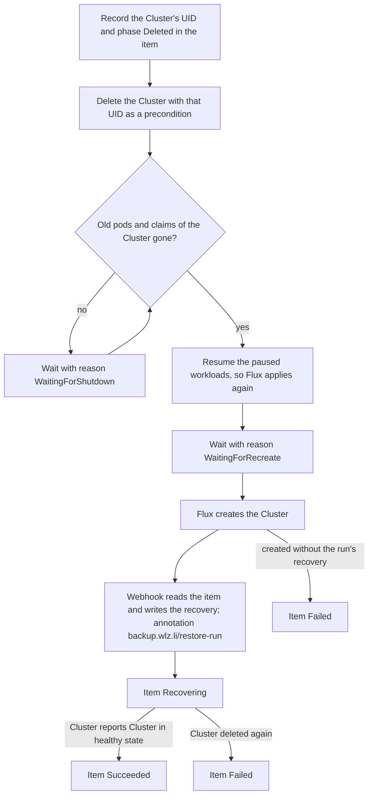
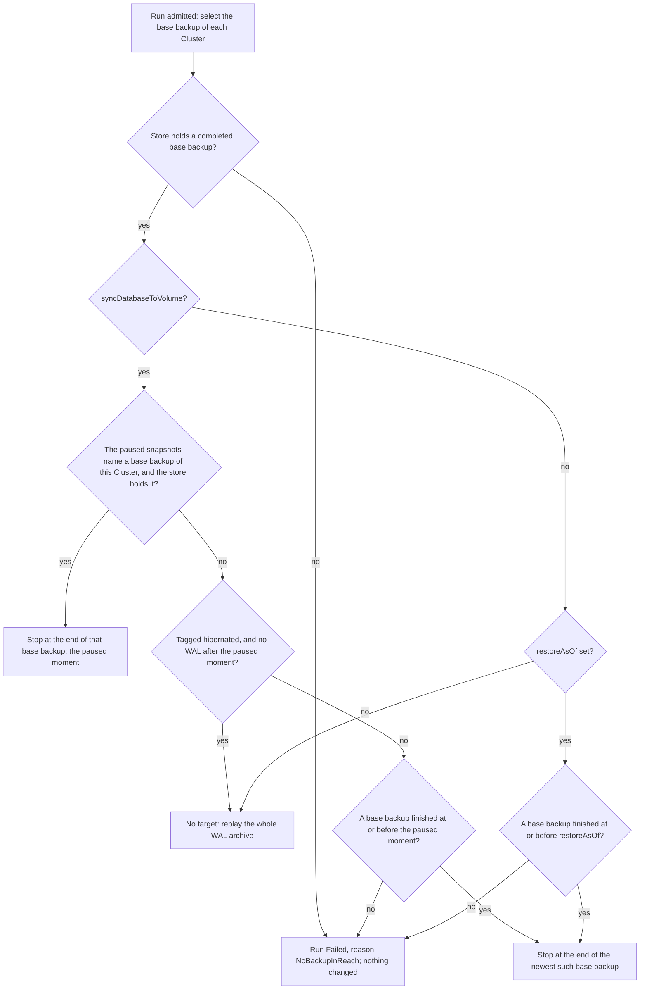

# Restores

A RestoreRun puts volumes and databases back to an earlier state. It restores
a claim in place, fills a new claim from a repository, recovers a
CloudNativePG Cluster, or does all of these for a whole namespace.

A namespace that is rebuilt, or a Cluster that is created again, comes back
without a RestoreRun; automatic restores cover that case
(docs/automatic-restore.md).

## Kinds of RestoreRun

| Spec | Restores |
| --- | --- |
| claim: data | the claim data in place, from its own repository |
| claim: data, into: copy | a new claim copy from the repository of data; data stays untouched |
| repository: SECRET, into: copy, intoSize: 1Gi | a new claim copy from the repository the Secret names |
| database: db | the Cluster db |
| all: true | every claim and every Cluster marked backup.wlz.li/enabled: "true" |
| all: true, syncDatabaseToVolume: true | every claim and every Cluster, to one paused moment |

Every kind accepts these fields:

| Field | Effect |
| --- | --- |
| restoreAsOf | an RFC 3339 time; the restore goes back to the newest backup at or before it |
| previous | steps back that many snapshots from the one otherwise selected, for a single claim |
| pauseDuringRestore | a list of kind and name, each a Deployment or StatefulSet to pause while the run restores |
| timeout | how long the run may work after Kueue admits it; 4 hours when omitted |
| moverSecurityContext | the pod security context of the restore Jobs; else the one of the claim's VolumeRestore |
| ttlSecondsAfterFinished | deletes the run that many seconds after it finished; kept for good when omitted |

pauseDuringRestore lists workloads by name. The annotation
backup.wlz.li/pause-during-backup has no effect on a RestoreRun.

## One RestoreRun from start to end

```mermaid
flowchart TD
    A[RestoreRun created] --> B[Check the spec and list the items, with API reads only]
    B -- invalid spec --> F1[Failed, reason Invalid; nothing changed]
    B --> C[Queued: Kueue Workload asks for one backup-controller.wlz.li/run]
    C -- Kueue admits it --> D[Running: the timeout counts from here]
    D --> E{Take the Leases of every item}
    E -- another run holds one --> W1[Wait with reason Busy] --> E
    E --> S[Select the snapshot of each volume and where each database recovers to]
    S -- an item has no backup in reach --> F2[Failed, reason NoBackupInReach; nothing changed]
    S --> P[Record the pause, then pause what pauseDuringRestore lists]
    P --> G[Wait until the paused pods are gone]
    G --> V[Restore each volume with a restore Job]
    V -- a pod still mounts the claim --> W2[Wait with reason ClaimInUse] --> V
    V -- a Job failed --> F3[Item Failed; databases not started are Skipped]
    V -- every volume restored --> DB[Restore each database, see below]
    DB --> R[Resume the paused workloads once every old Cluster is gone]
    R --> OK[Succeeded; Jobs, Leases and Workload removed]
    D -. timeout or Kueue eviction at any step .-> F4[Failed, reason TimedOut or Evicted; the app is resumed first]
```

### Before anything changes

Until Kueue admits the run, the controller only reads the claims, the
Clusters and the listed workloads. Once admitted, the run takes its Leases,
so no other run works on its claims, repositories or Clusters, and then
selects the backup of every item and records it on the item: the snapshot ID of each volume, and
the base backup of each database. If any item has no backup in reach, the run
ends Failed with reason NoBackupInReach and names each item and why. At that
point the run has paused, deleted and overwritten nothing.

Nothing selects again later. The restore Job restores the recorded snapshot ID,
and the webhook recovers the recorded base backup.

### Volumes

For each volume the run starts a restore Job with the image from the
controller's --restore-image flag, VolSync's mover image. The Job runs
`restic restore SNAPSHOTID --target /data --delete` with the claim mounted at
/data, so afterwards the claim holds exactly the snapshot. The Job's result is
its Kubernetes condition, Complete or Failed; no log is read.

| Kind | Before the Job starts |
| --- | --- |
| In place | No pod may mount the claim. List the workload in pauseDuringRestore, or the run waits with reason ClaimInUse and names the pod. |
| Into a new claim | The run creates the claim when no claim has that name. A claim of that name that the run did not create fails the item: the run never writes into it. The new claim stays after the run is deleted. |

A restore Job that is deleted before it finished fails its item, and the
message says the claim may hold part of the snapshot.

### Selecting the snapshot

| Spec | Snapshot |
| --- | --- |
| nothing | the newest snapshot |
| restoreAsOf T | the newest snapshot at or before T |
| previous N | N snapshots before the one otherwise selected |
| syncDatabaseToVolume | only snapshots tagged paused; every volume must select a snapshot of the same time, else NoBackupInReach |

## Databases

A Cluster can only recover when it is created, so the run deletes the Cluster
and the Cluster's owner (its Flux Kustomization, or the terragrunt unit)
creates it again. The controller's webhook then writes the recovery into the
new Cluster.

```mermaid
flowchart TD
    A[Record the Cluster's UID and phase Deleted in the item] --> B[Delete the Cluster with that UID as a precondition]
    B --> C{Old pods and claims of the Cluster gone?}
    C -- no --> W1[Wait with reason WaitingForShutdown] --> C
    C -- yes --> R[Resume the paused workloads, so Flux applies again]
    R --> W2[Wait with reason WaitingForRecreate]
    W2 --> N[Flux creates the Cluster]
    N --> H[Webhook reads the item and writes the recovery; annotation backup.wlz.li/restore-run]
    H --> I[Item Recovering]
    I -- Cluster reports Cluster in healthy state --> OK[Item Succeeded]
    N -- created without the run's recovery --> F1[Item Failed]
    I -- Cluster deleted again --> F2[Item Failed]
```

The item records the Cluster's UID before the delete. The delete carries that
UID as a precondition, so it never reaches a Cluster created since. A Cluster
that comes back without the annotation backup.wlz.li/restore-run naming the
run did not get the run's recovery, and the item fails.

### What Postgres recovers to

The recovery never goes ahead of the run's moment, and Postgres always reaches
the target it gets. No recovery gets a clock time as its target: Postgres
refuses to finish a recovery to a time when no transaction was committed after
that time, and CloudNativePG then retries the recovery forever.

```mermaid
flowchart TD
    A[Run admitted: select the base backup of each Cluster] --> Z{Store holds a completed base backup?}
    Z -- no --> F[Run Failed, reason NoBackupInReach; nothing changed]
    Z -- yes --> S{syncDatabaseToVolume?}
    S -- yes --> T{The paused snapshots name a base backup of this Cluster, and the store holds it?}
    T -- yes --> R1[Stop at the end of that base backup: the paused moment]
    T -- no --> HB{Tagged hibernated, and no WAL after the paused moment?}
    HB -- yes --> R3
    HB -- no --> B1{A base backup finished at or before the paused moment?}
    S -- no --> AS{restoreAsOf set?}
    AS -- yes --> B2{A base backup finished at or before restoreAsOf?}
    AS -- no --> R3[No target: replay the whole WAL archive]
    B1 -- yes --> R2[Stop at the end of the newest such base backup]
    B2 -- yes --> R2
    B1 -- no --> F
    B2 -- no --> F
```

The run records the selection on the item (baseBackup, stopAtBaseBackup)
before it deletes the Cluster, and the webhook writes the recorded target:

| Run | recoveryTarget the webhook writes | The database holds |
| --- | --- | --- |
| neither restoreAsOf nor syncDatabaseToVolume | none | everything in the WAL archive |
| restoreAsOf T | backupID of the newest base backup that finished at or before T, targetImmediate: true | the state at the end of that base backup |
| syncDatabaseToVolume | backupID from the snapshots' tag base-backup/CLUSTER=ID, targetImmediate: true | the state at the paused moment |
| syncDatabaseToVolume, the snapshots tag the Cluster hibernated and no WAL came after the paused moment | none | its state at the paused moment, which the whole archive holds |
| syncDatabaseToVolume, tag missing or backup gone | backupID of the newest base backup that finished at or before the paused moment, targetImmediate: true | a state at or before the paused moment |

A restore to a moment therefore lands on a base backup. A BackupRun writes one
base backup of each enabled Cluster on every run, so the schedule sets how
close to a chosen time a database can come back.

## When a restore fails

| What happened | Run | Changed before it failed |
| --- | --- | --- |
| Invalid spec, such as syncDatabaseToVolume without all | Failed, Invalid | nothing |
| No backup in reach for an item | Failed, NoBackupInReach | nothing |
| A restore Job failed | Failed, item message points at `kubectl logs job/NAME` | the claims restored so far, including a partial one |
| The Cluster came back without the run's recovery | Failed | the old Cluster was deleted |
| Timeout or eviction | Failed, TimedOut or Evicted | the app is resumed |

In every case the run resumes what it paused, deletes its restore Jobs, and
gives its Leases and its Workload back before it ends. A restore Job that
failed on its own stays for its logs, and goes away with the run. The Jobs
of a run that timed out or was evicted are deleted, which stops them.
